오늘은 IntelliJ Idea에서 내가 만든 Flutter App의 CPU 연산시간과 메모리 사용량 등을 체크하는 방법을 알아보도록 하겠습니다. 다 이해하는데 5분이면 되니까 천천히 읽어보세요~

플러그인(Flutter, Dart)은 모두 설치되어 있다는 가정하에 설명합니다.

1. **View - Tool Windows - Flutter Performance** 를 클릭하세요.

   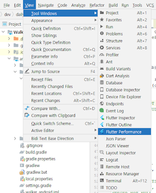

2. 그러면 우측탭 패널에 이런게 뜰겁니다. 지금은 앱을 실행하지 않았기 때문에 **No Running applications**가 나타나죠? 정상적인겁니다.

   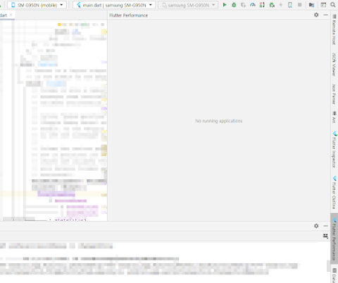
   
3. 이제 앱을 하나 실행하겠습니다. 참고로 프로파일링은 **ADB Wifi**에서도 측정가능합니다.

   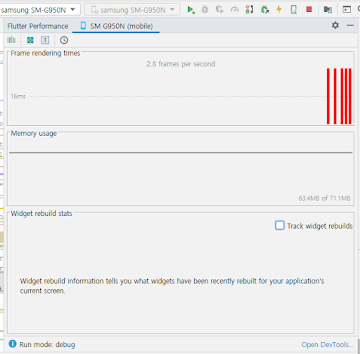   
이것만 봐서는 자세한 정보를 알 수 었으니까 우측하단에 **Open DevTools**를 클릭합니다.

4. 그러면 크롬창이 하나 뜨면서 **Flutter DevTools**가 나타납니다. 하나씩 알아보겠습니다.

   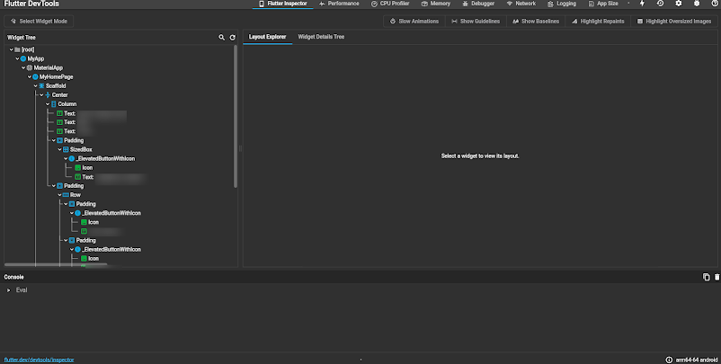

   - Flutter Inspector
     - Intellij 에도 따로 탭이 있습니다만, 여기가 화면이 큼직해서 더 가독성이 높습니다. 
     - Layout Explorer를 이용하면 위젯의 배치를 확인할 수 있습니다. 모든 속성을 다 수정할수는 없고, 정렬방식 등을 수정할 수 있습니다.
     
        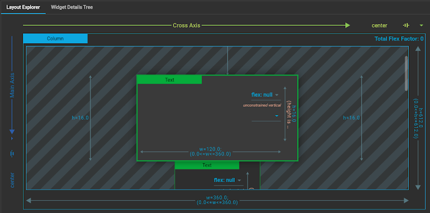
        
     - Widget Details Tree 를 이용하면 위젯속성을 확인할 수 있습니다. 그런데 수정은 불가능하네요.
     
        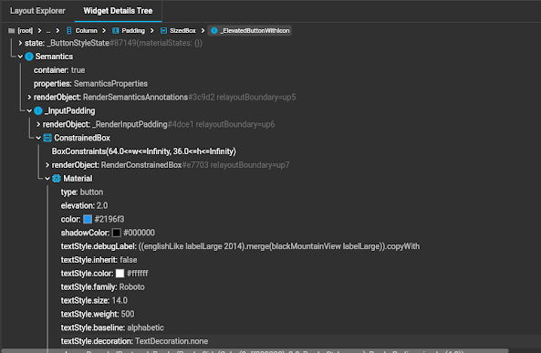
   
   - Performance
     - 위젯 렌더링시 소요되는 시간을 기준으로 퍼포먼스 체크를 할 수 있습니다.
     
        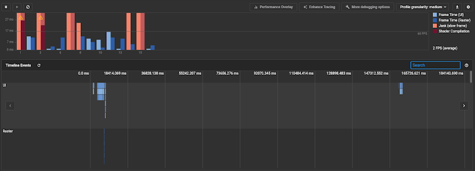
        
     - 여기서 앱성능을 측정하는데 눈여겨 볼 것이 붉은색 계통의 바(bar) 입니다. 제가 만들고 있는 앱은 페이지 전환시에 Jank가 많이 발생하고 있네요. 해당 부분을 클릭하면 아래처럼 소요시간 CPU 연산시간을 확인할 수 있습니다. 
     
        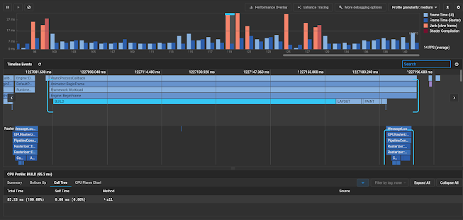
        
     - LAYOUT이나 PAINT는 얼마 안걸렸는데 BUILD 하는데 오래걸렸네요. 약 85ms. 다 합쳐서 0.1초 정도 걸린다는 거니까 아주 심각한 수준은 아닙니다만, 이런게 빈번하게 발생하면 앱의 성능은 떨어지게 되고 그만큼 사용자의 신뢰를 잃게 될 것 입니다.
     - 하단의 Call Tree를 이용해서 상세 연산 메써드를 확인할 수 있습니다. 저 같은 경우엔 이것만 봐서는 어떤 부분이 문제인지 알 수가 없었으나 추측은 가능합니다. 아무래도 사용하고 있는 테이블 레이아웃방식에 문제가 아닐까 싶네요. 
     - 이런식으로 화면구성에 있어서의 문제점을 구체적이고 직관적으로 확인할 수 있기 때문에 , 상용서비스 앱을 만드는 개발자라면 반드시 익숙해져야 하는 도구가 아닐까 싶습니다.
     
   - CPU Profiler
     - 이건 화면구성을 기준으로 하는게 아니라 모든 연산속도를 측정할 수 있습니다.
     
        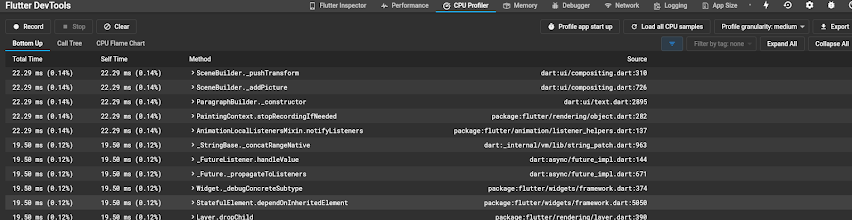
        
     - 다만, Record 버튼 클릭한 후에 앱을 사용하고 다시 Stop 버튼으로 완료를 해야 정보를 얻을 수 있습니다.
     - 저는 sqlite에서 사용하는 쿼리 중에 유독 느린 것을 찾아내서 어떤 함수호출 시에 이런 현상이 벌어지는지 추적하는데 썼습니다. 그런데 검색이 불가능해서 좀 불편하네요. Source 컬럼을 정렬해서 찾는 수 밖에 없었습니다.

   - Memory
     - 제가 만든 앱이 카카오톡의 메모리 사용을 능가한다는 리포트를 보고나니, 분석을 아니할 수 없게 되었습니다. 아니.. 뭘 그렇게 많이 사용한다고 이런 수치가 나오지? 메모리릭을 의심하지 않을 수 없겠죠?
     
        
        
     - 그런데 여기서 주목할 점이 Memory 탭에서 주황색 점선에 해당하는 RSS라는 값과 스마트폰 상에서 포착된 254MB 값이 비슷하단 말이죠. 혹시 디버그모드에서 공유하는 메모리공간이 아닐까 싶어서, 다른 플러터 앱도 켜봤습니다. 그런데 값이 다르더라구요. 그래서 RSS의 의미를 공홈에 들어가서 확인해 봤습니다. 
     
        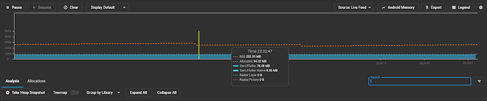
        
     - RSS : Resident Set Size(상주세트크기)라고 하네요. OS용어로 보입니다. 내 앱에 할당된 메모리 크기를 의미하는것 같습니다. 저게 넘으면 OS가 재할당 해줄것 같은데, 그런 앱은 만들면 안될것 같단 생각이 드네요. 아니 간단한 앱이 어떻게 카톡보다 무거워서야...
     - 실제 사용하고 있는 메모리 사이즈도 수행하고 있는 기능에 비해서 너무 과도합니다. 줄여봅시다. 메모리가 누수되고 있거나 과도하게 많이 잡아먹는 부분을 Analysis 탭을 이용해서 포착해보겠습니다.
     - Take Heap Snapshot을 클릭하면 다음과 같은 화면이 나옵니다. 범인을 찾아봅시다.
     
        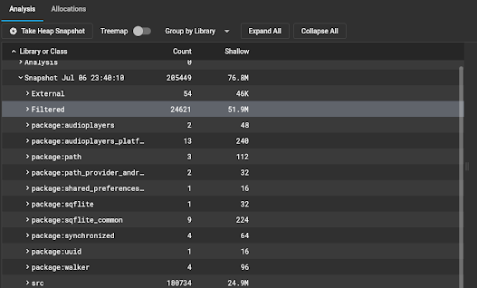
     
     - 그런데 LIST 방식은 좀 불편해요. 그래서 Treemap을 활성화 시켜봅시다. 아래처럼 화면이 변하는데요 직관적이죠? 아니? dart:core String 에서 왜 이렇게 많이 잡아먹어??? 그런데 이상합니다. 문자열 정보를 전혀 사용하지 않는 다른앱에서도 값이 같습니다. 이건 제가 어떻게 통제할 수 없는 부분 같네요.   
     
        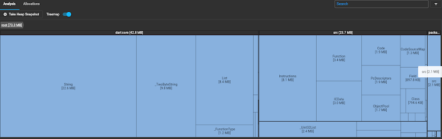
     
     - 혹시 릴리즈 모드이면 좀 달라질까 해서 봤는데, 할당된 메모리양이 비슷하네요. 검색을 좀 해보니까, 플러터의 내재적 요인 때문에 그렇다는 의견도 있고... 그게 아니라는 말도 있고. 아무튼 현상확인을 했으니 궁금합니다. 팩트체크를 안할 수가 없겠습니다.
     
   **그래서 다음 시간에는 "Hello World" 앱을 만들었을때 플러터와 네이티브 앱이 사용하는 메모리 비교를 해보겠습니다.**
   
   [Flutter VS Native 메모리 사용량 비교](flutter-vs-native-memory-usage) 

        
