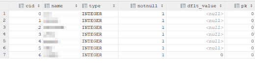

sqlite에서 

pragma table_info(테이블이름) 

으로 쿼리를 날리면 컬럼정보가 아래와 같은 유형으로 나타납니다. 그렇기 때문에 맵 리스트로 저장 되었을 때 name을 기준으로 비교해서 존재여부를 판단하면 됩니다.

   

이걸 flutter에서 sqflite를 사용할 때 alter table을 사용하기 위해서는 아래와 같은 사용예를 들 수 있습니다.

```dart
List<Map> res = await db.rawQuery("PRAGMA table_info(테이블네임)", null);
bool hasColumn = false;
for(int i = 0 ; i < res.length; i++) {
  if (res[i]["name"] == "컬럼네임") {
    hasColumn = true;
  }
}
if (!hasColumn) {
  await db.execute('''
    ALTER TABLE 테이블네임 ADD 컬럼네임 INTEGER DEFAULT 0 NOT NULL
  ''');
}
```