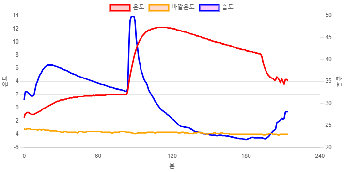

### 지난 시간에 이어서...
- 지난 시간에 라즈베리파이 피코로 실외에 있는 고양이 겨울집 내부의 온/습도를 측정한 다음, mqtt 통신을 통해서 원격의 구독서버가 값을 받아오는 것을 포스팅 했었습니다.
    - [Mosquitto와 라즈베리파이 피코를 이용해서 실외 온도 측정하기](https://reddol18.pe.kr/mqtt-pico-mosquitto)
- 오늘은 이 값을 이용해서 그래프를 그리는 페이지를 작성해 보겠습니다.

### 서버로그를 JSON으로 변환
- 구독 서버가 출력하는 로그는 이런 형태인데요

```txt
2025-02-20 22:39:40 {"device_id": "d2", "humidity": 30.8, "temperature": -1.5}
2025-02-20 22:40:22 {"device_id": "d2", "humidity": 32.7, "temperature": -0.9}
2025-02-20 22:41:22 {"device_id": "d2", "humidity": 32.7, "temperature": -0.8}
```

- 저기서 날짜 시간 부분을 time 프로퍼티로 추가했습니다.
- 그리고 기상청 데이터를 기반으로 해당 시간에 기록된 실외 온도를 out 프로퍼티로 추가했습니다.

```json
[{"time": "2025-02-20 22:39:40", "device_id": "d2", "humidity": 30.8, "temperature": -1.5,"out": -3.2},
{"time": "2025-02-20 22:40:22", "device_id": "d2", "humidity": 32.7, "temperature": -0.9,"out": -3.3},
{"time": "2025-02-20 22:41:22", "device_id": "d2", "humidity": 32.7, "temperature": -0.8,"out": -3.2}]
```

- 파일의 실제 길이는 더 길겠죠?? 

### next.js 설치
- npm을 이용해서 next.js를 설치해주세요. 이때 타입스크립트를 이용하겠습니다.
- 디렉토리나 인덱스 페이지와 컴포넌트 구성은 각자 알아서 해주시면 됩니다.


### JSON 로딩 유틸리티 모듈
- JSON 파일을 로딩하는 간단한 모듈을 아래와 같이 작성합니다.

```javascript
import jsonData from '../data/log-0220.json'; // JSON 파일 경로

interface THItem {
    time: string;
    temperature: number;
    humidity: number;
    device_id: string;
    out: number,
}

export const getJsonData = (): THItem[] => {
    return jsonData as THItem[];
};
```


### 차트를 그려주는 컴포넌트
- chart.js를 이용해서 그래프를 그려주는 컴포넌트를 작성했습니다.

```javascript
'use client';

import React, {ComponentType} from 'react';
import {Line} from 'react-chartjs-2';
import {Chart as ChartJS, LinearScale, PointElement, LineElement, Legend} from 'chart.js';
import type {ChartData, ChartOptions} from 'chart.js';

ChartJS.register(
    LinearScale,
    PointElement,
    LineElement,
    Legend
);

interface Props {
    data: {
        time: string,
        device_id: string,
        temperature: number,
        humidity: number,
        out: number,
    }[];
}

const Chart1Client: ComponentType<Props> = ({data}) => {
    const chartData: ChartData = {
        labels: data.map((_, index) => index),
        datasets: [
            {
                label: "온도",
                data: data.map(item => item.temperature),
                borderColor: 'red',
                backgroundColor: 'rgba(255, 0, 0, 0.2)',
                tension: 0.1,
                pointRadius: 0,
                yAxisID: 'y1',
            },
            {
                label: "바깥온도",
                data: data.map(item => item.out),
                borderColor: 'orange',
                backgroundColor: 'rgba(255, 69, 0, 0.2)',
                tension: 0.1,
                pointRadius: 0,
                yAxisID: 'y1',
            },
            {
                label: "습도",
                data: data.map(item => item.humidity),
                borderColor: 'blue',
                backgroundColor: 'rgba(255, 0, 255, 0.2)',
                tension: 0.1,
                pointRadius: 0,
                yAxisID: 'y2',
            }],
    };
    const chartOptions: ChartOptions = {
        scales: {
            x: {
                title: {
                    display: true,
                    text: '분',
                },
                type: 'linear',
                ticks: {
                    stepSize: 60,
                }
            },
            y1: {
                type: 'linear',
                display: true,
                position: 'left',
                title: {
                    display: true,
                    text: '온도',
                },
            },
            y2: {
                type: 'linear',
                display: true,
                position: 'right',
                grid: {
                    drawOnChartArea: false,
                },
                title: {
                    display: true,
                    text: '습도',
                },
            },
        },
    };
    return (
        <Line data={chartData} options={chartOptions}></Line>
    );
}
export default Chart1Client;
```

- 그리하여 아래와 같은 차트를 그릴 수 있었습니다.
    - 


### 시연연상
- 이 차트를 활용한 영상도 함께 봐주시면 감사하겠습니다.
    - 
    - [영상](https://youtu.be/2760mVtlEIU)