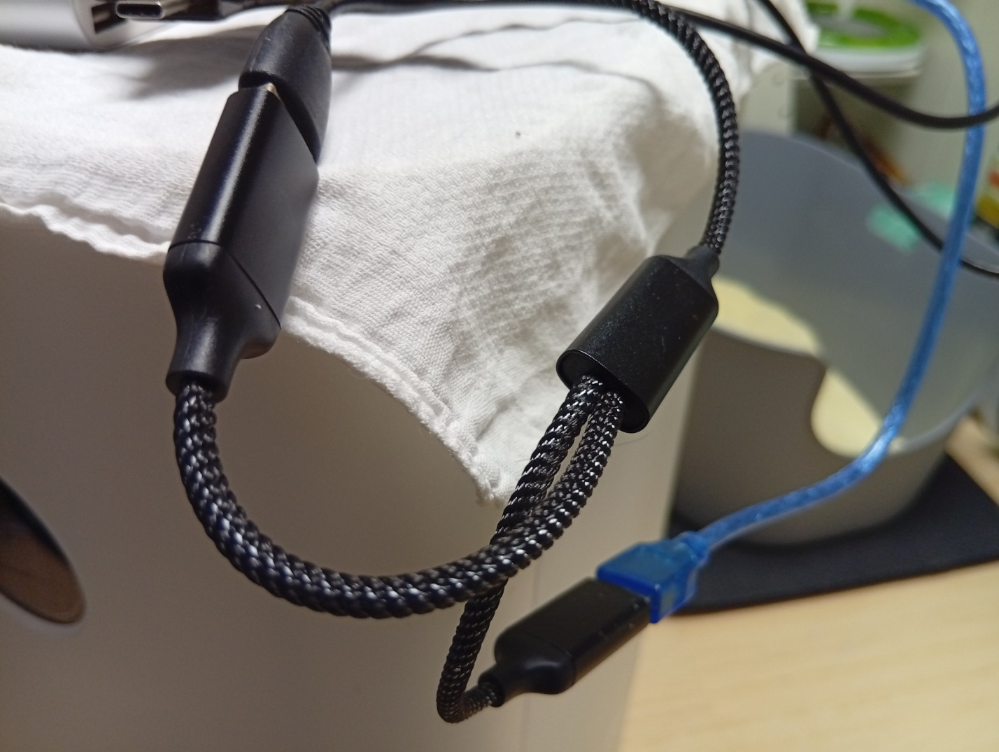

### 미세먼지 측정하기
- 저희집 고양이 호박이 화장실 모래의 미세먼지를 측정한 적이 있습니다.
    - [고양이 화장실 모래의 미세먼지를 측정해 봤어요](https://blog.naver.com/dolja21/223419893884)
- 결과가 너무 충격적이어서 뚜껑없는 개방형 화장실로 바꿔줬었지요.
- 그런데 겨울에 환기를 적게 하다보니, 모래 먼지가 방에 퍼져서 목이 너무 아픈거에요.
- 그래서 먼지가 덜 나온다는 카사바 모래로 화장실 모래를 바꿔줬습니다.
- 바꾼 모래도 먼지를 측정해 봐야겠죠?

### 측정 결과를 무선통신으로 보낼 수 없을까?
- 이전에는 측정 결과를 USB 라인을 통해서 보냈습니다.
- 그러다보니까 측정할 수 있는 공간에 한계가 생기더군요.
- 그래서 이번에는 와이파이로 통신할 수 있는 라즈베리파이 피코에 먼지센서를 연결해 보려고 했어요.
- 그런데 안타깝게도 3.3V 기반 ADC를 사용하는 피코에서는 값을 얻기가 어렵더군요.
- 그래서 아두이노를 사용하되, 라즈베리파이 피코를 와이파이 모듈처럼 써서 측정값을 보내봤습니다.
    - 
- 방법은 간단합니다, 아두이노의 시리얼핀(Tx,Rx)를 라즈베리파이 피코의 시리얼핀에 붙였어요.
- 그런 다음 피코에서는 받아지는 값을 그대로 mqtt를 이용해서 서버로 보내기만 하도록 프로그래밍 했습니다.
    - [관련 - Mosquitto와 라즈베리파이 피코를 이용해서 실외 온도 측정하기](https://reddol18.pe.kr/mqtt-pico-mosquitto)

### 보조배터리가 꺼지는 문제 해결
- 그런데 보조배터리에 아두이노와 피코를 각각 연결하니까 1분 정도 있다가 전원이 꺼져버리는 문제가 발생하더군요.
- 아무래도 보조배터리에 내장된 미세전류 차단 기준에 걸린것 같았습니다. 대략 60mA ~ 80mA가 그 기준값인 듯 한데요...
- 아두이노도 피코도 따로사용할 때는 저 값보다 낮은 전류를 사용합니다. 
- 그런데 보조배터리에 있는 2개의 USB 단자에서 동시에 사용하는 전류량의 합을 기준으로 차단하는게 아니라, 둘 중에 최대값을 기준으로 차단하는 것 같아요.
- 이로인해서 어쩔수 없이 USB 허브를 하나 투입했습니다. 이러니까 하나의 USB 단자로 약 80mA ~ 100mA를 사용하게 됩니다.
    - 
- 이제는 미세 전류 차단으로 인해 전원이 꺼지지 않고 꾸준히 동작하네요.

### 측정결과
- 측정 결과는 PC에서 아래와 같이 받아보게 되었구요.
    - 
- 무선으로 전송되니까 여기저기 옮겨다니면서 측정할 수 있게 되어서 좋네요.  
- 관련 에피소드는 아래 영상에서 시청할 수 있습니다~
    - 
    - [영상](https://youtu.be/H-TEPwiTZEo)