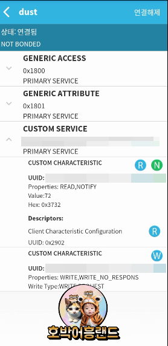
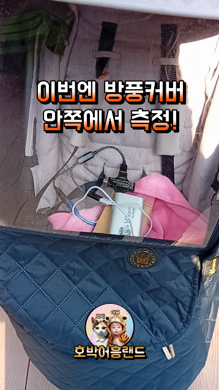

### Why Not WIFI
- 지난 시간에 라즈베리파이 피코를 아두이노 와이파이 모듈 처럼 사용하는 방법을 소개했었는데요.
    - [라즈베리파이 피코를 아두이노 와이파이 모듈 처럼 사용하기](https://reddol18.pe.kr/rpi-pico-as-wlan-module)
- 라우터가 없으면 통신이 어렵다는 최대의 단점이 있었습니다.
- 이로 인해서 집에서 나가면 먼지 측정을 할 수가 없었습니다.
- 결국 블루투스를 쓰게 되었는데요, 다행히도 제가 사용하는 라즈베리파이 피코 W는 BLE를 지원하더군요.
- 이번에는 라즈베리파이 피코를 아두이노의 블루투스 모듈처럼 써보겠습니다.

### BLE in RPI PICO
- 이제 마이크로 파이썬에서 BLE를 어떻게 써야하는지 찾아보겠습니다.
    - [BLE by MicroPython GITHUB example](https://github.com/micropython/micropython/tree/master/examples/bluetooth)
- 위에서 제시된 예제를 이해하기 위해서 몇 가지 개념을 설명하고자 합니다.
    - central : 중앙처리 장치 입니다. 이번 포스팅의 상황에서는 스마트폰이 이에 해당합니다.
    - peripheral : 단말장치를 의미합니다. 라즈베리파이 피코가 이에 해당합니다.
    - advertising : 단말장치가 중앙처리 장치에게 존재를 알리는 행위입니다.
    
    

### BLE 소스코드
- 사실상 위에서 찾아낸 예제 코드를 그대로 가져왔습니다.

```python
from micropython import const
import struct
import bluetooth
import time

_ADV_TYPE_FLAGS = const(0x01)
_ADV_TYPE_NAME = const(0x09)
_ADV_TYPE_UUID16_COMPLETE = const(0x3)
_ADV_TYPE_UUID32_COMPLETE = const(0x5)
_ADV_TYPE_UUID128_COMPLETE = const(0x7)
_ADV_TYPE_UUID16_MORE = const(0x2)
_ADV_TYPE_UUID32_MORE = const(0x4)
_ADV_TYPE_UUID128_MORE = const(0x6)
_ADV_TYPE_APPEARANCE = const(0x19)

_ADV_MAX_PAYLOAD = const(31)

_IRQ_CENTRAL_CONNECT = const(1)
_IRQ_CENTRAL_DISCONNECT = const(2)
_IRQ_GATTS_WRITE = const(3)

_FLAG_READ = const(0x0002)
_FLAG_WRITE_NO_RESPONSE = const(0x0004)
_FLAG_WRITE = const(0x0008)
_FLAG_NOTIFY = const(0x0010)

_UART_UUID = bluetooth.UUID("10000001-1000-1000-1000-100000000000")
_UART_TX = (
    bluetooth.UUID("10000003-1000-1000-1000-100000000000"),
    _FLAG_READ | _FLAG_NOTIFY,
)
_UART_RX = (
    bluetooth.UUID("10000002-1000-1000-1000-100000000000"),
    _FLAG_WRITE | _FLAG_WRITE_NO_RESPONSE,
)
_UART_SERVICE = (
    _UART_UUID,
    (_UART_TX, _UART_RX),
)

def advertising_payload(limited_disc=False, br_edr=False, name=None, services=None, appearance=0):
    payload = bytearray()

    def _append(adv_type, value):
        nonlocal payload
        payload += struct.pack("BB", len(value) + 1, adv_type) + value

    _append(
        _ADV_TYPE_FLAGS,
        struct.pack("B", (0x01 if limited_disc else 0x02) + (0x18 if br_edr else 0x04)),
    )

    if name:
        _append(_ADV_TYPE_NAME, name)

    if services:
        for uuid in services:
            b = bytes(uuid)
            if len(b) == 2:
                _append(_ADV_TYPE_UUID16_COMPLETE, b)
            elif len(b) == 4:
                _append(_ADV_TYPE_UUID32_COMPLETE, b)
            elif len(b) == 16:
                _append(_ADV_TYPE_UUID128_COMPLETE, b)

    # See org.bluetooth.characteristic.gap.appearance.xml
    if appearance:
        _append(_ADV_TYPE_APPEARANCE, struct.pack("<h", appearance))

    if len(payload) > _ADV_MAX_PAYLOAD:
        raise ValueError("advertising payload too large")

    return payload


def decode_field(payload, adv_type):
    i = 0
    result = []
    while i + 1 < len(payload):
        if payload[i + 1] == adv_type:
            result.append(payload[i + 2 : i + payload[i] + 1])
        i += 1 + payload[i]
    return result


def decode_name(payload):
    n = decode_field(payload, _ADV_TYPE_NAME)
    return str(n[0], "utf-8") if n else ""


def decode_services(payload):
    services = []
    for u in decode_field(payload, _ADV_TYPE_UUID16_COMPLETE):
        services.append(bluetooth.UUID(struct.unpack("<h", u)[0]))
    for u in decode_field(payload, _ADV_TYPE_UUID32_COMPLETE):
        services.append(bluetooth.UUID(struct.unpack("<d", u)[0]))
    for u in decode_field(payload, _ADV_TYPE_UUID128_COMPLETE):
        services.append(bluetooth.UUID(u))
    return services

class BLESimplePeripheral:
    def __init__(self, ble, name="dust"):
        self._ble = ble
        self._ble.active(True)
        self._ble.irq(self._irq)
        ((self._handle_tx, self._handle_rx),) = self._ble.gatts_register_services((_UART_SERVICE,))
        self._connections = set()
        self._write_callback = None
        self._payload = advertising_payload(name=name, services=[_UART_UUID])
        self._advertise()

    def _irq(self, event, data):
        # Track connections so we can send notifications.
        if event == _IRQ_CENTRAL_CONNECT:
            conn_handle, _, _ = data
            print("New connection", conn_handle)
            self._connections.add(conn_handle)
        elif event == _IRQ_CENTRAL_DISCONNECT:
            conn_handle, _, _ = data
            print("Disconnected", conn_handle)
            self._connections.remove(conn_handle)
            # Start advertising again to allow a new connection.
            self._advertise()
        elif event == _IRQ_GATTS_WRITE:
            conn_handle, value_handle = data
            value = self._ble.gatts_read(value_handle)
            if value_handle == self._handle_rx and self._write_callback:
                self._write_callback(value)

    def send(self, data):
        for conn_handle in self._connections:
            self._ble.gatts_notify(conn_handle, self._handle_tx, data)

    def is_connected(self):
        return len(self._connections) > 0

    def _advertise(self, interval_us=500000):
        print("Starting advertising")
        self._ble.gap_advertise(interval_us, adv_data=self._payload)

    def on_write(self, callback):
        self._write_callback = callback

```

### 기존 소스코드 변경
- Wifi 모듈처럼 사용하던 코드를 BLE 모듈로 바꿔 보겠습니다.
- 비교를 위해서 Wifi 를 위해서 사용하던 함수는 남겨놨습니다.

```python
import utime
import rp2 
from rp2 import PIO, asm_pio
from machine import UART, Pin
import network
import time
import urequests as requests
import uasyncio
import ujson
import umqtt.simple
import ble
from ble import BLESimplePeripheral, bluetooth


dust_value = 0

mqtt_broker_ip = "###.###.###.###"
client_id = "XXX"
ssid = ''
password = ''

uart = UART(0,9600)

def send_message_mqtt(client, value):
    print("Publish Mqtt Message")
    msg = ujson.dumps({'device_id': client_id, 'value': value})
    #msg = "Device: %s, Temp: %d, Hum: %d" % (client_id,h,t)
    try:
        client.publish("pico/dust_log", msg)
    except OSError as e:
        print(e)
    
def wlan_connect():
    wlan = network.WLAN(network.STA_IF)
    wlan.active(True)
    wlan.connect(ssid, password)

    # Setup onboard LED
    onboard_led = Pin('LED', Pin.OUT)  # Adjust the pin number if necessary

    # Initial connection attempt
    max_attempts = 10
    attempts = 0
    connected = False  # Flag to track connection status

    while not wlan.isconnected() and attempts < max_attempts:
        onboard_led.toggle()  # Blink LED while trying to connect
        time.sleep(1)
        attempts += 1
        
    if wlan.isconnected():
        print(f"Connected to {ssid} successfully!")
        print("Network Config:", wlan.ifconfig())
        onboard_led.value(1)  # Keep LED on when connected
        connected = True
    else:
        print("Failed to connect to WiFi.")
        onboard_led.value(0)  # Turn off LED if initial connection fails
    return [wlan, connected]

def mqtt_connect():
    print("Try Mqtt Connect")
    client = umqtt.simple.MQTTClient(client_id = client_id, server = mqtt_broker_ip, port = #####)
    client.connect()
    return client


def wlan_main():
    wret = wlan_connect()
    wlan = wret[0]
    connected = wret[1]
    client = 0
    utime.sleep(3)
    try:
        client = mqtt_connect()
    except OSError as e:
        print(f"Error: %s" % e)
    print("Mqtt Connect Done")
    
    utime.sleep(1)
    
    while True:
        if uart.any():
            dust_value = uart.readline()
            if dust_value:
                try:
                    dust_value = float(dust_value.decode().strip())
                    print(dust_value)
                except ValueError:
                    print("Invalid data:", dust_value)
                
        
        if wlan.isconnected() and not connected:
            print("Reconnected to WiFi.")
            onboard_led.value(1)  # Keep LED on when connected
            print("Network Config:", wlan.ifconfig())
            connected = True
        elif not wlan.isconnected() and connected:
            print("Disconnected from WiFi.")
            connected = False

        if not connected:
            print("Wlan Not Connected")
            onboard_led.toggle()  # Blink LED if disconnected
        else:
            if client == 0:
                print("MQTT is not connected")
            else:
                send_message_mqtt(client, dust_value)
            #message = "?m=2&h=%d&t=%d" % (humidity, temperature)
            #await send_message(message)     
        utime.sleep(2)

# 여기서부터 새로 바뀐 내용입니다    

def ble_connect():
    my_ble = bluetooth.BLE()
    p = BLESimplePeripheral(my_ble)

    def on_rx(v):
        print("RX", v)

    p.on_write(on_rx)
    return p


def ble_main():
    global dust_value
    ble_conn = 0
    onboard_led = Pin('LED', Pin.OUT)  # Adjust the pin number if necessary
    try:
        ble_conn = ble_connect()
        if ble_conn != 0 and ble_conn.is_connected():
            print("Connected as BLE.")
            onboard_led.value(1)  
            conncted = True
    except Exception as e:
        print("Ble Connection Error: %s" % e)
        
    utime.sleep(1)
    connected = False
    
    while True:
        if uart.any():
            dust_value = uart.readline()
            if dust_value:
                try:
                    dust_value = float(dust_value.decode().strip())
                    print(dust_value)
                except ValueError:
                    print("Invalid data:", dust_value)
                
        
        if  ble_conn != 0 and ble_conn.is_connected() and not connected:
            print("Connected as BLE.")
            onboard_led.value(1)  # Keep LED on when connected            
            connected = True
        elif not ble_conn.is_connected() and connected:
            print("Disconnected as BLE.")
            connected = False

        if not connected:
            print("BLE Not Connected")
            onboard_led.toggle()  # Blink LED if disconnected
        else:
            # Central(스마트폰)에서 별도 계산을 하지 않을거기 때문에 여기서 먼지값을 계산해서 보냅니다            
            last_value = int((0.173 * ((dust_value / 1024.0) * 5.0 - 0.622)) * 1000)
            data = str(last_value) + ""
            print("TX", data)
            ble_conn.send(data)
            #message = "?m=2&h=%d&t=%d" % (humidity, temperature)
            #await send_message(message)     
        utime.sleep(2)

#main()
ble_main()
```

### 측정결과
- 측정 결과는 스마트폰에 BLE scanner 앱을 설치해서 확인할 수 있습니다.
    - 
- 그런데 이번에도 전력이 너무 적게 사용해서 보조배터리가 거부(?)하는 문제가 발생하네요.
- 지난번에 아두이노 + 먼지센서 + 피코(wlan 모듈사용) 조합으로 80mA ~ 100mA를 사용했는데, 이번에는 60mA ~ 80mA를 사용하게 됩니다.
- 부족한 20mA를 추가하기 위해서 쓸데 없는 전력사용을 해야하는 아이러니한 상황이 펼쳐지고 말았네요.
- 실제로 결과물을 어떻게 사용했는지는, 아래 영상에서 시청할 수 있습니다~
    - 
    - [영상](https://www.youtube.com/shorts/PPgo98PVhnA)