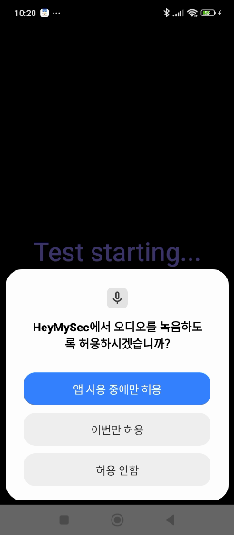

### 플러터 통합 테스트
- 안드로이드 네이티브 코드의 경우엔, 앱피움이라는 좋은 프레임워크가 존재합니다.
- 그런데 플러터를 앱피움으로 테스트하려고 하면, 몇 가지 제약사항이 있더군요.
- 하지만 실망할 필요가 없습니다! 플러터는 자체적으로 통합 테스트를 지원하거든요!

### 테스트를 해봅시다
- 제가 일전에 소개했던 앱을 테스트 해 볼건데요. 여기 블로그로도 올렸었습니다.
    - [Google STT와 Gemini를 이용해서 캘린더에 음성으로 스케쥴 추가하기](https://reddol18.pe.kr/stt-google-calendar)
- 실제로 이번 테스트를 통해서 버그도 몇 개 고쳤습니다.
- 이 앱의 특성상 테스트를 위해서 몇 가지 고려사항이 있는데요. 
    - 프로바이더를 이용한 상태관리 패턴을 구현했다는 점
    - STT를 이용하기 때문에 테스트에서 문장이 음성으로 재생되어야 한다는 점
    - 위젯들이 애니메이션으로 타나난다는 점
  
### 테스트 소스코드
- 주석을 통해 코드 설명을 대신 하겠습니다.

```dart
import 'package:string_similarity/string_similarity.dart';
import 'package:flutter/material.dart';
import 'package:flutter/semantics.dart';
import 'package:flutter_gemini/flutter_gemini.dart';
import 'package:flutter_test/flutter_test.dart';
import 'package:integration_test/integration_test.dart';
import 'package:mysec/global_vars.dart';
import 'package:mysec/main.dart' as app;
import 'package:flutter_tts/flutter_tts.dart';
import 'package:mysec/slot_editor.dart';
import 'package:mysec/stt_tools.dart';
import 'package:provider/provider.dart';


// 타입에 의해서 값을 가져옵니다
String? getValueByType(WidgetTester tester) {
  final Finder itemFinder = find.byType(SlotEditor);
  final SlotEditorState state = tester.state(itemFinder);
  return state.selectedCategory;
}

/// ValueKey로 정의된 key 값을 조회해서 가져옵니다.
/// ex: const ValueKey('listen_button')
String getTextByKey(WidgetTester tester, String keyString) {
  final Finder itemFinder = find.byKey(ValueKey(keyString));
  final Text itemText = tester.widget<Text>(itemFinder);
  return itemText.data!;
}

// SemanticsLabel로 정의된 값을 조회해서 가져옵니다
String? getValueByLabel(WidgetTester tester, String label) {
  final Finder itemFinder = find.bySemanticsLabel(label);
  final SemanticsNode itemText = tester.getSemantics(itemFinder);
  return itemText.value;
}

// 문장 유사도 계산 함수
double calculateSimilarity(String str1, String str2) {
  final double distance = StringSimilarity.compareTwoStrings(str1, str2);
  final int maxLength = str1.length > str2.length ? str1.length : str2.length;
  if (maxLength == 0) {
    return 1.0; // 둘 다 빈 문자열이면 완전히 동일
  }
  final double similarity = 1.0 - (distance / maxLength);
  return similarity;
}

// 문장 유사도 기준치 판정 함수
bool isSimilarEnough(String str1, String str2, double threshold) {
  return calculateSimilarity(str1, str2) >= threshold;
}


void main() {
  IntegrationTestWidgetsFlutterBinding.ensureInitialized(); // 통합 테스트 환경 초기화

  testWidgets('ListenAndResult', (WidgetTester tester) async {
    Gemini.init(apiKey: "");
    // Provider를 사용하기 때문에 아래와 같이 정의합니다.
    await tester.pumpWidget(MultiProvider(
      providers: [
        ChangeNotifierProvider<SttTools>(create: (_) => SttTools(),), // SttTools Provider 추가,
        ChangeNotifierProvider<GlobalVars>(create: (_) => GlobalVars()),
      ],
      child: const app.MyApp(), // 앱 시작
    ),);

    // 권한 지정 및 구글 로그인을 위한 시간을 벌기 위해서 10초를 기다립니다.
    await Future.delayed(const Duration(seconds: 10));

    final Finder listenButton = find.byKey(const ValueKey("listen_button"));
    await tester.tap(listenButton);
    /**
     * 위젯에 애니메이션이 들어가서 그런지, pumpAndSettle 함수가 작동하지 않았습니다.
     * 어쩔수 없이 약간의 시간차를 두고 TTS를 실행하기 위해서 0.5초를 기다립니다
     */
    await Future.delayed(const Duration(milliseconds: 500));

    /**
     *  TTS를 이용해서 문장을 읽겠습니다. SpeechRate 0.5이하에서 인식이 되고
     *  그 이상은 전혀 안되는 현상이 발생하였고, 0.5 이하에서도 주변 소음 상태에 따라서
     *  인식률이 떨어지는 경우가 있어서 안전하게 0.3으로 SpeechRate를 잡았습니다.
     */

    final FlutterTts flutterTts = FlutterTts();
    await flutterTts.setLanguage("ko-KR");
    await flutterTts.setSpeechRate(0.3);
    await flutterTts.setPitch(1.0);
    await flutterTts.setVolume(1.5);
    await flutterTts.speak("내일 오전 9시부터 30분동안 JP 카테고리에 선예매 관련 포스팅 추가");
    await flutterTts.awaitSpeakCompletion(true);

    // STT가 TTS 음성을 인식할 때 까지 대기
    await Future.delayed(const Duration(seconds: 15));

    final Finder nextButton = find.byKey(const ValueKey("next_step_button2"));
    await tester.tap(nextButton);

    // AI 에이전트와의 통신 시간을 위한 대기
    await Future.delayed(const Duration(seconds: 10));
    /// 화면이 넘어가고 나서 위젯이 배치될 때 까지 대기
    /// 아래 코드들에서 값들을 받아오지 못합니다
    await tester.pump(const Duration(seconds: 2));

    final String datePickerValue = getTextByKey(tester, "date_picker");
    final String time1PickerText = getTextByKey(tester, "time1_picker");
    final String time2PickerText = getTextByKey(tester, "time2_picker");
    final String? categoryPickerText = getValueByType(tester);
    final String? titleText = getValueByLabel(tester, "title_text");

    DateTime today = DateTime.now();
    DateTime tomorrow = today.add(const Duration(days: 1));
    String formattedDate = "${tomorrow.year}-${tomorrow.month.toString().padLeft(2, '0')}-${tomorrow.day.toString().padLeft(2, '0')}";

    expect(datePickerValue, formattedDate);
    expect(time1PickerText, '9:00 AM');
    expect(time2PickerText, '9:30 AM');
    expect(categoryPickerText, 'JP');
    // STT 인식률을 감안해서 50% 유사도 이상일 경우 테스트 통과처리
    expect(isSimilarEnough(titleText!, '선예매 관련 포스팅', 0.5), true);

  });
}
```

### 테스트 과정 설명

- 처음에 테스트를 시도하면 설치 다이얼로그가 뜹니다. 테스트 실행해야 할 때 마다 매번 설치해야 하는게 귀찮은데, 안뜨게 할 방법은 없는것 같더라구요.
- 각종 권한 설정 및 구글 로그인 다이얼로그도 뜹니다. 이것도 새로 설치하기 때문에 매번 뜹니다.
    -     
- 이후로는 테스트가 진행됩니다. 동영상으로 확인하시죠.    
    - <video controls src="../images/20250421/test.mp4" title="Title"></video>