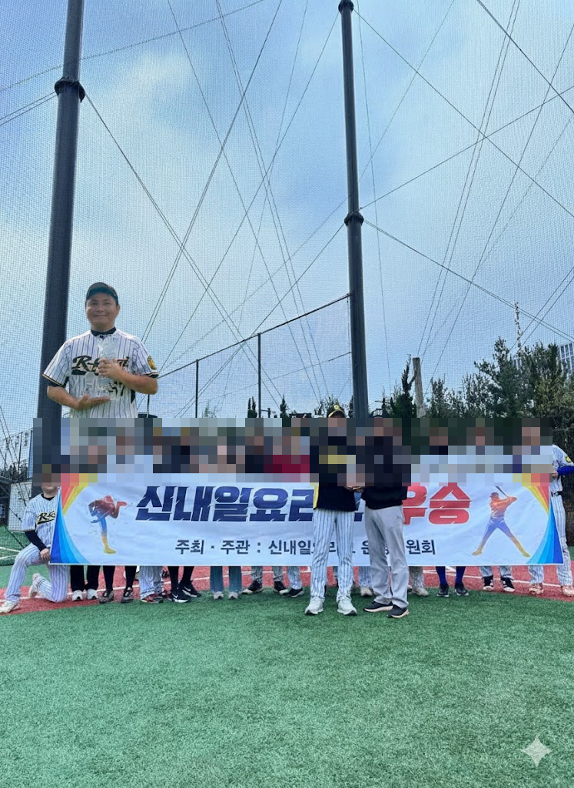
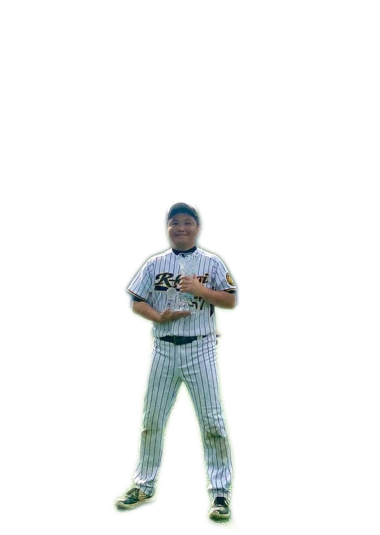
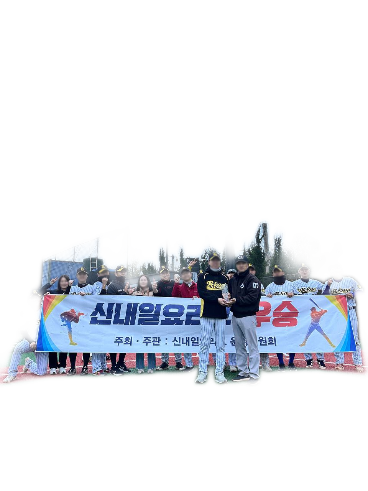
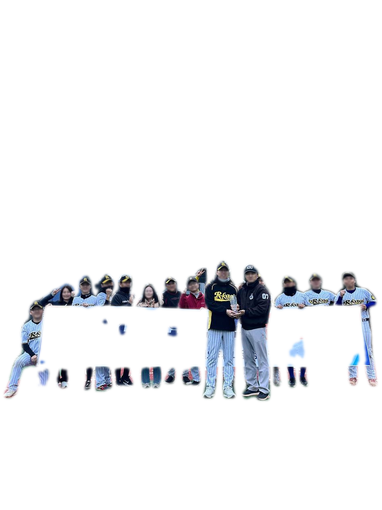

### 배경을 제거해야 하는 이유
- 얼마전에 저희 사회인야구팀이 우승을 했는데요. 처갓집에 가족들을 데리로 가야 할 시간이 다되어서 우승 사진을 못 찍고 그냥 왔어요.
- 사진 속에 제가 없는게 너무 허전했는데, 때마침 저말고 또 다른 한 친구가 가려져서 얼굴이 안보인다고 하더군요.
- 그래서 AI를 이용해서 합성을 해보려고 하는데, 하고싶은대로 잘 안되더라구요.
  - 
- 어쩔수 없이 제가 직접 편집을 해서 만들어야 했는데, 문제는 배경을 지우는 것 이었어요.  

### U2Net을 이용해서 지워봤습니다
- 먼저 제 사진을 하나 찾아서 배경을 지워봤는데요. 처음에는 아래 라이브러리를 이용했습니다.
  - [U-2-Net](https://github.com/xuebinqin/U-2-Net)
  - 
- 나름 나쁘지 않은 것 같아서, 이번에는 단체 사진에서 배경을 제거해 봤습니다.
  - 
  - U-2-Net의 약점이 발견되었습니다. 혼자 있는 사람은 잘 처리하지만, 단체사진일 경우에 디텍팅하는 정확도가 떨어집니다.
    
    

### Detectron2로 바꿔봤습니다
- 아무래도 Detectron2가 여러명을 찾아내는 능력은 더 뛰어날 것 같아서 라이브러리를 바꿔서 구현해 봤습니다.
  - [Detectron2](https://github.com/facebookresearch/detectron2)
  - 
  - 그렇습니다. 현수막 부분까지 아주 정확하게 제외하고 사람들만 딱딱 알아서 찾아줍니다.
- 반면 1명만 있는 사진은 다소 부자연스러운 결과가 나타났는데요.  
  - 
  - 배경 부분이 약간 남아있는걸 확인할 수 있습니다.

### 결론
- U2Net은 한 사람을 정확하게 찾아내는데 강하고, Detectron2는 여러명을 찾아내는데 강하다.
- 사용한 코드는 아래와 같습니다. 각각의 라이브러리는 git으로 직접 설치해서 임포트 했구요.
- U2Net의 경우 모델 파일은 직접 다운로드 해야 합니다.

```python
import os
from PIL import Image, ImageFilter
import torch
import torch.nn.functional as F
from torchvision import transforms
import numpy as np
import cv2
import sys
sys.path.append(r'detectron2')

from detectron2.engine import DefaultPredictor
from detectron2.config import get_cfg
from detectron2 import model_zoo

sys.path.append(r'U-2-Net/model')
# U^2-Net 모델 코드 가져오기
from u2net import U2NET  # u2net.py 파일을 같은 폴더에 두세요

def u2net_remove_bg(input_path, output_path, model_path='u2net.pth'):
    device = torch.device('cuda' if torch.cuda.is_available() else 'cpu')
    net = U2NET(3, 1)
    net.load_state_dict(torch.load(model_path, map_location=device))
    net.to(device)
    net.eval()

    # 이미지 로드 및 전처리
    image = Image.open(input_path).convert('RGB')
    orig_size = image.size
    image = image.resize((320, 320), Image.BICUBIC)
    img_np = np.array(image).astype(np.float32) / 255.0
    img_np = img_np.transpose((2, 0, 1))
    img_tensor = torch.from_numpy(img_np).unsqueeze(0).to(device)

    # 마스크 예측
    with torch.no_grad():
        d1, *_ = net(img_tensor)
        pred = d1[:, 0, :, :]
        pred = F.interpolate(pred.unsqueeze(1), size=orig_size[::-1], mode='bilinear', align_corners=True)
        mask = pred.squeeze().cpu().numpy()
        mask = (mask - mask.min()) / (mask.max() - mask.min() + 1e-8)

    # 경계 feathering (OpenCV)
    mask_uint8 = (mask * 255).astype(np.uint8)
    mask_blur = cv2.GaussianBlur(mask_uint8, (15, 15), 0)
    mask_blur = mask_blur.astype(np.float32) / 255.0

    # RGBA 이미지 생성
    orig_img = Image.open(input_path).convert('RGB')
    orig_np = np.array(orig_img)
    result = np.zeros((orig_np.shape[0], orig_np.shape[1], 4), dtype=np.uint8)
    result[..., :3] = orig_np
    result[..., 3] = (mask_blur * 255).astype(np.uint8)

    out_img = Image.fromarray(result)
    if not output_path.lower().endswith('.png'):
        output_path = os.path.splitext(output_path)[0] + '.png'
    out_img.save(output_path)
    print(f"Saved: {output_path}")


def detectron2_remove_people(input_path, output_path):
    # Detectron2 config 및 모델 로드 (COCO Instance Segmentation)
    cfg = get_cfg()
    cfg.merge_from_file(model_zoo.get_config_file("COCO-InstanceSegmentation/mask_rcnn_R_50_FPN_3x.yaml"))
    cfg.MODEL.ROI_HEADS.SCORE_THRESH_TEST = 0.5
    cfg.MODEL.ROI_HEADS.NUM_CLASSES = 80
    cfg.MODEL.WEIGHTS = model_zoo.get_checkpoint_url("COCO-InstanceSegmentation/mask_rcnn_R_50_FPN_3x.yaml")
    cfg.MODEL.DEVICE = "cuda" if torch.cuda.is_available() else "cpu"
    predictor = DefaultPredictor(cfg)

    # PIL로 이미지 로드 후 numpy 변환
    pil_img = Image.open(input_path).convert('RGB')
    image = np.array(pil_img)
    image_bgr = cv2.cvtColor(image, cv2.COLOR_RGB2BGR)

    outputs = predictor(image_bgr)
    masks = outputs["instances"].pred_masks.cpu().numpy()
    classes = outputs["instances"].pred_classes.cpu().numpy()

    # COCO에서 사람 클래스는 0
    person_masks = [m for m, c in zip(masks, classes) if c == 0]
    if not person_masks:
        print("사람 객체가 없습니다.")
        return

    # 여러 사람 마스크 합치기
    mask = np.zeros(image.shape[:2], dtype=np.uint8)
    for m in person_masks:
        mask = np.maximum(mask, m.astype(np.uint8))

    # 경계 feathering
    mask_blur = cv2.GaussianBlur(mask * 255, (15, 15), 0).astype(np.float32) / 255.0

    # RGBA 이미지 생성
    result = np.zeros((image.shape[0], image.shape[1], 4), dtype=np.uint8)
    result[..., :3] = image
    result[..., 3] = (mask_blur * 255).astype(np.uint8)

    out_img = Image.fromarray(result)
    if not output_path.lower().endswith('.png'):
        output_path = output_path.rsplit('.', 1)[0] + '.png'
    out_img.save(output_path)
    print(f"Saved: {output_path}")


if __name__ == "__main__":
    import argparse
    parser = argparse.ArgumentParser()
    parser.add_argument("--input", type=str, required=True, help="입력 이미지 파일 경로 (jpg, jpeg, png, jfif 등)")
    parser.add_argument("--output", type=str, required=True, help="출력 이미지 파일 경로")
    parser.add_argument("--u2net", type=str, default="u2net.pth", help="U^2-Net 모델 경로")
    args = parser.parse_args()
    detectron2_remove_people(args.input, args.output)
```
