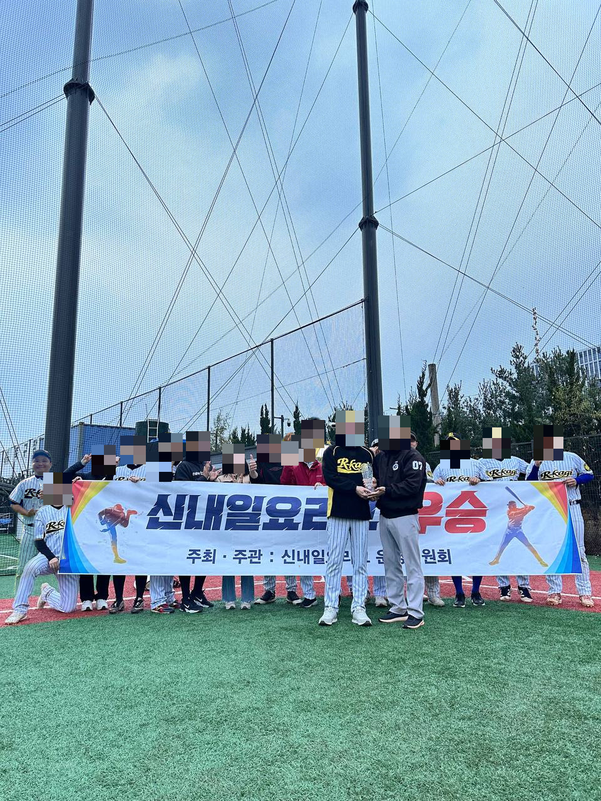
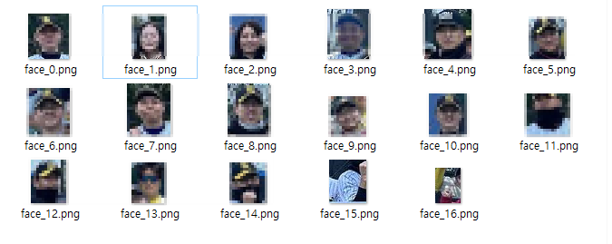

### 나 빼고 다 모자이크 처리해야 하는데...
- 지난 시간에 배경제거 AI 모델을 이용해서 단체사진 속에 저의 사진을 합성해 봤는데요
- 결과물을 블로그에 올리려다 보니, 사진에 나오신 분들의 얼굴을 모자이크 처리해야 겠더라구요
- 처음에는 포토피아로 하나하나 블럭 지정해서 할까 하다가 그냥 코파일럿으로 코드 하나 만들어서 돌리는게 더 편하겠더군요
  - 
- 그런데 또 제 사진은 굳이 모자이크 처리하지 않고 싶은거에요...

    

### 모자이크 처리 할 얼굴을 골라서 해보자
- 얼굴인식 모델은 yolo를 이용했구요
- 프로그램을 돌리면 디텍팅한 얼굴을 하나씩 파일로 저장하게 했습니다.
  - 
- 그럼 이제 여기서 제 사진의 번호만 빼고 selection 옵션에 입력해서 모자이크 처리하게 할건데요
- 위 사진을 보시면 아시겠지만, 정확도가 100%는 아니라서 얼굴이 아닌 것도 디텍팅 합니다.
- 굳이 이런것도 모자이크 처리하는데 넣을 필요는 없겟죠.

```python
import os
import cv2
import numpy as np
from PIL import Image
from ultralytics import YOLO

def ensure_dir(path):
    if not os.path.exists(path):
        os.makedirs(path)

def detect_faces_yolov8(image_np, model_path='yolov8x-face-lindevs.pt', conf=0.15):
    # YOLOv8-face 모델 로드 및 추론
    model = YOLO(model_path)
    results = model(image_np, conf=conf)
    faces = []
    for r in results:
        for box in r.boxes.xyxy.cpu().numpy():
            x1, y1, x2, y2 = box[:4]
            x, y, w, h = int(x1), int(y1), int(x2 - x1), int(y2 - y1)
            faces.append((x, y, w, h))
    return faces

def save_faces(image_np, faces, output_dir, expand_ratio=0.8):
    ensure_dir(output_dir)
    h_img, w_img = image_np.shape[:2]
    for idx, (x, y, w, h) in enumerate(faces):
        # 영역 확대
        x_exp = max(0, int(x - w * expand_ratio / 2))
        y_exp = max(0, int(y - h * expand_ratio / 2))
        w_exp = min(w_img - x_exp, int(w * (1 + expand_ratio)))
        h_exp = min(h_img - y_exp, int(h * (1 + expand_ratio)))
        face_img = image_np[y_exp:y_exp+h_exp, x_exp:x_exp+w_exp]
        face_pil = Image.fromarray(face_img)
        face_pil.save(os.path.join(output_dir, f"face_{idx}.png"))

def mosaic_faces(image_np, faces, selection, expand_ratio=0.8):
    out_img = image_np.copy()
    h_img, w_img = image_np.shape[:2]
    # selection이 'all'이면 모든 얼굴 인덱스 선택
    if selection == 'all':
        selected_indices = set(range(len(faces)))
    else:
        selected_indices = set(selection)
    for idx, (x, y, w, h) in enumerate(faces):
        if idx in selected_indices:
            # 영역 확대
            x_exp = max(0, int(x - w * expand_ratio / 2))
            y_exp = max(0, int(y - h * expand_ratio / 2))
            w_exp = min(w_img - x_exp, int(w * (1 + expand_ratio)))
            h_exp = min(h_img - y_exp, int(h * (1 + expand_ratio)))
            face = out_img[y_exp:y_exp+h_exp, x_exp:x_exp+w_exp]
            small = cv2.resize(face, (max(1, w_exp//15), max(1, h_exp//15)), interpolation=cv2.INTER_LINEAR)
            mosaic = cv2.resize(small, (w_exp, h_exp), interpolation=cv2.INTER_NEAREST)
            out_img[y_exp:y_exp+h_exp, x_exp:x_exp+w_exp] = mosaic
    return out_img

def main(input_path, output_dir, selection_str=None, model_path='yolov8x-face-lindevs.pt'):
    # PIL로 이미지 로드 (jfif 등 지원)
    pil_img = Image.open(input_path).convert('RGB')
    image_np = np.array(pil_img)

    faces = detect_faces_yolov8(image_np, model_path)
    print(f"얼굴 검출 수: {len(faces)}")

    # 1. 얼굴 부분만 따로 저장
    save_faces(image_np, faces, output_dir)

    # 2. 선택된 얼굴만 모자이크 처리
    if selection_str:
        if selection_str.strip().lower() == 'all':
            selection = 'all'
        else:
            selection = [int(s) for s in selection_str.split(',') if s.strip().isdigit()]
        mosaic_img = mosaic_faces(image_np, faces, selection, expand_ratio=0.8)
        mosaic_pil = Image.fromarray(mosaic_img)
        mosaic_path = os.path.join(output_dir, "mosaic.png")
        mosaic_pil.save(mosaic_path)
        print(f"모자이크 이미지 저장: {mosaic_path}")

if __name__ == "__main__":
    import argparse
    parser = argparse.ArgumentParser()
    parser.add_argument("--input", type=str, required=True, help="입력 이미지 파일 경로 (jpg, png, jfif 등)")
    parser.add_argument("--output", type=str, required=True, help="출력 폴더 경로")
    parser.add_argument("--selection", type=str, default="", help="모자이크 처리할 얼굴 번호(쉼표로 구분, 예: 0,2,3, 또는 all)")
    parser.add_argument("--model", type=str, default="yolov8x-face-lindevs.pt", help="YOLOv8-face 모델 경로")
    args = parser.parse_args()
    main(args.input, args.output, args.selection, args.model)
```
