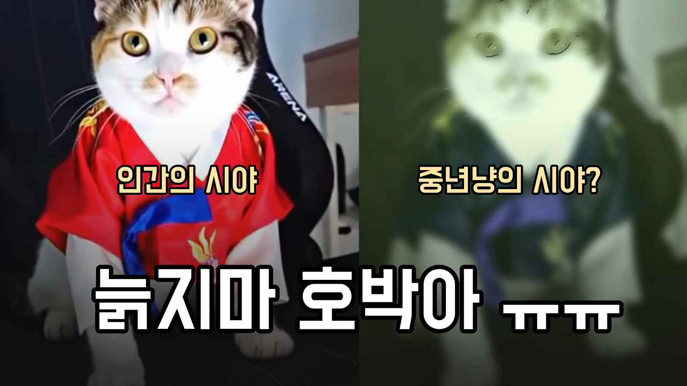

### 고양이는 과연 세상을 어떻게 바라볼까?
- 저희 집 반려묘 호박이도 어느덧 8살을 지나 9살이 되어가고 있는데요...
- 최근들어 시력이 나빠졌는지 종종 어딘가에 부딛힌다던가, 점프실수를 하더라구요 ㅠㅠ
- 고양이들은 지독한 근시에, 붉은색을 못 본다고 하더군요.  
- 다만 사냥을 잘 하기위해서 움직이는 물체는 상대적으로 잘 포착하도록 동체시력이 발달되어 있다고 하네요.
- 그래서 문득 궁금해 졌어요. 호박이의 눈에 세상은 어떻게 보일까? 하구요~

### 동영상을 찍어서 호박이 시각으로 변환해보자
- 이 목표를 달성하기 위해 기술적으로 구현해야 할 것은 아래와 같은데요
    1. 붉은색을 제거하는 필터링
    2. 카메라에 투영된 화면을 타원형으로 왜곡시키기
    3. 멀리있는 물체 및 배경 블러처리
    4. 움직이는 객체는 상대적으로 또렷하게 보이기
    5. 이 모든것들의 정도를 연령에 따라서 조정할 수 있게 하기
- 여기서 1,2,3,5는 OpenCV를 이용하면 어느정도 처리가능할 것으로 보였지만
- 4번의 경우가 문제였어요...    
    - 움직인다는 것은 프레임 이미지간의 상대격차를 이용하면 됩니다. 이건 OpenCV나 직접 구현하는 루틴으로도 가능하죠.
    - 하지만 문제가 그리 쉽지는 않습니다. 상대격차를 유발한 대상이 실제 객체(사람, 동물)라면 또렷하게 보이게 해야 하지만
    - 고양이가 움직이면서 발생하는 정적인 것들의 변화(실제로는 카메라의 이동으로 인한)는 그대로 블러처리 되어야 한다는 것이죠.    

    

### 이번에도 역시 객체탐지다! 결론은 Detectron2!
- 지난 번에 [U2Net VS Detectron2, 어떤 모델이 배경을 더 잘 지워줄까?](https://reddol18.pe.kr/u2net-vs-detectron2-remove-bg)에서 Detctron2의 강력한 객체탐지 능력을 확인한 바 있는데요.
- 결국 실제로 움직이는 객체는 사람 혹은 동물일 가능성이 높기 때문에, 이런것들을 화면에서 찾아내서 이전 프레임에서 찾아낸 것과 상대격차가 발생할 경우 또렷하게 보이게 하면 될 것 같았어요.
  - 
- 아래는 detectron2를 이용해서 프레임 상에서 사람, 고양이, 개가 아닌 부분은 블러처리하는 함수이구요.

```python
def blur_except_objects_with_detectron2(frame, blur_kernel=(31, 31), object_classes=(0, 15, 16), return_mask_only=False):
    """
    frame: numpy array (H, W, 3), BGR
    blur_kernel: tuple, 블러 강도
    object_classes: tuple, COCO 클래스 번호 (0=person, 15=cat, 16=dog 등)
    return: numpy array (H, W, 3), 오브젝트 영역만 선명, 나머지는 블러
    """
    # Detectron2 config 및 모델 로드 (COCO Instance Segmentation)
    cfg = get_cfg()
    cfg.merge_from_file(model_zoo.get_config_file("COCO-InstanceSegmentation/mask_rcnn_R_50_FPN_3x.yaml"))
    cfg.MODEL.ROI_HEADS.SCORE_THRESH_TEST = 0.5
    cfg.MODEL.ROI_HEADS.NUM_CLASSES = 80
    cfg.MODEL.WEIGHTS = model_zoo.get_checkpoint_url("COCO-InstanceSegmentation/mask_rcnn_R_50_FPN_3x.yaml")
    cfg.MODEL.DEVICE = "cuda" if torch.cuda.is_available() else "cpu"
    predictor = DefaultPredictor(cfg)

    # 입력이 RGB면 BGR로 변환
    if frame.shape[2] == 3:
        image_bgr = frame
    else:
        raise ValueError("frame must be (H, W, 3) BGR numpy array")

    outputs = predictor(image_bgr)
    masks = outputs["instances"].pred_masks.cpu().numpy()
    classes = outputs["instances"].pred_classes.cpu().numpy()

    # 지정된 클래스(사람/동물 등) 마스크 합치기
    object_masks = [m for m, c in zip(masks, classes) if int(c) in object_classes]
    if not object_masks:
        # 객체가 없으면 전체 블러 반환
        return cv2.GaussianBlur(frame, blur_kernel, 0)

    mask = np.zeros(frame.shape[:2], dtype=np.uint8)
    for m in object_masks:
        mask = np.maximum(mask, m.astype(np.uint8))
    mask = (mask * 255).astype(np.uint8)
    if return_mask_only:
        # 객체가 없을 때도 항상 (H, W) 0마스크 반환
        return mask

    # 경계 feathering
    mask_blur = cv2.GaussianBlur(mask, (21, 21), 0).astype(np.float32) / 255.0
    mask_blur = np.expand_dims(mask_blur, axis=2)

    # 블러 이미지 생성
    blurred = cv2.GaussianBlur(frame, blur_kernel, 0).astype(np.float32)
    frame_float = frame.astype(np.float32)

    # 객체 영역은 원본, 나머지는 블러
    result = frame_float * mask_blur + blurred * (1 - mask_blur)
    return result.astype(np.uint8)
```

- 아래는 위 함수를 이용해서 목표했던 기능을 구현한 코드 입니다.

```python
import cv2
import numpy as np
import argparse
import time
from tqdm import tqdm
from remove_bg import blur_except_objects_with_detectron2
import os
import glob

# --- 고양이 시야 시뮬레이션 상수 설정 ---

def get_senior_cat_params(age):
    # age: 고양이 나이(예: 10살 이상이면 노령)
    if age < 7:
        return (25, 25), 15, 0.7, (5, 5)    # 젊은 고양이
    elif age < 12:
        return (31, 31), 25, 0.5, (9, 9)    # 중년
    else:
        return (35, 35), 35, 0.3, (20, 20)  # 노령

cat_age = 12  # 예시: 고양이 나이 10살
BLUR_LEVEL_STATIC,MOTION_THRESHOLD, DYNAMIC_BLUR_WEIGHT, BLUR_LEVEL_DYNAMIC = get_senior_cat_params(cat_age)
# 1. 시력(Acuity) 저하를 위한 기본 가우시안 블러 커널 크기
# 정지된 물체에 적용될 강한 블러 (고양이의 낮은 시력)
#BLUR_LEVEL_STATIC = (31, 31) 
# 움직이는 물체에 적용될 약한 블러 (움직임에 대한 민감도 증가)
#BLUR_LEVEL_DYNAMIC = (5, 5)  
# 움직임 감지 임계값 (작을수록 작은 움직임에도 반응)
#MOTION_THRESHOLD = 15
# 블러를 혼합할 때 동적 블러의 기여도
#DYNAMIC_BLUR_WEIGHT = 0.7

# 2. 주변 시야 왜곡 (어안 효과)
# K 값은 왜곡 강도. 양수일수록 배럴 왜곡(중앙이 부풀어 오름)이 강해집니다.
# 고양이의 넓은 시야각을 시뮬레이션합니다.
DISTORTION_K = 0.00000001 # 왜곡 계수. 이미지 크기에 따라 조정이 필요할 수 있습니다.

# 3. 색상 변환 (이색성 시야 시뮬레이션)
# Red 채널의 민감도를 낮추고 Blue-Yellow 계열을 강조합니다.
COLOR_SHIFT_MATRIX = np.array([
    [0.9, 0.1, 0.05],  # B_out: 주로 B_in에서. R_in 기여도 낮음 (0.05)
    [0.1, 0.9, 0.05],  # G_out: 주로 G_in에서. R_in 기여도 낮음 (0.05)
    [0.2, 0.8, 0.0]    # R_out: B_in과 G_in에서 색상 정보 받아 노란/갈색 톤 생성. R_in 기여도 낮음 (0.1)
], dtype=np.float32)


def apply_field_of_view_correction(frame):
    """
    고양이의 넓은 시야를 시뮬레이션하기 위해 주변부에 왜곡(배럴 왜곡)을 적용합니다.
    """
    h, w = frame.shape[:2]
    k = 0.0000001  # 기존 0.0007에서 더 작게 조정 (값이 작을수록 왜곡이 약해짐)
    # 왜곡 강도 조절
    # k = 0.0007  # 값이 클수록 왜곡이 강해짐
    # 좌표 그리드 생성
    y_indices, x_indices = np.indices((h, w), dtype=np.float32)
    x_c = w / 2
    y_c = h / 2
    x = x_indices - x_c
    y = y_indices - y_c
    r = np.sqrt(x**2 + y**2)
    # 배럴 왜곡 공식
    x_distorted = x * (1 + k * r**2)
    y_distorted = y * (1 + k * r**2)
    map_x = (x_distorted + x_c).astype(np.float32)
    map_y = (y_distorted + y_c).astype(np.float32)
    distorted_frame = cv2.remap(frame, map_x, map_y, cv2.INTER_LINEAR)
    return distorted_frame


def align_frame(prev_frame, curr_frame):
    # ORB 특징점 추출 및 매칭
    orb = cv2.ORB_create(500)
    kp1, des1 = orb.detectAndCompute(prev_frame, None)
    kp2, des2 = orb.detectAndCompute(curr_frame, None)
    bf = cv2.BFMatcher(cv2.NORM_HAMMING, crossCheck=True)
    matches = bf.match(des1, des2)
    if len(matches) < 10:
        return prev_frame  # 매칭 실패 시 원본 반환
    src_pts = np.float32([kp1[m.queryIdx].pt for m in matches]).reshape(-1,1,2)
    dst_pts = np.float32([kp2[m.trainIdx].pt for m in matches]).reshape(-1,1,2)
    M, mask = cv2.estimateAffinePartial2D(src_pts, dst_pts)
    if M is not None:
        aligned = cv2.warpAffine(prev_frame, M, (curr_frame.shape[1], curr_frame.shape[0]))
        return aligned
    else:
        return prev_frame

def apply_dynamic_blur(current_frame, prev_frame, subtitle_mask=None):
    if prev_frame is None:
        return cv2.GaussianBlur(current_frame, BLUR_LEVEL_STATIC, 0)
    # 카메라 움직임 보정
    gray_curr = cv2.cvtColor(current_frame, cv2.COLOR_BGR2GRAY)
    gray_prev = cv2.cvtColor(prev_frame, cv2.COLOR_BGR2GRAY)
    aligned_prev = align_frame(gray_prev, gray_curr)
    diff = cv2.absdiff(gray_curr, aligned_prev)
    _, motion_mask = cv2.threshold(diff, MOTION_THRESHOLD, 255, cv2.THRESH_BINARY)

    # 자동 탐지된 자막 영역 마스킹
    if subtitle_mask is not None:
        motion_mask[subtitle_mask > 0] = 0

    motion_ratio = np.sum(motion_mask > 0) / motion_mask.size
    if motion_ratio < 0.05:
        return cv2.GaussianBlur(current_frame, BLUR_LEVEL_STATIC, 0)

    motion_mask_3ch = cv2.cvtColor(motion_mask, cv2.COLOR_GRAY2BGR)
    mask_float = motion_mask_3ch.astype(np.float32) / 255.0
    dynamic_blur = cv2.GaussianBlur(current_frame, BLUR_LEVEL_DYNAMIC, 0)
    static_blur = cv2.GaussianBlur(current_frame, BLUR_LEVEL_STATIC, 0)
    combined_blur = (dynamic_blur.astype(np.float32) * mask_float * DYNAMIC_BLUR_WEIGHT) + \
                    (static_blur.astype(np.float32) * (1.0 - mask_float * DYNAMIC_BLUR_WEIGHT))
    return combined_blur.astype(np.uint8)


def apply_color_conversion(frame):
    """
    고양이의 이색성 시야를 시뮬레이션하기 위해 색상 변환을 적용합니다.
    """
    float_frame = frame.astype(np.float32) / 255.0
    
    # BGR -> Cat Vision Color Space (행렬 변환)
    transformed_frame = np.dot(float_frame.reshape(-1, 3), COLOR_SHIFT_MATRIX.T).reshape(float_frame.shape)

    transformed_frame = np.clip(transformed_frame, 0.0, 1.0)
    final_frame = (transformed_frame * 255).astype(np.uint8)
    
    return final_frame

def make_odd(n):
    n = int(n)
    return n if n % 2 == 1 else n + 1


def cat_vision_filter(current_frame, prev_frame=None, subtitle_mask=None, transform_strength=1.0):
    # 변환 강도에 따라 블러, 색상, 오버레이 등 처리
    # 예시: 블러 강도 조절
        if transform_strength == 0:
            return current_frame

        def make_odd(n):
            n = int(n)
            return n if n % 2 == 1 else n + 1

        blur_kernel = (
            make_odd(5 + 26 * transform_strength),
            make_odd(5 + 26 * transform_strength)
        )
        blurred_frame = cv2.GaussianBlur(current_frame, blur_kernel, 0)

        # 1. 주변 시야 왜곡 적용
        distorted_frame = apply_field_of_view_correction(blurred_frame)

        # 2. Detectron2로 오브젝트 마스크 생성 (사람/동물 등)
        obj_mask = blur_except_objects_with_detectron2(
            distorted_frame, blur_kernel=BLUR_LEVEL_STATIC, object_classes=(0, 14, 15, 16), return_mask_only=True
        )  # (H, W) 0/255

        # obj_mask: (H, W), distorted_frame: (H, W, 3)
        if obj_mask is None or obj_mask.shape != distorted_frame.shape[:2]:
            obj_mask = np.zeros(distorted_frame.shape[:2], dtype=np.uint8)

        # 3. 움직임 마스크 생성 (카메라 보정 포함)
        if prev_frame is not None:
            gray_curr = cv2.cvtColor(distorted_frame, cv2.COLOR_BGR2GRAY)
            gray_prev = cv2.cvtColor(apply_field_of_view_correction(prev_frame), cv2.COLOR_BGR2GRAY)
            aligned_prev = align_frame(gray_prev, gray_curr)
            diff = cv2.absdiff(gray_curr, aligned_prev)
            _, motion_mask = cv2.threshold(diff, MOTION_THRESHOLD, 255, cv2.THRESH_BINARY)
        else:
            motion_mask = np.ones(distorted_frame.shape[:2], dtype=np.uint8) * 255  # 첫 프레임은 모두 움직임

        # 4. 마스크 결합
        obj_motion_mask = cv2.bitwise_and(obj_mask, motion_mask)  # 오브젝트 & 움직임

        # 5. 블러 이미지 생성
        strong_blur = cv2.GaussianBlur(distorted_frame, BLUR_LEVEL_STATIC, 0)
        # 오브젝트 & 움직임: 원본, 나머지: 블러
        mask_float = cv2.cvtColor(obj_motion_mask, cv2.COLOR_GRAY2BGR).astype(np.float32) / 255.0
        result = distorted_frame.astype(np.float32) * mask_float + strong_blur.astype(np.float32) * (1 - mask_float)
        result = result.astype(np.uint8)

        # 6. 색상 변환
        final_frame = apply_color_conversion(result)

        # 7. 황록색 오버레이
        overlay_color = np.array([80, 255, 180], dtype=np.uint8)
        alpha = 0.18
        overlay = np.full(final_frame.shape, overlay_color, dtype=np.uint8)
        final_frame = cv2.addWeighted(final_frame, 1 - alpha, overlay, alpha, 0)

        if 0 < transform_strength < 1:
            return cv2.addWeighted(current_frame, 1 - transform_strength, final_frame, transform_strength, 0)
        else:
            return final_frame

def process_video(input_path, output_path, linear=False):
    start_time = time.time()
    """
    입력 동영상을 읽어 프레임별로 처리하고, 결과를 새로운 파일에 저장합니다.
    """
    print(f"입력 파일: {input_path}")
    print(f"출력 파일: {output_path}")

    cap = cv2.VideoCapture(input_path)
    if not cap.isOpened():
        print("오류: 비디오 파일을 열 수 없습니다. 경로를 확인해 주세요.")
        return

    # 비디오 속성 가져오기
    frame_width = int(cap.get(cv2.CAP_PROP_FRAME_WIDTH))
    frame_height = int(cap.get(cv2.CAP_PROP_FRAME_HEIGHT))
    fps = cap.get(cv2.CAP_PROP_FPS)
    fourcc = cv2.VideoWriter_fourcc(*'mp4v') 

    print(f"원본 해상도: {frame_width}x{frame_height}, FPS: {fps:.2f}")

    out = cv2.VideoWriter(output_path, fourcc, fps, (frame_width, frame_height))

    total_frames = int(cap.get(cv2.CAP_PROP_FRAME_COUNT))
    frame_count = 0
    prev_frame = None

    with tqdm(total=total_frames, desc="프레임 처리") as pbar:
        while cap.isOpened():
            ret, current_frame = cap.read()
            if not ret:
                break

            progress = frame_count / max(1, total_frames)
            if linear:
                # 변환 강도: 0~1
                transform_strength = progress
            else:
                transform_strength = 1.0

            processed_frame = cat_vision_filter(
                current_frame, prev_frame,
                transform_strength=transform_strength
            )
            out.write(processed_frame)
            prev_frame = current_frame
            frame_count += 1
            pbar.update(1)

    # 마무리 및 자원 해제
    cap.release()
    out.release()
    end_time = time.time()
    
    total_time = end_time - start_time
    print(f"\n--- 비디오 처리 완료 ---")
    print(f"총 {frame_count} 프레임 처리 완료. 소요 시간: {total_time:.2f}초")


def process_all_videos_in_folder(input_folder, output_folder, linear=False):
    os.makedirs(output_folder, exist_ok=True)
    # mp4, avi 등 원하는 확장자 추가
    video_files = []
    for ext in ('*.mp4', '*.avi', '*.mov', '*.mkv'):
        video_files.extend(glob.glob(os.path.join(input_folder, ext)))
    print(f"총 {len(video_files)}개의 동영상 파일을 변환합니다.")

    for video_path in tqdm(video_files, desc="전체 동영상 변환"):
        filename = os.path.basename(video_path)
        output_path = os.path.join(output_folder, f"cat_{filename}")
        print(f"\n[처리중] {filename}")
        try:
            process_video(video_path, output_path, linear)
        except Exception as e:
            print(f"오류: {filename} 변환 실패 - {e}")


if __name__ == '__main__':
    parser = argparse.ArgumentParser(description="입력 동영상을 고양이 시야 (동적 블러 및 주변 시야 왜곡)로 변환합니다.")
    parser.add_argument('--input', type=str, help='변환할 입력 동영상 파일 경로 (예: input.mp4)')
    parser.add_argument('--output', type=str, help='변환된 출력 동영상 파일 경로 (예: cat_vision_output_v2.mp4)')
    parser.add_argument('--input_folder', type=str, help='입력 동영상 폴더 경로')
    parser.add_argument('--output_folder', type=str, help='출력 동영상 폴더 경로')
    args = parser.parse_args()

    try:
        if args.input and args.output:
            process_video(args.input, args.output, True)
        elif args.input_folder and args.output_folder:
            process_all_videos_in_folder(args.input_folder, args.output_folder, True)
        else:
            print("입력 및 출력 경로를 정확히 지정해 주세요.")
    except Exception as e:
        print(f"\n치명적인 오류 발생: {e}")
```

### 실제활용 예
- 실제로 화면이 고양이의 시각으로 어떻게 변환되는지 알고 싶다면 아래 영상을 시청해주세요~
    - [영상링크](https://youtu.be/4NwF8Rcn42I)