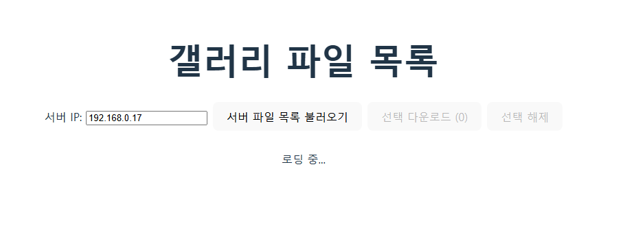
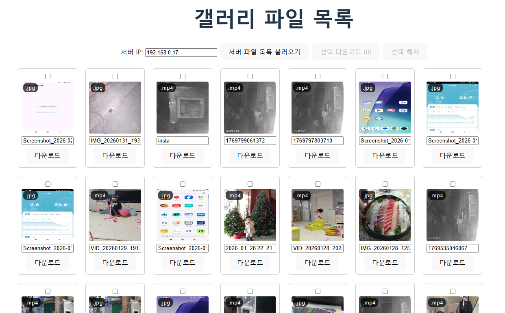

## 1. 기존 프로그램들의 문제점
- **윈도우즈의 휴대폰과 연결**: 동영상 파일 동기화는 지원되지 않음
- **탐색기를 통한 연결**: 동영상 파일의 경우 한 번 재생하면 미리보기가 나타나지 않는 경우가 발생, HEIC 등의 파일은 썸네일을 보기 위해 별도의 확장프로그램을 설치해야 함
- **FTP 앱을 통한 연결**: 썸네일이 보이지 않는 경우가 대부분
- **클라우드를 통한 연결**: 업로드 시간이 소요되고, 용량 한계가 있음

## 2. 굿떰의 경우
- [github](https://github.com/reddol18/good_thumb)
- 플러터로 제작된 앱이 서버가 되고, 로컬에서 실행되는 VUE.JS 기반 클라이언트가 파일 정보를 가져옴
- 몇 가지 편리한 기능을 제공하여, 파일을 쉽게 다운로드할 수 있음

    

## 3. 사용 방법
1. 옮겨 올 파일들을 스마트폰 갤러리 폴더로 복사(혹은 이동)
2. 서버 앱을 실행하고, 로컬 네트워크 상에서의 서버 주소를 확인
    - 
    - 서버가 띄워지는데 1~2분의 시간이 소요 됩니다.
    - 
3. 클라이언트 앱을 실행하고 브라우저에서 접속
    - ``cd pc_client``
    - ``npm run dev``
    - 이때 반드시 앱을 띄워놓은 상태에서 클라이언트를 실행해야 합니다. (백그라운드 모드 지원 X)
    - 
4. 서버 주소를 입력 후 접속
    - 
5. 브라우저의 기본 다운로드 폴더를 원하는 폴더로 수정
6. 가져올 파일들을 확인하고 체크하여 다운로드
7. 원하면 파일명을 직접 수정하여 다운로드 가능
8. 파일명 입력창에서 엔터키를 누르면 해당 파일이 선택되고, 다음 파일의 파일명 입력창으로 이동
9. 파일명 입력창에서 탭키를 누르면 파일 선택은 생략하고 다음 파일의 파일명 입력창으로 이동

## 4. 앞으로의 계획
- 배포 및 실행이 쉬운 클라이언트 프로그램 제작
- 백그라운드 모드에서도 서버와 통신 가능하도록 처리