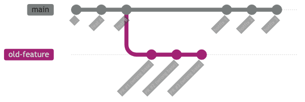
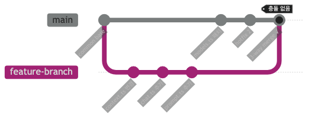
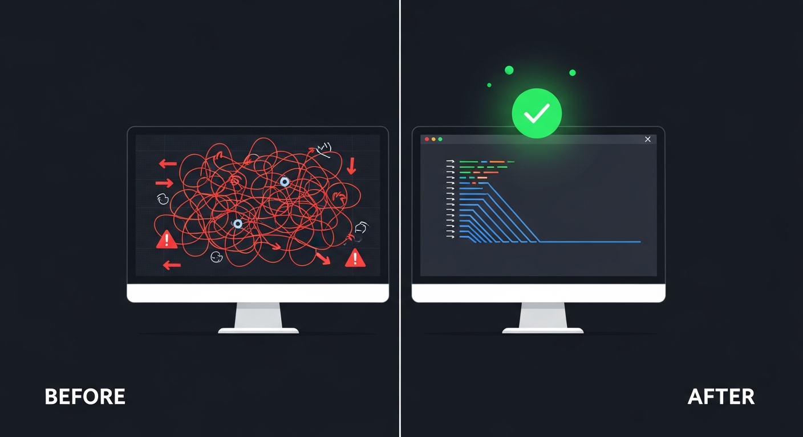

> 지침 문서의 빈틈 + 모델의 판단 실수 + 외부 서비스 장애가 겹쳤을 때 무슨 일이 일어나는가

## 사건의 시작

우리 팀은 AI 에이전트를 활용한 개발 파이프라인을 운영 중이다. 기능 구현부터 코드 리뷰, 테스트, PR 생성까지 AI가 각 역할을 맡아 순서대로 진행하는 방식이다. 평소처럼 여러 이슈를 연달아 처리하던 중, 아무도 눈치채지 못한 채 작은 실수 하나가 조용히 시작됐다.

---



## 무엇이 잘못됐나

### 문제 1 — 잘못된 base 브랜치

AI가 PR을 생성할 때 `--base main`을 명시하지 않았다. `gh pr create`는 base를 자동으로 추론하는데, 이 과정에서 오래전에 만들어진 채 닫히지 않은 feature 브랜치를 base로 잡았다. 이 브랜치는 main보다 수십 개의 커밋이 뒤처진 상태였다.

첫 번째 PR이 잘못된 base에 머지되자, 이후 PR들도 그 브랜치를 base로 연쇄 생성됐다. 결과적으로 3개의 PR이 main이 아닌 오래된 feature 브랜치 위에 쌓였다.



```
main ──●──●──●──●  ← 정상 커밋들이 여기 쌓이고 있었음
        \
         ●──●──●   ← PR 3개가 여기 잘못 머지됨
```

### 문제 2 — 지침 문서의 누락

파이프라인 지침에는 브랜치를 `main`에서 만들라는 규칙은 있었다. 그러나 **PR 생성 시 `--base main`을 반드시 명시하라**는 규칙은 없었다. AI는 명시되지 않은 규칙을 스스로 채워 넣지 못했다.

인간 개발자라면 "당연히 main이겠지"라고 문맥에서 유추했을 것이다. AI는 그렇지 않았다.

### 문제 3 — GitHub 인시던트가 원인 파악을 흐렸다

문제를 발견하고 원인을 추적하던 중, 마침 GitHub에서 PR 인덱싱 관련 인시던트가 진행 중이었다. Elasticsearch 손상으로 일부 PR이 저장소 목록에 표시되지 않는 현상이었다. 이 때문에 "GitHub 버그로 main에 반영이 안 보이는 것 아닐까?"라는 오해가 잠시 생겼다.

그러나 `gh api`로 각 PR의 `base.ref`를 직접 조회한 결과, 명확히 잘못된 브랜치를 가리키고 있었고 GitHub 인시던트와는 무관한 것으로 확인됐다. 외부 노이즈에 흔들리지 않고 1차 데이터를 직접 확인한 것이 빠른 원인 규명으로 이어졌다.

---

## 얼마나 위험했나

가장 큰 우려는 **소스코드 퇴행**이었다. 오래된 브랜치를 base로 쓴 뒤 main과 머지하면, 충돌 해소 과정에서 최신 코드가 이전 버전으로 덮일 수 있다.

실제로 머지 커밋의 diff를 파일 단위로 전수 검사한 결과:

- 두 줄기가 **서로 다른 파일과 함수 영역**을 수정했다
- 충돌이 전혀 발생하지 않았고, Git의 자동 3-way merge가 양쪽 변경사항을 모두 온전히 포함했다
- **소스코드 퇴행 없음** 확인



운이 좋았다. 만약 두 줄기가 같은 파일을 건드렸다면 훨씬 복잡한 상황이 됐을 것이다.

---

## 어떻게 수습했나

1. **상황 파악**: `gh api`로 각 PR의 `base.ref`를 직접 조회해 정확한 구조 확인
2. **동기화 PR 생성**: 잘못 쌓인 feature 브랜치 → main으로의 동기화 PR을 새로 생성
3. **코드 검증**: 머지 커밋 diff 전수 검사로 소스코드 퇴행 여부 확인
4. **배포 진행**: 안전 확인 후 전체 서비스 순차 배포



---

## 재발 방지

### 지침 문서에 추가된 규칙

```
PR 생성 시 반드시 --base main 을 명시할 것.
gh pr create 에서 base 자동 추론에 의존하지 않는다.
PR 생성 직후 gh pr view {번호} --json base 로 base 브랜치를 반드시 검증한다.
```

### 오래된 브랜치 정리

닫히지 않은 feature 브랜치는 자동 추론 오탐의 원인이 된다. 머지된 브랜치는 즉시 삭제하는 것을 원칙으로 한다.

---

## 교훈

**AI는 명시된 규칙만 따른다.** "당연히 main이겠지"라는 암묵적 전제는 규칙이 아니다. 파이프라인 지침은 "왜 실패했는가"를 역추적하며 계속 보완해야 한다.

**외부 장애는 원인 분석을 방해한다.** GitHub 인시던트처럼 무관한 노이즈가 끼어들 때, `gh api` 같은 1차 데이터 직접 조회가 빠른 판단의 기준이 된다.

**AI가 만든 문제는 AI가 함께 분석한다.** 이번 사후 분석도 AI와 함께 진행했다. git 그래프를 그리고, PR base를 추적하고, merge diff를 전수 검사하는 과정을 AI가 수행했다. 실수의 원인도 AI가 스스로 진단했다.

---