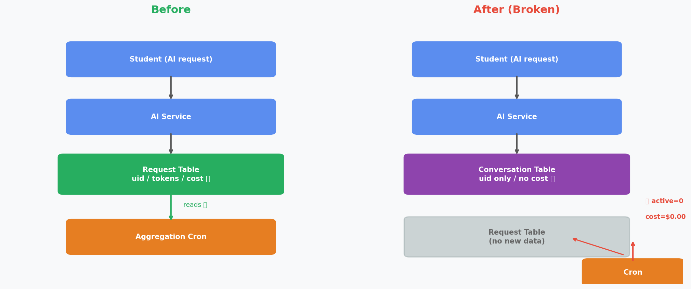
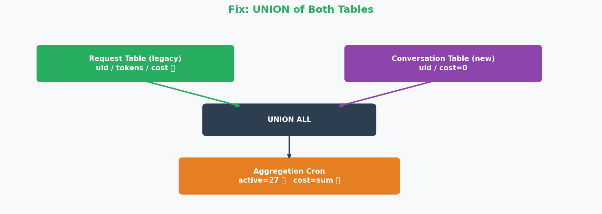
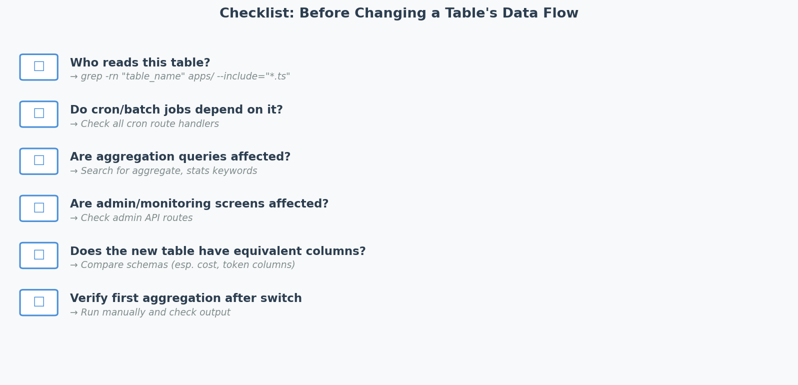

# AI 서비스 운영 중 배운 것: 데이터 흐름을 바꿀 때 놓치기 쉬운 것

## 상황

학생들이 AI와 대화하는 서비스를 운영하고 있습니다. 매일 자정마다 크론 잡이 돌면서 전날 AI 사용량(활성 사용자 수, 토큰 수, 비용)을 집계해 별도 통계 테이블에 저장합니다.

어느 날 채팅 기록 저장 방식을 개선했습니다. 기존에는 AI 요청 하나하나를 `요청 테이블`에 기록했는데, 대화 맥락을 더 잘 관리하기 위해 `대화 테이블` + `메시지 테이블` 구조로 전환한 것입니다. 기능적으로는 더 나은 구조였고, 전환 후 채팅도 잘 동작했습니다.

문제는 다음 날 발견됐습니다.

```
[aggregate-usage] date=2026-05-05 active=0 total=1050 costPerUser=$0.00000000
```

활성 사용자가 0명, 비용도 $0. 실제로 수십 명의 학생이 AI를 사용했는데도 말입니다.

---




## 원인

집계 크론은 `요청 테이블`을 기준으로 동작하고 있었습니다.

```
[기존 흐름]
학생 → AI 요청 → 요청 테이블 (uid, 토큰, 비용 저장)
                      ↑
               집계 크론이 여기를 읽음
```

채팅 저장 방식을 바꾼 후:

```
[변경 후 흐름]
학생 → AI 요청 → 대화 테이블 / 메시지 테이블 (uid만, 비용 없음)
                      
요청 테이블 ← 더 이상 신규 데이터 없음
      ↑
집계 크론은 여기만 계속 읽고 있음 → active=0



```

채팅 저장 방식을 바꾸는 목표에만 집중하다 보니, **그 테이블을 읽고 있던 다른 코드**를 미리 파악하지 못했습니다.

---

## 왜 놓쳤을까

변경 전에 자문해야 할 질문은 이것이었습니다.

> "이 테이블을 지금 누가 읽고 있는가?"

단순한 grep 한 줄이면 됐습니다.

```bash
grep -rn "요청_테이블명" apps/ --include="*.ts"
```

결과를 보면 크론, 어드민 API, 집계 로직 등이 모두 나왔을 것이고, 각각 영향 여부를 검토할 수 있었을 것입니다. 하지만 이 단계를 건너뛰었습니다.

---

## 수정

두 가지 수정이 필요했습니다.

**1차 수정**: 활성 사용자 집계를 새 테이블 기준으로 전환

```sql
-- 기존: 요청 테이블만
SELECT COUNT(DISTINCT uid) FROM 요청_테이블
WHERE date = yesterday AND status = 'done'

-- 수정: 메시지 테이블 기준으로
SELECT COUNT(DISTINCT c.uid)
FROM 메시지_테이블 m
JOIN 대화_테이블 c ON c.id = m.conversation_id
WHERE date = yesterday AND m.role = 'assistant'
```

→ 활성 사용자는 복원됐지만 비용은 여전히 $0.

**2차 수정**: 메시지 테이블에는 비용 컬럼이 없다는 걸 발견. 두 테이블을 UNION해서 집계

```sql
SELECT
  COUNT(DISTINCT uid) AS active_users,
  SUM(cost_usd)       AS total_cost
FROM (
  -- 구버전: 비용 정보 있음
  SELECT uid, cost_usd FROM 요청_테이블
  WHERE date = yesterday AND status = 'done'
  
  UNION ALL
  
  -- 신버전: 비용 정보 없음(0으로)
  SELECT c.uid, 0 AS cost_usd
  FROM 메시지_테이블 m
  JOIN 대화_테이블 c ON c.id = m.conversation_id
  WHERE date = yesterday AND m.role = 'assistant'
) combined



```

---

## 배운 것

### 테이블/컬럼을 변경하기 전 반드시 확인할 것

| 확인 항목 | 방법 |
|----------|------|
| 이 테이블을 읽는 코드가 어디 있는가 | `grep -rn "테이블명" apps/` |
| 크론/배치 잡이 이 테이블에 의존하는가 | 크론 목록 전체 확인 |
| 집계/통계 로직이 영향 받는가 | 집계 관련 코드 확인 |
| 어드민/모니터링 화면이 영향 받는가 | 어드민 API 확인 |

### 데이터 흐름 전환 시 체크리스트

```
□ 기존 테이블을 읽는 모든 코드 파악 완료
□ 각 코드가 신규 테이블로 함께 전환됐는가, 또는 영향 없는가 확인
□ 새 테이블에 기존 테이블과 동등한 컬럼(특히 집계에 필요한 것)이 있는가
□ 전환 후 첫 집계 실행 결과 검증



```

### 근본 원인

기능 변경의 목표("채팅 저장 구조 개선")에만 집중하고, 변경의 **다운스트림 영향**을 사전에 체계적으로 점검하지 않았습니다. 변경 전 5분의 grep이 수정-배포-재수정 사이클 몇 시간을 아낄 수 있었습니다.

---

## 결론

AI 에이전트가 코드를 작성할 때도, 사람이 코드를 작성할 때도 마찬가지입니다. **"이게 잘 동작하는가"와 "이걸 바꿀 때 다른 무엇이 깨지는가"는 별개의 질문입니다.** 후자를 먼저 묻는 습관이 안정적인 운영의 기본입니다.
