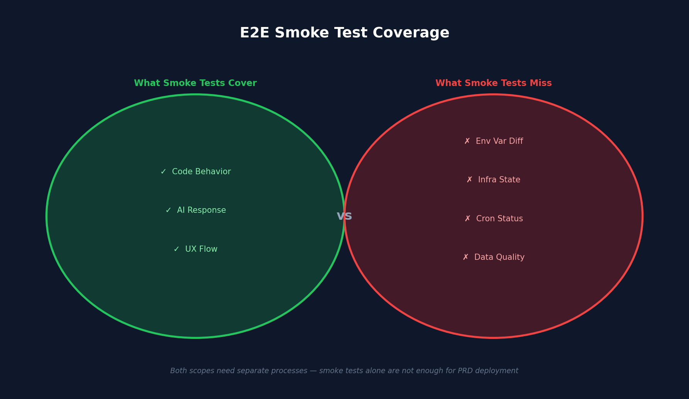
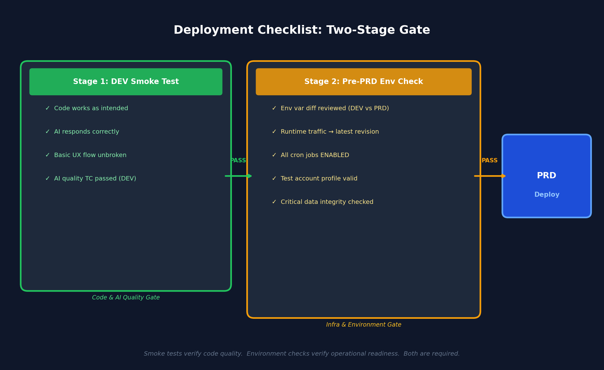
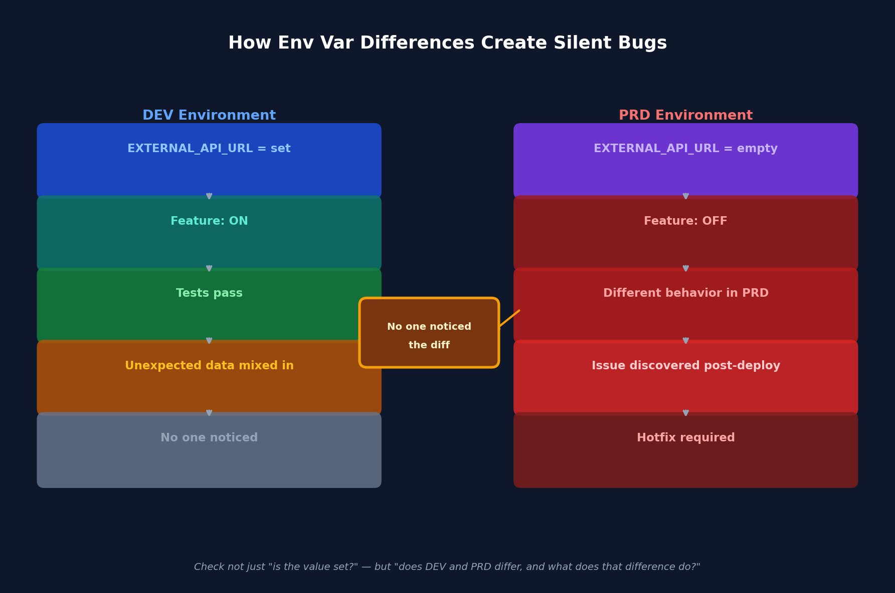

---

## 무슨 일이 있었나

PRD 배포 전 E2E 스모크 테스트를 돌렸다. 13개 TC 전부 PASS. 자신 있게 배포했다.

그런데 배포 직후 PRD에서 문제가 연속으로 터졌다.

1. **특정 콘텐츠 카드가 하나도 안 보임** — 테스트 계정의 프로필 설정값이 데이터 없는 케이스를 가리키고 있었음
2. **다른 학교 A의 데이터가 학교 B 계정에 노출** — 외부 플랫폼 연동 URL 환경변수의 DEV/PRD 존재 여부 차이
3. **AI 에이전트 진입 시 오류** — 클라우드 런타임 트래픽이 구 리비전에 묶여 있었음
4. **외부 데이터 없음** — 데이터 수집 크론이 PAUSED 상태였음
5. **AI 에이전트 응답에 금지 문구 포함** — 프롬프트 금지 지시를 AI가 무시함
6. **특정 필드가 "null"로 표시** — RAG DB에 OCR 오류로 유입된 불량 데이터

테스트는 통과했다. 그런데 PRD는 망가져 있었다. 이게 어떻게 가능한가.

---

## 테스트가 오래 걸린 이유

### 1. 실제 AI SSE 스트리밍을 쓰기 때문에 기다리는 시간이 길다

스모크 테스트는 mock 없이 실제 Anthropic/Gemini API를 호출한다. AI 응답 하나를 기다리는 데 10~30초가 걸린다. 챗봇 품질 TC 여러 개가 각각 2턴 대화를 하므로, 순수 대기 시간만 해도 상당하다.

```
챗봇 품질 TC-1: 콘텐츠 추천 에이전트 2턴 → ~40초
챗봇 품질 TC-2: 역질문 에이전트 + 2턴 → ~60초
에이전트 응답 TC: AI 에이전트 자료 없는 질문 → ~30초
...
```

이는 피할 수 없는 구조적 한계다. E2E 스모크는 "진짜 AI가 진짜 응답을 돌려주는지"를 검증하는 게 목적이므로, mock을 쓰면 본래 의미가 없어진다.

> **핵심 교훈**: 실제 AI를 통과하는 E2E 테스트는 빠를 수 없다. 속도보다 신뢰성 있는 검증을 우선하되, 그 대기 비용을 설계에 반영하라.

### 2. DOM 셀렉터가 불안정했다

초기에 어시스턴트 메시지를 CSS 클래스 조합으로 잡았는데, 다른 컴포넌트의 유사한 스타일 클래스와 충돌이 발생했다. 결국 ChatPanel 영역을 명시적으로 스코핑해서 해결했지만, 이 과정에서 디버깅 사이클이 반복됐다.

> **핵심 교훈**: CSS 클래스 기반 셀렉터는 스타일 변경에 취약하다. `data-testid` 같은 테스트 전용 어트리뷰트로 교체하면 유지보수 비용이 줄어든다.

### 3. AI 스트리밍 race condition

메시지 전송 직후 AI가 응답을 막 시작하는 시점에 텍스트를 읽으면 길이가 0이다. `not.toHaveText("")` 체크만으로는 부족했고, `waitForFunction`으로 응답 텍스트가 충분히 채워질 때까지 대기하는 로직이 필요했다. 이런 타이밍 문제를 찾고 수정하는 데 시간이 소요됐다.

> **핵심 교훈**: 비동기 스트리밍 응답을 테스트할 때는 "비어있지 않다"가 아닌 "충분히 채워졌다"를 기준으로 삼아야 race condition을 피할 수 있다.

### 4. 추천 질문 클릭 후 입력 시도 문제

추천 질문을 클릭하면 AI가 자동으로 응답을 시작한다. 이 스트리밍이 끝나기 전에 두 번째 메시지를 보내려고 하면 전송 버튼이 disabled 상태다. ChatPanel 진입 방식을 바꿔서 해결했지만, 이 역시 한 사이클을 소비했다.

> **핵심 교훈**: 인터랙션 순서가 UI 상태에 의존할 때는, 테스트 시나리오가 UI의 상태 전이를 명시적으로 고려해야 한다.

---

## 테스트가 통과했는데 PRD에서 문제가 생긴 이유

결론부터 말하면, **DEV 스모크 테스트는 충분히 통합 테스트 역할을 했다.** 실제 AI API를 통과하는 전체 경로를 검증했고, 코드 동작에는 문제가 없었다.

문제는 다른 곳에 있었다. 발생한 6가지 이슈 중 코드 버그는 하나도 없었다.

### 문제 분류

| 문제 | 실제 원인 |
|------|-----------|
| 특정 콘텐츠 카드 안 보임 | PRD 테스트 계정 프로필 설정값 오설정 |
| 다른 학교 데이터 노출 | DEV/PRD 간 외부 플랫폼 연동 URL 환경변수 존재 여부 차이 |
| AI 에이전트 진입 오류 | 클라우드 런타임 트래픽이 구 리비전에 묶임 |
| 외부 데이터 없음 | 데이터 수집 크론 PAUSED 상태 |
| AI 금지 문구 포함 | AI 프롬프트 준수 실패 (확률적 동작) |
| null 필드 | RAG DB OCR 오류 데이터 |

전부 **배포 프로세스와 운영 상태의 문제**다. 코드 테스트로 잡을 수 있는 범위 바깥이다.

### 핵심 원인: 환경변수 diff를 검토하지 않았다

이번에 가장 결정적인 실수는 외부 플랫폼 연동 URL 환경변수였다.

- DEV 환경: `EXTERNAL_API_URL` — 설정됨 → 외부 플랫폼의 데이터를 가져오는 기능이 켜짐
- PRD 환경: `EXTERNAL_API_URL` — 비어있음 → 해당 기능이 꺼짐

DEV에서는 이 동작이 켜져 있었기 때문에 스모크 테스트 중 다른 학교 데이터가 섞여 들어왔어도 "원래 그런 데이터가 있나보다"고 넘어갔다. 인지 자체가 안 됐던 것이다. PRD에는 이 변수가 없어서 다른 동작을 했고, 그게 문제로 드러났다.

**단순히 "값이 채워져 있는가"가 아니라, "DEV와 PRD 사이에 존재 여부가 다른 변수가 있는가"를 확인하고, 있다면 그 변수가 동작에 어떤 영향을 주는지 검토하는 과정이 없었다.**

이건 테스트의 실패가 아니라 **배포 전 환경 검토 프로세스의 부재**다.

> **핵심 교훈**: 환경변수는 단순히 "값"이 아니라 "기능 스위치"다. DEV에서만 활성화된 변수가 테스트 결과를 오염시키고 있을 수 있다.

---

## 실질적인 문제: 스모크 테스트와 배포 전 체크리스트가 분리되지 않았다

현재 프로세스는 이렇다:

```
스모크 테스트 (DEV) → PASS → PRD 배포 → 문제 발견 → 핫픽스
```

스모크 테스트가 커버하는 것 (잘 동작함):
- 코드가 의도대로 동작하는가
- AI 응답이 오는가
- 기본 UX 흐름이 끊기지 않는가

배포 프로세스에서 별도로 챙겨야 하는 것 (현재 공백):
- DEV와 PRD 사이에 환경변수 구성 차이가 있는가, 있다면 그 의미는 무엇인가
- 클라우드 런타임 트래픽이 방금 빌드한 리비전에 붙어 있는가
- 크론 잡 상태가 모두 ENABLED인가




이 두 범주가 구분되지 않은 채 "테스트 통과 = 배포 완료"로 간주한 것이 착오였다.

> **핵심 교훈**: 스모크 테스트는 "코드 품질 게이트"다. "인프라 상태 게이트"는 별도로 운영해야 한다. 하나로 합치면 둘 다 제대로 못 한다.

---

## 무엇을 바꿔야 하나

### 1. PRD 배포 전 인프라 체크리스트를 별도로 운영한다




```markdown
## PRD 배포 전 체크리스트

### 환경 상태
- [ ] 클라우드 런타임 트래픽이 최신 리비전(방금 빌드한 것)에 100% 붙어 있는가
- [ ] 주요 환경변수가 의도한 값인가 (외부 플랫폼 연동 URL, CORS 허용 오리진 등)
- [ ] DEV와 PRD 간 환경변수 diff — 없어진 것, 새로 생긴 것, 값이 다른 것 — 각각의 동작 영향을 검토했는가
- [ ] 크론 잡 상태가 ENABLED인가 (데이터 수집 크론, 집계 크론 등)

### 데이터 상태
- [ ] PRD 테스트 계정의 프로필 설정값이 유효한 데이터를 가리키는가
- [ ] 핵심 RAG 데이터에 NULL/오류 값이 없는가

### 배포 직후 빠른 수동 확인 (5분)
- [ ] 앱 진입 → 주요 콘텐츠 카드 보이는가
- [ ] AI 에이전트 진입 → 오류 없는가
- [ ] 외부 수집 데이터 있는가 (오늘 날짜 기준)
```

### 2. 스모크 테스트를 PRD에서도 돌린다 (테스트 계정 공유)

지금은 DEV 전용이다. PRD에도 동일한 테스트 계정을 두고, 배포 완료 후 자동으로 PRD 스모크를 돌리면 데이터 불일치 문제를 조기에 발견할 수 있다.

단, PRD 스모크는 실제 AI 비용이 나가고 DB에 흔적이 남기 때문에 **전체 시나리오가 아닌 핵심 화면 렌더링과 최소한의 TC만 돌리는 "미니 스모크"** 로 제한하는 게 합리적이다.

```bash
# PRD 미니 스모크 — AI 응답 포함 TC 제외, 핵심 화면 렌더링만
BASE_URL=https://your-prd-domain.example.com \
  npx playwright test tests/e2e/prd-smoke-test-student-flow.spec.ts \
  --project="Mobile Chrome" \
  --grep "TC-SMOKE-[1-6]"
```

> **핵심 교훈**: PRD 스모크는 비용과 흔적을 감수해야 하므로 최소화하되, 완전히 없애면 배포 후 문제를 놓친다. "미니 스모크" 레이어를 별도로 설계하라.

### 3. AI 응답 품질은 DEV 스모크 테스트가 이미 검증한다

흔히 이런 생각을 한다: "PRD AI 파이프라인도 직접 테스트해야 하지 않나?" 하지만 오프라인에서 AI API를 직접 호출하는 평가는 실제 경로와 다르다. 컨텍스트 조립 함수, 프롬프트 캐싱 헤더, 모델 버전, 동적 프롬프트 조립 순서까지 포함한 진짜 파이프라인을 검증하려면 실제 서버를 통해야 한다.

DEV 스모크 테스트가 이 역할을 이미 수행하고 있다. 별도 레이어를 추가하는 것보다, **AI 품질 관련 TC가 PRD 배포 이전에 반드시 DEV에서 통과해야 한다는 게이트를 명확히** 하는 게 현실적이다.

다만 AI는 확률적으로 동작하므로, "한 번 통과 = 영구 보장"이 아니다. 프롬프트를 수정했을 때 재검증이 필요하다는 점은 운영 규칙으로 명시해두는 것으로 충분하다.

> **핵심 교훈**: AI 품질 검증은 "코드 레벨 단위 테스트"가 아닌 "파이프라인 전체 통합 테스트"여야 한다. DEV 서버를 통과하는 E2E가 그 역할을 담당한다.

### 4. 스모크 테스트 DOM 셀렉터를 안정화한다

테스트가 깨지는 주된 이유 중 하나가 CSS 클래스 기반 셀렉터다. 컴포넌트 스타일이 바뀌면 테스트도 같이 깨진다.

```tsx
// 취약한 방식: CSS 클래스 의존
// → 스타일 변경 시 테스트 함께 깨짐

// 안정적인 방식: data-testid 명시
<div data-testid="assistant-message">...</div>
// → page.locator('[data-testid="assistant-message"]')
```

핵심 컴포넌트(채팅 패널, 메시지 버블, 전송 버튼 등)에 `data-testid`를 붙이면 스타일 변경에 무관하게 테스트가 안정적으로 동작한다. 테스트 작성 시간도 줄어든다.

> **핵심 교훈**: 테스트 셀렉터는 테스트를 위해 존재한다. 스타일에 기생하지 말고 `data-testid`로 명시적으로 선언하라.

### 5. 테스트 환경 데이터를 코드로 관리한다

흔히 이런 상황이 생긴다: 테스트 계정의 상태가 수동으로 설정되어 있어서 언제 망가질지 모른다. 누군가 DB를 손대면 테스트가 갑자기 실패한다.

```typescript
// 테스트 시작 전 DB 상태를 픽스처로 초기화
test.beforeAll(async () => {
  await db.execute(sql`
    UPDATE test_profiles
    SET profile_setting_a = ${'expected_value'}, profile_setting_b = 1
    WHERE uid = ${TEST_UID}
  `);
  await db.execute(sql`DELETE FROM test_entries WHERE uid = ${TEST_UID}`);
});
```

이렇게 하면 테스트가 자체적으로 필요한 상태를 보장한다. 수동 DB 조작 없이 반복 실행이 가능해진다.

> **핵심 교훈**: 테스트는 자신이 필요한 환경을 스스로 만들어야 한다. 수동으로 세팅된 데이터에 의존하는 테스트는 언제든 깨질 준비가 된 테스트다.

---

## 정리: 이번 경험이 가르쳐준 것

DEV 스모크 테스트는 제 역할을 했다. 코드와 AI 파이프라인은 검증됐다. 문제는 테스트가 아니라 **배포 전 환경 검토 프로세스가 없었다**는 것이다.

특히 DEV와 PRD 사이에 환경변수 구성이 다른 경우, 그 차이가 동작에 어떤 영향을 주는지를 배포 전에 한 번 생각하는 과정이 있었다면 환경변수 이슈는 사전에 잡을 수 있었다.

앞으로 필요한 건 두 가지다:

1. **DEV 스모크 테스트**: 현재 수준을 유지하되 DOM 셀렉터를 `data-testid` 기반으로 안정화한다. AI 품질 검증(챗봇 품질 TC 시리즈)은 이 안에서 충분히 커버된다.

2. **PRD 배포 전 환경 체크리스트**: 코드가 아닌 인프라·환경 상태를 사람이 확인하는 단계. 핵심은 "DEV와 PRD 간 환경변수 diff — 없어진 것, 새로 생긴 것, 값이 다른 것 — 각각의 동작 영향을 검토했는가"이다.

스모크 테스트에 더 많은 것을 기대하는 방향이 아니라, **스모크 테스트가 커버하지 않는 범위를 별도 프로세스로 명확히 분리하는 것**이 핵심이다.

---

## 부록: Playwright 작성 관점에서 배운 것

실제 AI SSE 스트리밍이 포함된 E2E 테스트를 처음 작성할 때 마주치는 문제들과 해결 패턴이다.

- **AI SSE 스트리밍 대기**: `not.toHaveText("")`로 부족하다. `waitForFunction`으로 응답 텍스트가 충분한 길이(예: 10자 이상)로 채워질 때까지 기다리는 로직이 안정적이다.

- **전송 취소 버튼 사이클 활용**: AI 응답 중엔 취소 버튼이 나타난다. 이 버튼이 나타났다가 사라지는 것을 기다리면 응답 완료를 신뢰성 있게 감지할 수 있다.

- **채팅 패널 스코핑**: 전체 페이지가 아닌 채팅 패널 컨테이너 내부로 어시스턴트 메시지 셀렉터를 한정해야 다른 컴포넌트와 충돌하지 않는다. 이를 위해 채팅 패널 컨테이너에 `data-testid`를 붙이는 것이 가장 확실한 방법이다.

- **역질문 에이전트 첫 메시지**: 사용자 메시지 없이 AI가 먼저 응답하는 에이전트는 초기 메시지 카운트가 0인 상태에서 1로 바뀌는 것을 기다리는 로직이 필요하다.

- **추천 질문 클릭 후 입력 시도**: 추천 질문 클릭이 AI 스트리밍을 시작시키고, 그 동안 전송 버튼이 disabled 상태가 된다. 두 번째 입력이 필요한 시나리오라면 채팅 패널 진입 방식을 바꾸거나 스트리밍 완료를 명시적으로 기다려야 한다.



