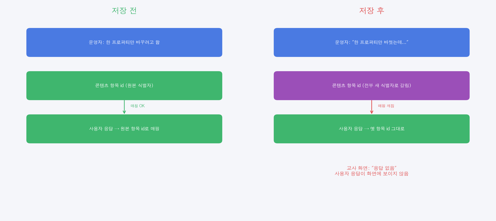
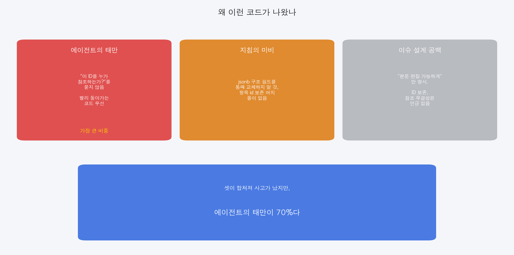
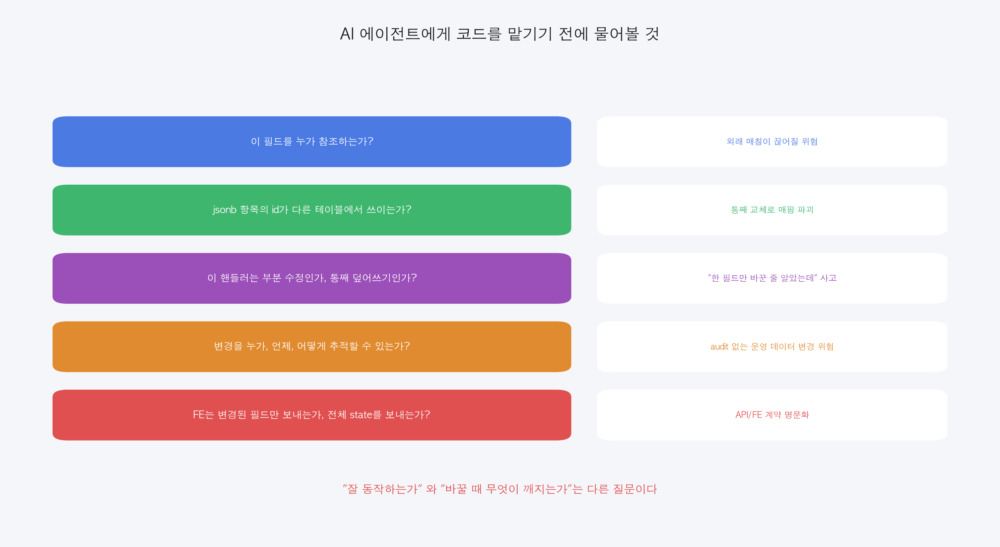

## 요약

운영자가 어드민에서 **콘텐츠 몇 건의 마감 날짜만 수정**한 줄 알았습니다. 그 결과 다수의 사용자가 작성한 응답이 교사용 조회 화면에서 "응답 없음"으로 표시되었습니다.

원인을 한 줄로 요약하면 이렇습니다.

> **프로퍼티 하나를 바꿔야 했는데 객체 전체를 갈아엎었다.**

이건 흔한 안티패턴입니다. **부분 갱신(PATCH)으로 처리해야 할 일을 전체 교체(PUT)로 대충 처리**하는 습관. 사람 개발자가 평생 반복해 온 실수이고, AI 에이전트도 똑같이 반복합니다.



---

## 사건 흐름

어느 날 오전, 어드민에서 콘텐츠 몇 건의 마감 날짜를 수정했습니다. 한 건당 한 번씩, 총 여러 번의 저장. 폼에는 기존 항목들이 그대로 떠 있었고 운영자는 날짜만 바꿨습니다.

오후, 같은 신고가 잇따라 들어오기 시작했습니다.

> "사용자는 응답을 완료한 상태인데 들어가 보면 답이 없어요"

DB를 들여다보니 진실은 단순했습니다.

```
[콘텐츠 측 항목 식별자 — 현재 상태]
ID가 모두 새 값으로 갈려 있음

[사용자 응답 측 — 참조하던 ID]
옛 식별자(원본 항목 id) 그대로 보존
```

수백 명이 원래 항목 id로 응답을 적어 두었는데, 콘텐츠 쪽 항목 id는 어느 시점에 한꺼번에 새 식별자로 갈렸습니다. 매칭이 끊어지니 화면엔 답이 안 보입니다. 데이터는 살아 있는데 보이지 않을 뿐.

새로 발급된 식별자들에는 모두 같은 타임스탬프 정보가 박혀 있었고, 그 시각이 정확히 운영자가 저장 버튼을 누른 순간과 일치했습니다. 사고의 발생 시점을 코드 한 줄 보지 않고도 식별자에서 역추적할 수 있었던 셈입니다.

---

## 안티패턴 — "객체 전체 덮어쓰기"

REST에서 메서드의 의미는 명확합니다.

| 메서드 | 의미 | 의도 |
|---|---|---|
| **PUT** | 자원 전체를 보낸 값으로 교체 | "이게 새 상태다" |
| **PATCH** | 보낸 필드만 부분 갱신, 나머지는 그대로 | "이 프로퍼티만 바꿔라" |

운영자의 의도는 "마감 날짜라는 **프로퍼티 하나만** 바꿔달라"였습니다. 따라서 PATCH가 정답입니다.

하지만 코드는 객체 전체(blocks 포함)를 PUT으로 보내고, 서버는 그걸 그대로 받아 적었습니다. PATCH로 처리해야 할 일을 PUT으로 처리한 것 — 이게 사고의 본질입니다.

이 안티패턴은 동시성 분야에서 **lost update**, 슬랭으로는 **clobbering**, 데이터 정합성 측면에선 **last-write-wins 안티패턴**으로 불립니다. 부르는 이름은 달라도 같은 실수입니다. 한 사람이 일부만 바꾸려고 보낸 요청이 다른 정보를 통째로 덮어쓰는 것.

빠르고 편하기 때문에 자주 반복됩니다. 그게 안티패턴의 정의이기도 합니다 — **처음엔 잘 동작하지만 시간이 지나면 정합성을 깨뜨리는 관습**.

---

## 또 하나의 안티패턴 — "빈 초기값으로 시작"

이번 사고를 더 깊이 들여다보면 두 번째 안티패턴이 보입니다. 어드민 폼은 이런 구조입니다.

- 페이지가 처음 뜰 때 폼 state의 **초기값을 "새 식별자 한 개짜리 빈 항목"** 으로 잡는다.
- 그 뒤 비동기로 서버에서 실제 데이터를 받아 state를 덮어쓴다.

문제는 두 가지입니다.

1. **fetch가 늦거나 실패하면 빈 한 칸이 그대로 살아 있다.** 이 상태에서 저장 버튼을 누르면 이 한 칸이 진짜 상태로 굳혀집니다.
2. **응답이 비어 있을 때 "사용자 편의를 위해" 또 빈 한 칸을 만든다.** 친절한 fallback이 데이터를 덮습니다.

이 패턴을 일반화하면 이렇습니다.

> **빈 값을 임시 상태로 두고 비동기로 채우는 동안 저장 가능한 폼.**

UI가 잠시 텅 비어 보이는 게 보기 흉하니 "기본값 한 개라도 깔고 시작"하는 발상에서 출발합니다. 빠르고 편합니다. 그리고 위험합니다. 사용자가 비동기 fetch보다 빨리 저장 버튼을 누르거나, fetch가 실패하거나, 응답이 예상 형식과 다르면 그 빈 초기값이 진짜 데이터가 되어 운영 데이터를 덮습니다.

올바른 방향은 명료합니다.

- **로딩 동안엔 저장 UI 자체를 띄우지 말 것**.
- **fetch 실패·빈 응답 시엔 "데이터를 가져올 수 없습니다"로 분기**할 것. "빈 한 칸이라도 보여주자"는 친절은 운영 데이터 폼에선 사고의 씨앗.
- **폼 state 초기값은 `null` 또는 unset**으로 두고, 명시적으로 fetch가 완료된 시점부터만 폼을 활성화.

이 안티패턴엔 정해진 이름은 없지만 흔히 **optimistic empty initialization**, 혹은 **uninitialized save race**라고 부릅니다. 비동기 로딩과 저장이 같은 state를 공유할 때 항상 의심해야 할 패턴입니다.

이번 사고의 데이터를 보면 정황 증거도 있습니다. 같은 시점에 똑같이 저장을 한 여러 콘텐츠 중, 어떤 건 항목이 줄어들고 어떤 건 개수가 그대로 였습니다. 운영자의 입력이 동일했다면 결과도 같아야 하는데 다릅니다. 즉 저장 시점마다 폼이 보고 있던 state가 달랐다는 뜻이고, 가장 그럴듯한 설명은 **fetch 응답 타이밍과 초기값의 상호작용**입니다.

---

## 두 줄짜리 코드의 두 가지 잘못

### 프런트엔드 — 매번 새 식별자

어드민 폼은 화면에 있는 항목을 저장할 때, 매번 새 식별자를 발급하는 헬퍼 함수에 의존합니다. "새 항목 추가" 버튼을 눌렀을 때만 식별자를 새로 만들어야 하는데, 코드 구조상 **폼을 다시 열 때마다 항목 객체가 재생성되며 식별자가 새로 발급**됩니다. 사용자 응답과의 연결고리는 이미 끊어진 채 저장 요청이 떠납니다.

요점: **항목의 정체성을 의미하는 id는 처음 만들어진 그대로 보존되어야** 한다. 매 저장마다 새로 발급된다면 그건 더 이상 id가 아니라 일회용 토큰입니다.

### 백엔드 — PATCH여야 할 자리에 PUT

핸들러는 형식상 PUT 메서드이고, 내부 로직은 "받은 필드만 적용"하려는 PATCH 시맨틱처럼 보이지만 실제로는 클라이언트가 보낸 jsonb 객체를 그대로 신뢰해 통째 교체합니다. 의미와 동작이 어긋난 상태 — **HTTP semantics mismatch**.

이 한 줄에 대고 묻고 싶은 질문은 단 하나입니다.

> "이 구조 필드 안의 id가 다른 어딘가에 참조되고 있는가?"

답은 yes일 가능성이 높습니다. 사용자 응답이 항목 id로 매핑되어 있는 도메인은 흔합니다. grep 한 번이면 보이는 사실인데, "전체 객체를 받아 set"하는 안티패턴이 이 질문 자체를 묻지 않게 만듭니다.

---

## 왜 이런 코드가 나왔나



이 사건의 원인 분포를 정리하면 이렇습니다.

**1. 에이전트의 태만 (가장 큰 비중)**

`genId()`를 매번 부르는 코드와 `body.blocks`를 통째 덮어쓰는 코드는 모두 "빨리 동작하게 만들기"의 흔적입니다. 시니어 개발자라면 즉시 떠올릴 질문 — "이 ID를 누가 참조하는가?" — 을 하지 않았습니다. 코드를 작성한 주체가 사람이든 AI든 같은 종류의 태만입니다.

특히 AI 에이전트는 **즉시 돌아가는 코드를 우선시**하는 경향이 강합니다. 사용자가 "어드민 폼에서 과제를 수정할 수 있게 해줘"라고 하면, 폼을 띄우고 PUT을 보내는 가장 짧은 경로를 찾습니다. 그 PUT이 다른 테이블의 정합성을 깨뜨릴 수 있다는 점은 명시적으로 묻지 않으면 짚지 않습니다.

**2. 지침의 미비**

팀 가이드에 "다운스트림을 grep으로 먼저 확인하라"는 룰은 있었습니다. 하지만 **"jsonb 구조 필드를 통째 교체하지 말 것, 항목 ID를 보존하며 머지하라"** 같은 데이터 무결성 룰은 명문화되어 있지 않았습니다. 룰이 있었으면 리뷰에서 잡혔을 사안입니다.

**3. 이슈 설계의 공백**

원본 이슈는 "어드민에서 과제 본문을 편집 가능하게" 만 요구했습니다. ID 보존, 참조 무결성, 운영 데이터 보호 같은 비기능 요구사항은 적히지 않았습니다. 그래도 그건 당연한 전제라고 면책되진 않습니다.

---

## 무엇을 고쳤나

데이터 복구는 운이 좋은 편이었습니다.

- 운영과 분리된 환경에 원본 구조가 그대로 보존되어 있었습니다
- 사용자 응답 측에는 원래 항목 id가 살아 있었습니다
- 원본을 운영에 덮어 쓰면서 항목 id를 옛것으로 되돌리니 매핑이 즉시 복구됐습니다

그 사이 사고 발생 이후 새 id로 응답을 저장한 일부 사용자는 별도로 마이그레이션했습니다. 일부는 한 칸짜리 화면을 본 채로 여러 문항 답을 한 칸에 합쳐 적었기에, 그건 분리해 옮겼습니다.

근본 수정은 두 가지로 갑니다.

1. **프런트엔드** — 항목 id를 매번 새로 발급하지 말고 기존 id를 보존. 즉 객체를 새로 만들지 말고 **프로퍼티만 갱신**.
2. **백엔드** — PUT 핸들러를 **PATCH 시맨틱**으로 정리. 구조 필드가 들어와도 항목 id를 보존해 머지. 클라이언트 버그가 또 나도 객체 전체가 갈리지 않게.

---

## 에이전틱 개발자에게



이 글이 강조하고 싶은 건 단 하나입니다.

> **"프로퍼티를 바꾸려는가, 객체를 바꾸려는가."**

이 구분을 매 변경마다 의식하는 것이 안티패턴을 차단하는 첫 단추입니다. PUT으로 모든 걸 처리하는 습관은 빠르지만, 그 속도가 운영 데이터를 잠재적으로 갈아엎습니다.

AI 에이전트는 "동작하게" 만드는 일에 강합니다. 하지만 "동작은 같지만 시맨틱이 다른 두 선택지" 중에 위험한 쪽을 무심히 고르는 일도 잦습니다. 그래서 사람이 묻거나, 룰로 강제하거나, 리뷰에서 잡아야 합니다.

### 잠깐 — "최첨단 코드 리뷰 스킬을 쓰면 되지 않나?"

요즘은 코드 리뷰를 자동화해주는 잘 다듬어진 스킬 팩들이 공개되어 있습니다. 검증된 체크리스트와 specialist를 여러 갈래로 나눠 PR 하나에 다관점 리뷰를 자동으로 돌려주는 도구들입니다. 한번 끌어다 쓰면 우리 사고 같은 게 사전에 잡힐 것 같죠.

실제로 그중 하나의 리뷰 체크리스트와 'API Contract specialist' 항목까지 본문을 들여다봤습니다. SQL 안전성, race condition, 인증 누락, 타입 강제 변환, CI/CD 파이프라인까지 정말 광범위하게 잡습니다. 그런데 — **PUT/PATCH 시맨틱을 구분해 부분 갱신이 통째 교체로 변하지 않는지** 보는 항목, **jsonb 배열을 통째 교체할 때 항목 id가 다른 테이블에서 참조되는지** 보는 항목은 명시적으로 없었습니다. Breaking changes 섹션에 "필드 타입 변경"이 있을 뿐, 부분 업데이트 의미론은 별개 영역으로 다뤄지지 않습니다.

체크리스트가 부실해서가 아닙니다. **이 안티패턴이 워낙 도메인 의존적이라 일반 체크리스트에 박기 어렵기 때문**입니다. "이 jsonb 안의 id가 다른 테이블의 외래키로 쓰이는가"는 그 서비스의 스키마와 운영 패턴을 알아야 답할 수 있는 질문입니다. 일반화된 리뷰 도구로는 "수상한 패턴이 있다"까지는 잡아도, "이 특정 jsonb 교체가 사용자 응답 매핑을 파괴할 것이다"까지는 추론하지 못합니다.

그리고 비용. 다관점 specialist 7~8개를 PR 하나에 매번 돌리면 토큰이 통상 리뷰의 5~10배로 늘어납니다. 우리는 그걸 매일 수십 번 돌립니다. 더 정확하지도 않은 리뷰에 그 비용을 쓰는 건 다른 형태의 태만입니다.

결국 길은 같은 곳으로 돌아옵니다 — **사내 사고로 한 번 얻어맞은 안티패턴을 사내 리뷰 룰에 명문화해 두는 것**. 일반 도구가 비워둔 칸은 그 도메인을 가장 잘 아는 사람·팀이 채워야 합니다. 이 글이 우리 리뷰 체크리스트의 그 한 칸을 채우는 자료가 되기를 바랍니다.


코드 변경을 받기 전에 에이전트에게 던질 질문 몇 가지.

| 질문 | 왜 묻는가 |
|---|---|
| 이건 프로퍼티 갱신인가, 객체 교체인가 | PATCH/PUT 시맨틱 어긋남 차단 |
| 이 필드를 누가 참조하는가 | 외래 매칭이 끊어질 위험 |
| 이 jsonb의 항목 id가 다른 테이블에서 쓰이는가 | 통째 교체로 매핑 파괴 |
| 폼의 초기값과 fetch 결과 중 무엇이 저장되는가 | 빈 초기값 race로 운영 데이터 덮어쓰기 |
| 이 변경을 누가, 언제, 어떻게 추적할 수 있는가 | audit 없는 운영 데이터 변경의 위험 |
| FE는 전체 폼 state를 보내는가, 변경된 필드만 보내는가 | API/FE 계약 명문화 |

AI 에이전트가 코드를 짜는 시대에 이 질문들이 줄어들 거라는 기대는 틀렸습니다. 오히려 늘려야 합니다. 에이전트는 빠르게, 그리고 무심하게, 사람 개발자가 평생 동안 반복해 온 안티패턴을 그대로 재현합니다.

이 글의 원래 제목은 "AI도 사람처럼 일을 엉망으로 한다"였습니다. 운영 책임을 지는 입장에선 그 사실을 인정하는 데서 시작해야 합니다. 시작점은 단순합니다 — **객체를 바꾸려는가, 프로퍼티를 바꾸려는가**를 매번 묻는 것.
