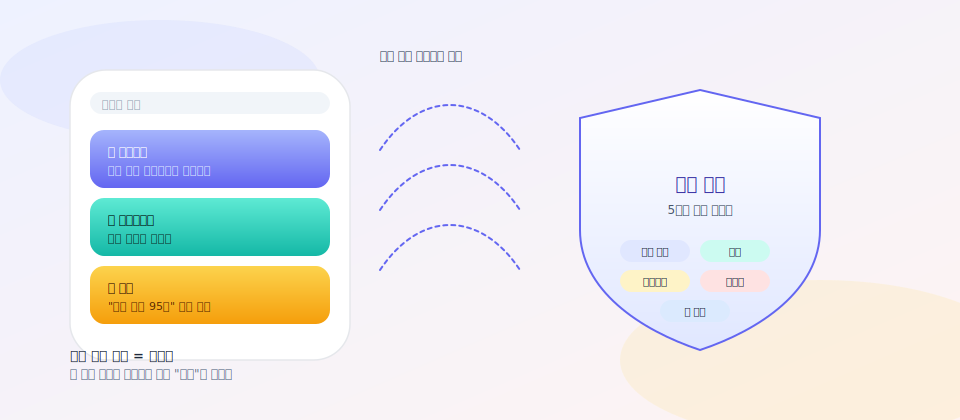
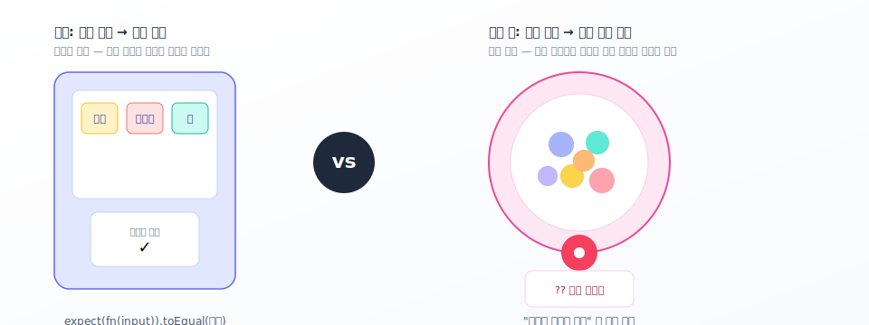
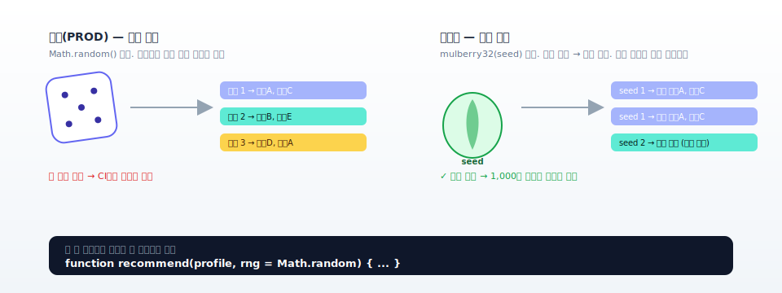
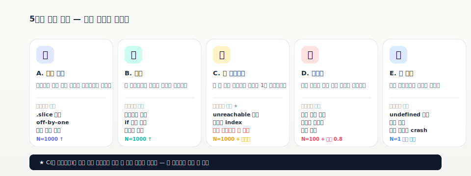
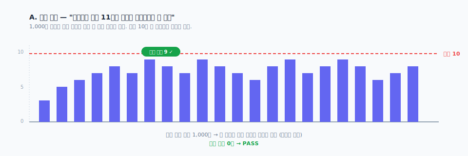
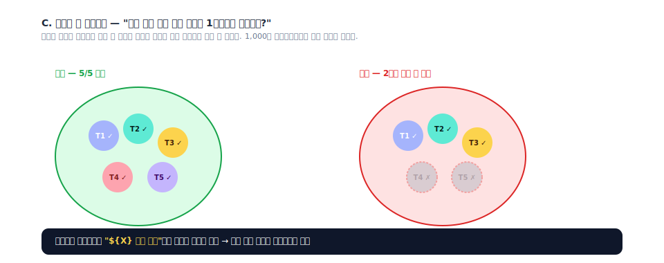
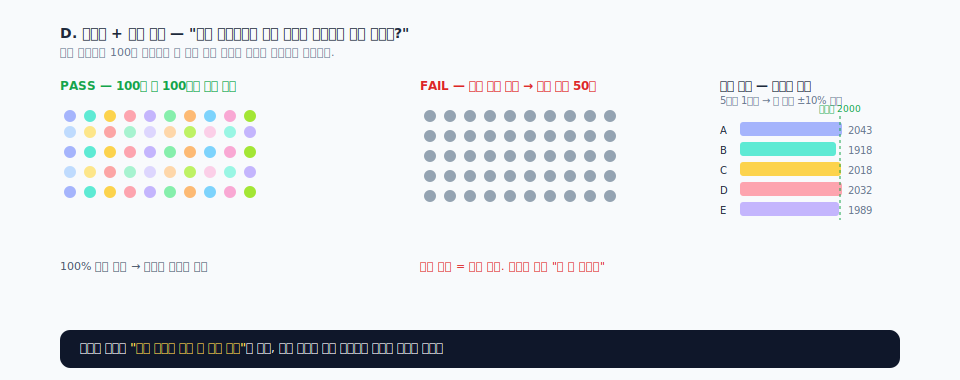

> 사용자별로 매번 다른 추천 카드를 보여주는 시스템은, 일반적인 "입력 → 기대값" 식의 자동 테스트로는 검증이 어렵다. "매번 달라야 한다"는 게 사양인데 어떻게 "값이 같다"를 확인하겠는가. 이 글은 그 문제를 통계적 검증으로 풀어낸 실전 기록이다.



---

## 누구를 위한 글인가

- **개발자**: 시드 가능한 PRNG · Fisher-Yates · 마스킹 같은 구현 디테일을 그대로 가져다 쓸 수 있다.
- **기획자 / 마케팅 / PM**: "왜 우리 추천이 매번 같아 보일까?", "신선도를 어떻게 보장하지?" 같은 비즈니스 질문에 답하기 위한 검증 프레임을 얻을 수 있다.

> 💡 **이 글의 비유 한 줄**  
> 기존 추천 = **자판기**(같은 버튼 → 같은 음료) ↔ 새 추천 = **가챠**(같은 손잡이 → 매번 다른 캡슐).  
> 가챠가 정상 작동하는지 보려면 "내가 누른 버튼에서 콜라가 나왔다"가 아니라 "캡슐 100개 중 모든 종류가 적어도 한 번씩 나왔다"를 확인해야 한다.

---



## 1. 시작점 — "왜 우리 추천이 매번 같아 보이지?"

원래 코드는 간단했다. 사용자 프로필을 받아 추천 카드 목록을 만든다.

```ts
function buildRecommendations(profile: Profile): Card[] {
  const out: Card[] = [];
  if (profile.tags.length > 0) {
    out.push({ text: `${profile.tags[0]} 관련 추천` });
  }
  if (profile.tags.length > 1) {
    out.push({ text: `${profile.tags[1]} 시작하기` });
  }
  // ...
  return out.slice(0, 6);
}
```

문제가 있다. 같은 사용자가 앱을 열 때마다 **늘 같은 카드 6장**이 떴다. 사용자 입장에서 "또 그거네"라는 인상이 되고, 클릭률은 시간이 지나면서 빠르게 내려간다.

그래서 다음과 같이 바꾸기로 했다.

| 변경 | 효과 |
|---|---|
| 입력 배열을 **무작위로 섞기**(셔플) | 같은 프로필이라도 카드 순서·후보가 매번 달라짐 |
| 텍스트는 카테고리별 **템플릿 풀**에서 랜덤 선택 | "고양이 관련 추천" / "고양이 사진 모음" / "고양이 시작하기" 등 표현 다양화 |
| 카테고리 신규 추가 (취미·목표 등) | 한 사용자에게 보여줄 후보 폭 확대 |
| 슬롯 상한 동적화 | 데이터가 많으면 더 다양하게, 적으면 알아서 줄임 |

코드 변경은 두 시간이면 끝난다. 진짜 어려운 질문은 그다음이다.

> **"이게 잘 동작한다는 걸 어떻게 자동으로 확인할 것인가?"**

---

## 2. 왜 통상 단위 테스트로는 부족한가



자판기는 검증이 쉽다. "콜라 버튼을 누르면 콜라가 나온다"를 확인하면 된다 (`expect(fn("콜라")).toEqual("콜라")`). 한 줄로 끝.

가챠는 다르다. 손잡이를 한 번 돌렸을 때 무엇이 나올지는 정해져 있지 않다. **여러 번 돌려보고 패턴을 보는 수밖에 없다.**

> 🎯 **비유로 기억하기**  
> - 자판기를 점검하는 방법 = 결정적 단위 테스트  
> - 가챠를 점검하는 방법 = 통계 검증

랜덤 추천은 가챠다. 결정적 테스트가 잡지 못하는 결함들을 살펴보자.

| 결함 유형 | 일반 단위 테스트 | 통계 검증 | 사용자에게 어떻게 보이는가 |
|---|---|---|---|
| 호출 시 에러 / 타입 불일치 | ✅ 잡음 | ✅ 잡음 | 화면이 비어 보임 |
| **특정 템플릿이 영원히 안 뽑힘** | ❌ 못 잡음 | ✅ 커버리지 | "왜 이 표현은 안 보일까?" 콘텐츠 낭비 |
| **편향** (항상 첫 카테고리만 나옴) | ❌ 못 잡음 | ✅ 분포 | 추천이 단조로워 보임 |
| **사실은 랜덤이 아님** (셔플 호출 누락 등) | ❌ 못 잡음 | ✅ 다양성 | "또 그거네" → 이탈 |
| **슬롯 상한 위반** (특정 조합에서만 발현) | ❌ 못 잡음 | ✅ 대량 스캔 | 카드가 11장이 나와 UI 깨짐 |

이 결함들은 운영에 나간 뒤에야 알게 된다. GA 데이터에서 "신선도 지표"가 떨어지거나, CS로 "왜 같은 추천만 보이냐"는 문의가 올 때. **그 전에 잡자**는 게 이 글의 목표다.

---

## 3. 핵심 아이디어: 시드 주입 (가장 중요한 한 가지)



가챠를 점검하려면 "특정 손잡이를 100번 돌리면 어떻게 되는지"를 **재현 가능하게** 측정할 수 있어야 한다. 실제 가챠는 매번 다른 결과를 주니까, 테스트용으로는 **"같은 손잡이 = 같은 결과"가 되는 모드**가 필요하다.

이것이 **시드 주입**(seeded RNG)이다.

> 💡 **시드(seed)란?**  
> 난수 생성기가 시작하는 "씨앗" 값. 같은 씨앗을 주면 항상 같은 난수 시퀀스가 나온다.  
> - 운영(실제 사용자) = 진짜 랜덤 (`Math.random()`)  
> - 테스트 = 시드를 주는 가짜 랜덤 → 재현 가능한 시나리오

코드로는 함수 시그니처에 **랜덤 생성기를 인자로 받게** 한 줄만 추가하면 된다.

```ts
export type Rng = () => number;

export function buildRecommendations(
  profile: Profile,
  rng: Rng = Math.random,   // ← 운영에선 기본값 사용, 테스트에선 시드 PRNG 주입
): Card[] {
  const shuffled = shuffle(profile.tags, rng);
  // 내부에서 Math.random()을 직접 부르지 않고, rng()로 통일
}
```

테스트 쪽에서는 **mulberry32** 같이 작은 시드 PRNG를 주입한다. 단 12줄이면 끝난다.

```ts
function mulberry32(seed: number): () => number {
  let a = seed >>> 0;
  return function () {
    a = (a + 0x6D2B79F5) >>> 0;
    let t = a;
    t = Math.imul(t ^ (t >>> 15), t | 1);
    t ^= t + Math.imul(t ^ (t >>> 7), t | 61);
    return ((t ^ (t >>> 14)) >>> 0) / 4294967296;
  };
}
```

이제 두 가지가 가능해진다.

- **시드 1개 고정 → 회귀 가드**: 이전 시드로 나온 출력이 이번 변경 후 깨지면 → 동작이 바뀐 것
- **시드 N개 순회 → 통계 검증**: 다음 섹션의 5가지 검증을 1,000번씩 돌릴 수 있다

> ⚠️ **시드를 안 쓰면 일어나는 일**  
> CI(자동화된 빌드/테스트 서버)에서 `Math.random()`이 가끔 운 나쁘게 한쪽으로 치우치면, 테스트가 **어떤 날은 통과하고 어떤 날은 실패한다**. 이걸 "flaky test"라 부르고, 개발 생산성을 깎아먹는 대표적인 원인이다. 시드 주입 한 줄이 이걸 깨끗이 해결한다.

---

## 4. 5가지 통계 검증



### A. 슬롯 상한 — "진열대에 너무 많이 깔리지 않는가?"



> 💼 **비즈니스 시각**  
> 추천 카드 10장이 사양인데, 어떤 사용자 조합에서는 11장이 나와 UI가 깨진다면? 화면 진열대를 망친다.

**검증 방법**: 1,000개의 다른 시드로 함수를 호출해, **가장 긴 출력 길이**가 상한을 넘는지 확인한다.

```ts
let maxLen = 0;
for (let i = 0; i < 1000; i++) {
  const out = buildRecommendations(profile, mulberry32(i + 1));
  maxLen = Math.max(maxLen, out.length);
}
expect(maxLen).toBeLessThanOrEqual(SLOT_LIMIT);
```

- **왜 1,000회인가**: 함수 내부에 if/else 분기가 많을수록 모든 조합을 자연스럽게 커버하려면 N이 충분히 커야 한다. 100회로는 운 좋게 못 만나는 조합이 생긴다.
- **무엇을 잡는가**: `.slice(SLOT_LIMIT)` 호출을 빠뜨렸거나, off-by-one(경계값을 한 칸 잘못 처리), 특정 분기 조합에서만 가끔 초과되는 경우.

### B. 카테고리 분포 — "메뉴판이 골고루 채워지는가?"

> 💼 **비즈니스 시각**  
> 카테고리 5개(공부 / 진로 / 취미 / 목표 / 알림)가 있는데, 어떤 사용자에게는 항상 "공부"만 4장 나온다면? 추천의 폭이 좁아 보인다.

**검증 방법**: 1,000회 호출하면서 **카테고리별 등장 횟수**를 누적해, 코드가 의도한 빈도와 맞는지 본다.

```ts
const counts: Record<string, number> = {};
for (let i = 0; i < 1000; i++) {
  const out = buildRecommendations(profile, mulberry32(i + 100));
  for (const card of out) counts[card.category] = (counts[card.category] ?? 0) + 1;
}
```

기대값과 비교한다.
- 카테고리 A가 "데이터 있을 때 항상 2개"라면 → 정확히 2,000회 출현
- 카테고리 B가 "1~2개 랜덤"이면 → 평균 1,500회 부근 (랜덤이라 약간 변동 허용)

- **무엇을 잡는가**: 특정 카테고리가 영영 안 나옴(잘못된 if 가드), 카테고리 간 빈도가 의도와 다른 경우.

### C. 템플릿 풀 커버리지 — "가챠 안 모든 캡슐이 나오는가?" ⭐



> 💼 **비즈니스 시각**  
> 카피라이터가 카테고리당 5개 표현을 정성껏 써줬는데, 코드 버그로 그중 2개가 영영 안 뽑힌다면? 표현 다양성이 5/5가 아니라 사실은 3/5. **이게 통상 테스트로는 절대 못 잡히는 결함이다.**

**검증 방법**: 1,000회 호출하면서 등장한 **고유 템플릿**을 모은 뒤, 풀 크기와 일치하는지 확인한다.

```ts
const seenTemplates = new Set<string>();
for (let i = 0; i < 1000; i++) {
  const out = buildRecommendations(profile, mulberry32(i + 9000));
  for (const card of out) {
    seenTemplates.add(`${card.category}:${maskSlotValues(card.text)}`);
  }
}
expect(countByCategory(seenTemplates)).toEqual(POOL_SIZES);
```

여기서 결정적인 기법이 **슬롯값 마스킹**이다. "고양이 사진 모음"과 "강아지 사진 모음"은 사용자가 보기엔 다른 카드지만, **템플릿으로는 같다** (`${X} 사진 모음`). 마스킹은 이 동치를 만든다.

```ts
function maskSlotValues(text: string, fixtureValues: string[]): string {
  let t = text;
  for (const v of fixtureValues) t = t.split(v).join("${X}");
  return t;
}
// "고양이 사진 모음" → "${X} 사진 모음"
// "강아지 사진 모음" → "${X} 사진 모음"  ← 같은 템플릿으로 인식
```

- **무엇을 잡는가**: 풀에 등록은 했지만 인덱스 계산 버그로 영영 안 뽑히는 항목, 추가했다가 깜빡 빠뜨린 분기 등 unreachable한 콘텐츠.

### D. 다양성 — "같은 사용자에게 같은 카드만 보여주고 있진 않은가?"



> 💼 **비즈니스 시각**  
> "셔플이 동작 안 하는 버그"는 의외로 흔하다. 누가 코드를 정리하다가 셔플 호출을 빼먹거나, 캐시 로직을 끼워 넣어 같은 입력에 같은 결과를 박제하는 경우. → 사용자 입장 "또 그거네" → 이탈.

**검증 방법**: 같은 프로필을 100번 호출했을 때 서로 다른 조합이 몇 개인지 측정한다.

```ts
const combinations = new Set<string>();
for (let i = 0; i < 100; i++) {
  const out = buildRecommendations(SAME_PROFILE, mulberry32(i + 50000));
  combinations.add(out.map(c => c.text).join("|"));
}
expect(combinations.size / 100).toBeGreaterThanOrEqual(0.8);
```

같은 프로필 100회 → **80개 이상이 서로 다른 조합**이어야 PASS. 임계값(0.8)은 제품 특성에 맞게 조정.

- **무엇을 잡는가**: 셔플 호출 누락, 잘못된 정렬로 결정화, 캐시 회귀.

### E. 빈 입력 안전성 — "데이터가 없는 신규 사용자도 안전한가?"

> 💼 **비즈니스 시각**  
> 가입한 지 1분 된 사용자는 태그도 활동 데이터도 없다. 이때 함수가 터지면 앱 첫인상이 깨진다.

```ts
expect(() => buildRecommendations(EMPTY_PROFILE, mulberry32(1))).not.toThrow();
expect(buildRecommendations(EMPTY_PROFILE, mulberry32(1))).toEqual([]);
expect(buildRecommendations(SPARSE_PROFILE, mulberry32(2)).length).toBeLessThanOrEqual(SLOT_LIMIT);
```

- **무엇을 잡는가**: 빈 배열 접근, undefined dereference, 가드 누락.

---

## 5. 보너스 — 셔플 알고리즘 자체의 무편향 검증

> 💡 **알려진 함정**  
> JavaScript의 `Array.prototype.sort(() => Math.random() - 0.5)`는 셔플 코드로 종종 보이지만, 실제로는 **편향**이 있다 (V8 엔진의 timsort 특성). 첫 자리에 특정 요소가 더 자주 오는 식의 미묘한 쏠림이 생긴다. 그래서 Fisher-Yates 알고리즘을 쓴다.

이 사실을 회귀로부터 보호하기 위해, 셔플 함수만 따로 분포 테스트한다.

```ts
const trials = 10000;
const firstSlot: Record<string, number> = {};
const items = ["A", "B", "C", "D", "E"];

for (let i = 0; i < trials; i++) {
  const shuffled = shuffle(items, mulberry32(i + 700000));
  firstSlot[shuffled[0]] = (firstSlot[shuffled[0]] ?? 0) + 1;
}

// 5요소를 1만 번 셔플하면 각 요소가 첫 자리에 2,000회씩 나와야 함 (= 10000/5)
const expectedShare = trials / items.length;
const tolerance = expectedShare * 0.10;
for (const k of items) {
  expect(Math.abs(firstSlot[k] - expectedShare)).toBeLessThanOrEqual(tolerance);
}
```

이 테스트가 통과하면 **"우리 셔플은 무편향이다"가 자동 보증**된다. 누가 미래에 셔플을 잘못된 알고리즘으로 바꾸면 즉시 빨간불.

---

## 6. 실제 측정 결과

위 방법론으로 만든 테스트의 실제 출력. 시드 1,000개로 측정.

### 슬롯 상한 (1,000회)
- 상한 초과: **0회**
- 실제 최대 길이: **9** (상한 10 대비 여유 1)

### 카테고리 분포 (1,000회)

| 카테고리 | 출현 횟수 | 비율 | 비고 |
|---|---:|---:|---|
| A (고정 2개) | 2,000 | 24.9% | 데이터 있을 때 정확히 2 |
| B (랜덤 2~3개) | 2,521 | 31.4% | 평균 2.5 |
| C (랜덤 1~2개) | 1,498 | 18.7% | 평균 1.5 |
| D (고정 1개) | 1,000 | 12.5% | 항상 1 |
| E (고정 1개) | 1,000 | 12.5% | 항상 1 |

→ 분포가 코드의 가용성 분기와 정확히 부합.

### 템플릿 풀 커버리지 (1,000회)

| 카테고리 | 풀 크기 | 등장한 distinct 템플릿 | 커버 |
|---|---:|---:|---:|
| A | 2 | 2 | 100% |
| B | 5 | 5 | 100% |
| C | 4 | 4 | 100% |
| D | 2 | 2 | 100% |
| E | 2 | 2 | 100% |

→ 풀의 모든 표현이 실제 노출 경로에 살아 있다.

### 다양성 (같은 입력 100회)
- 고유 조합 수: **100/100 (100%)**
- → 결정적 회귀 가드 통과. 셔플이 진짜로 동작.

### shuffle 분포 (5요소 1만회)

| 첫 자리 | 관측 | 기대 | 편차 |
|---|---:|---:|---:|
| A | 2,043 | 2,000 | +43 |
| B | 1,918 | 2,000 | −82 |
| C | 2,018 | 2,000 | +18 |
| D | 2,032 | 2,000 | +32 |
| E | 1,989 | 2,000 | −11 |

→ 모든 요소 ±10% 이내. Fisher-Yates 무편향 확인.

### 빈 입력 안전성
- 빈 프로필 → 빈 배열 (crash 0건)
- 1요소 + 나머지 빈 프로필 → 가드 동작, 부분 결과 반환

**결과: 19 PASS / 0 FAIL**

---

## 7. 이걸 우리 팀에 적용하려면 — 체크리스트

블로그를 본 다른 팀이 자기 코드에 적용하려 할 때 강조할 포인트.

1. **시드 가능한 PRNG 주입이 본 방법론의 척추.** 이게 없으면 통계 검증 자체가 재현 불가능. 함수 시그니처에 RNG를 옵셔널로 받는 **한 줄**이 모든 걸 가능하게 한다.

2. **N을 작게 잡지 말 것.** 1,000회 정도는 돼야 분포·커버리지가 통계적 의미를 갖는다. 100회는 다양성 측정 같은 좁은 용도로만.

3. **카테고리/템플릿 식별을 타입화하라.** 문자열 비교 대신 enum/리터럴 타입으로 회귀 가드. 풀 크기 같은 상수도 export해서 테스트가 자체 계산하지 않게.

4. **슬롯값 마스킹은 별도 헬퍼로 빼라.** 텍스트에서 동적 값을 마스킹해 템플릿만 비교하는 패턴(`"고양이 사진 모음" → "${X} 사진 모음"`)은 커버리지 검증의 핵심. 인라인으로 두면 가독성 망함.

5. **수동 검증을 함께 권장하라.** 통계 검증으로 잡지 못하는 UX 측면(같은 형식 반복으로 보이는 어색함 등)은 사람이 새로고침 3~4회 해보고 판단해야 한다. 자동 테스트가 모든 걸 대체하지 않는다.

---

## 8. 기획·마케팅 시각에서 — 이 테스트가 보장하는 KPI

| 통계 검증 | 보장하는 비즈니스 지표 |
|---|---|
| A. 슬롯 상한 | UI 일관성 (카드 개수가 사양과 일치) |
| B. 분포 | 카테고리 다양성 — "한쪽으로 쏠려 있지 않다" |
| C. 풀 커버리지 | 콘텐츠 ROI — 카피라이터가 쓴 모든 표현이 실제로 노출됨 |
| D. 다양성 | 신선도(Freshness) — 같은 사용자 재방문 시 "또 그거네" 방지 |
| E. 빈 입력 안전성 | 신규 사용자 첫인상 — 첫 화면에서 앱이 안 깨짐 |

기획 측에서 이 5개 지표를 GA / 어팩스 같은 데이터 도구에서 사후 측정하는 것보다, **배포 전에 단위 테스트로 보장**할 수 있다는 점이 핵심 가치다.

---

## 정리

랜덤 추천 시스템은 "테스트하기 어렵다"가 보통의 첫 반응이지만, **시드 주입 한 줄 + 5가지 통계 검증**이면 결정적 시스템보다도 더 견고한 회귀 가드를 만들 수 있다. 특히 **풀 커버리지(C)** 는 통상 단위 테스트가 절대 못 잡는 결함을 잡는 — 본 방법론의 가장 큰 가치다.