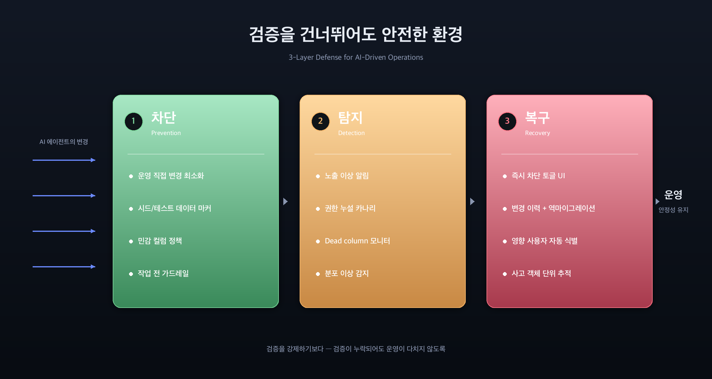
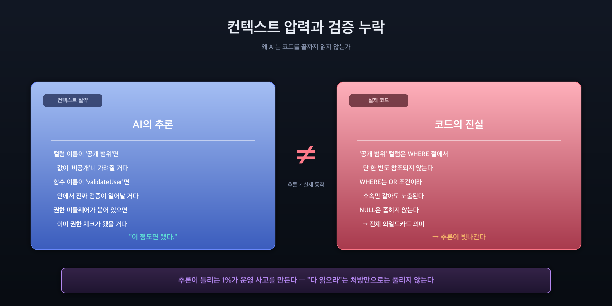
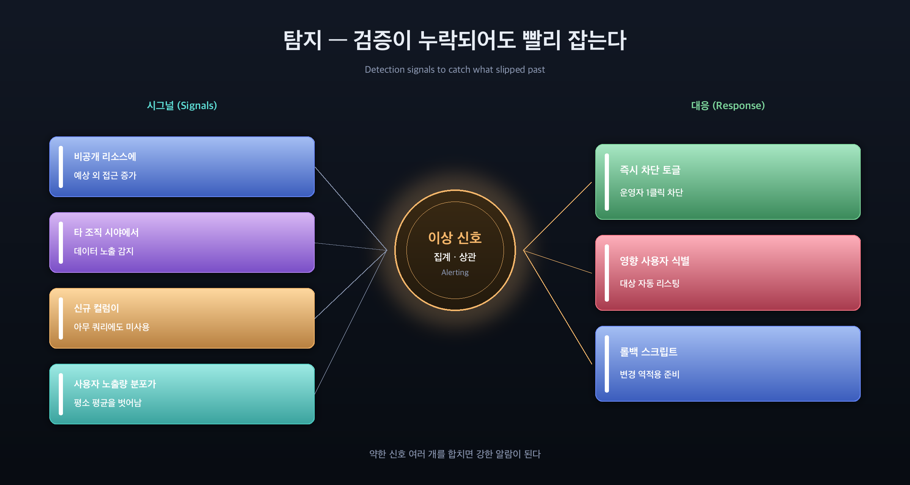

## 한 줄 요약

AI 에이전트는 무한히 코드를 읽지 않습니다. 컨텍스트 토큰은 비용이고 시간이며, 그래서 **"이 이름이라면 이런 의미겠지"라는 추론으로 자주 건너뜁니다.** 사람도 마찬가지지만, AI는 그 횟수가 압도적으로 많습니다. 그러니 "검증을 강제하라"가 아니라 **"검증을 건너뛰어도 운영을 다치지 않게 하라"**가 현실적인 전략입니다.

---

## 사건 — 무엇이 일어났나

운영 환경에 테스트용 데이터 몇 건을 추가하는 짧은 작업이 있었습니다. 의도는 단순했습니다.

> "특정 테스트 계정에게만 보이는 비공개 항목을 만든다."

데이터를 만들 때는 다음과 같은 속성을 부여했습니다.

- **소유자**: 테스트 계정
- **공개 범위**: 비공개로 표시
- **조직/집단**: 그 계정이 소속된 조직
- **부가 분류 필드**: 공란

며칠 후 다른 작업을 하다가 발견했습니다 — **같은 조직에 속한 실제 사용자들이 그 "비공개 항목"에 이미 응답을 작성한 상태**였습니다. 비공개로 만든다고 했던 데이터가 실제로는 같은 조직 사용자 전원에게 공개되어 있었던 것입니다.

원인은 세 가지가 겹친 결과였습니다.

1. **"공개 범위" 컬럼은 데이터 조회 쿼리에서 사실상 무시되고 있었습니다.** 스키마에는 존재하지만, 사용자 측 목록을 만드는 쿼리에서 이 컬럼을 WHERE 절에 단 한 번도 쓰지 않고 있었습니다. **이름은 있고 로직은 없는 상태.**
2. **목록 쿼리의 가시성은 OR 조건이었습니다.** "소유자가 본인이거나, 같은 조직에 속하면 보인다"라는 구조라서, 소유자가 본인이 아니어도 같은 조직이면 노출되도록 되어 있었습니다.
3. **부가 분류 필드의 NULL은 좁히는 게 아니라 넓혔습니다.** `해당 필드가 NULL이거나 사용자 값과 같으면`이라는 패턴에서 NULL은 와일드카드 의미였습니다. 공란이 곧 전체 공개를 뜻한 셈입니다.

세 조건이 겹치자 "비공개 항목"이 실제로는 "조직 전체 공개 항목"으로 동작했고, 발견될 때까지 응답이 누적되었습니다.

---

## 진짜 원인 — AI는 왜 검증하지 않았나

표면적인 답은 "코드를 끝까지 안 읽고 이름의 의미를 추론으로 채웠다"입니다. 맞습니다. 하지만 그건 결과이지 원인이 아닙니다. 원인은 더 구조적입니다.

### 컨텍스트는 자원이다

대형 언어 모델은 작업 중 사용 가능한 토큰 양에 제한이 있습니다. 토큰은 시간이고 비용입니다. 한 번의 응답을 생성하기 위해 AI가 읽은 모든 파일, 모든 함수, 모든 SQL이 다음 응답에서 더 큰 입력 비용으로 돌아옵니다.

그래서 AI는 무의식적으로 **"이 정도면 됐다"라는 절약 판단**을 합니다. 사람 개발자도 합니다. 하지만 사람은 "내가 잘 아는 코드"라는 메타인지가 있고, AI는 그게 약합니다. 그래서:

- 컬럼 이름이 *공개 범위*이고 값이 *비공개*면 비공개일 거라 가정합니다.
- 함수 이름이 *validateUser*면 그 안에서 진짜 검증이 일어날 거라 가정합니다.
- *권한 미들웨어*가 라우트 앞에 붙어 있으면 권한 체크가 이미 됐을 거라 가정합니다.

이런 추론은 보통 맞습니다. 문제는 **틀리는 1%가 운영 사고를 만든다**는 점입니다.

### 진실은 코드에 있고, 매번 다 읽을 수는 없다

개발 프로세스에서 진실의 원천은 여럿입니다. DB, 이슈 트래커, 문서, 그리고 무엇보다 소스코드. 그런데 매 작업마다 관련 코드를 전부 다 읽는 건 비현실적입니다. 관련 코드를 찾는 일 자체가 또 다른 코드 읽기를 요구하고, 그게 누적되면 한 번의 작업이 끝없이 늘어집니다.

그래서 자연스럽게 처방으로 떠오르는 "다음부터는 WHERE 절을 꼭 확인하라" 같은 규칙에는 한계가 있습니다.

- 규칙 하나로 모든 케이스가 잡히지 않습니다. 미들웨어 어딘가에서 사용자 식별자를 덮어쓰는 코드가 있을 수 있고, 그건 라우트 파일만 봐서는 안 보입니다.
- 다음 사고는 *공개 범위*가 아니라 *활성 상태* 컬럼일 수도 있고, *만료 시각*이 비어 있을 때 영구 노출되는 로직일 수도 있습니다. 매 케이스마다 새 규칙이 필요합니다.
- 규칙이 많아질수록 그 규칙들을 매번 **읽고 적용하는 데 다시 컨텍스트를 씁니다**. 결국 어느 순간 다시 절약 판단으로 회귀합니다.

처방은 필요하지만 충분하지 않습니다. **검증을 강제하는 방향만으로는 한계가 명확합니다.**

---

## 발상 전환 — 검증을 건너뛰어도 안전한 환경

현실적으로 AI가 매번 모든 관련 코드를 다 읽는 건 불가능합니다. 그렇다면 답은 하나입니다.

> **AI가 검증을 건너뛰어도 운영을 다치지 않는 환경을 만든다.**

이건 인간 개발자에게도 적용되는 원칙이지만, AI 시대에는 우선순위가 더 올라갑니다. 사람보다 훨씬 많은 양의 변경을 만들기 때문입니다.

세 가지 층위로 나눠 볼 수 있습니다.

### 1층 — 차단 (Prevention)

- **운영 환경 직접 변경을 줄인다.** 이번 사건의 시작은 운영 DB에 직접 데이터를 넣은 것이었습니다. 어드민 UI를 거쳤다면 "당신이 만든 비공개 항목은 미리보기에서 본인에게만 보입니다"처럼 시각적으로 확인할 기회가 있었을 겁니다.
- **테스트 데이터에는 강제 격리 마커.** 모든 시드 데이터에 일관된 접두사·태그를 강제하고, 사용자 페이싱 쿼리에서 운영 환경에서는 그 마커가 붙은 데이터를 기본적으로 제외하도록 설계합니다. AI가 시드 마커 다는 걸 잊어도 환경이 잡아줍니다.
- **민감 컬럼 정책.** 권한·노출에 영향을 주는 컬럼은 마이그레이션 시점에 정적 검사로 "이 컬럼이 어디 WHERE 절에서 사용되는가"를 강제 명세하게 합니다. 컬럼 추가는 했는데 enforcement 코드 없는 상태가 곧 PR 머지 차단 사유.

### 2층 — 탐지 (Detection)

차단을 못 뚫고 문제 데이터가 들어가도 **빨리 발견**되어야 합니다. 이번 사건은 며칠이 지나서야 발견됐습니다. 그동안 응답이 누적됐고, 그 응답들은 이제 "어떻게 처리할 것인가"라는 의사결정 부담이 됐습니다.

탐지 관점에서 가능한 장치들:

- **이상 노출 모니터.** 신규 생성된 항목이 24시간 안에 **예상보다 많은 사용자에게 노출**되면 알림. *비공개*로 만든 항목에 작성자 외 사용자의 조회가 임계치 이상 들어오면 즉시 알림.
- **권한 누설 카나리.** 매일 정해진 시각, 가상의 "다른 조직 사용자" 시점으로 모든 페이싱 GET 엔드포인트를 호출해 봅니다. 조직 A의 데이터가 조직 B의 카나리에 잡히면 즉시 경보.
- **신규 컬럼 사용처 미존재 알람.** 마이그레이션으로 추가된 컬럼이 N일 안에 어느 쿼리에서도 사용되지 않으면 dead column 후보로 리포팅. "이름만 있고 로직 없는" 상태를 시스템이 추적합니다.
- **분포 이상 감지.** 사용자 한 명의 일일 신규 노출 항목 수가 평소 평균에서 크게 벗어나면 알림. 이번 사건도 다수 사용자에서 "신규 항목 1건 동시 증가"라는 분포 이상으로 잡을 수 있었습니다.

약한 신호 여러 개를 합치면 강한 알람이 됩니다. 어느 하나의 임계만 넘기는 어렵지만, 셋이 동시에 흔들리면 사람이 봐야 할 시그널입니다.

### 3층 — 복구 (Recovery)

탐지가 되면 빨리 끄는 게 중요합니다.

- **즉시 차단 토글.** 운영자가 "이 항목 노출 즉시 차단" 버튼 하나로 공개 상태를 변경할 수 있어야 합니다. SQL 직접 들어가서 UPDATE 하는 일을 줄여야, 사고 대응 자체가 새 사고를 만들지 않습니다.
- **롤백 가능한 변경 이력.** 잘못된 결정으로 데이터를 옮겼다면 되돌릴 수 있어야 합니다. 마이크로 단위 audit log + 자동 역마이그레이션 스크립트.
- **영향받은 사용자 자동 식별.** "이 항목에 응답한 사용자가 누구인가"를 SQL 쥐어짜서 알아내는 게 아니라, 사고 객체 ID 하나만 넣으면 영향받은 사용자 리스트와 그들의 행동(응답, 알림 받은 횟수, 마지막 접근 시각)이 한 페이지에 뜨도록.

---

## 메타 — AI 에이전트 운영의 비대칭성

이번 사건을 일반화하면 이렇게 보입니다.

> **AI 에이전트는 인간보다 훨씬 많은 변경을 만들지만, 인간만큼 메타인지가 깊지 않다.** 그래서 차단·탐지·복구의 비대칭성이 커진다.

지금까지 많은 팀이 차단(1층)에 가장 큰 비중을 둡니다. 컨벤션 문서, 룰북, 가이드라인, 작업 전 체크리스트... 다 차단 장치입니다. 그런데 이번 같은 사건은 차단이 뚫린 케이스가 아니라 **그 차단 규칙이 처음부터 없었던** 케이스입니다. 권한 enforcement 자체가 없었으니까요.

차단 규칙이 빠짐없이 완벽해질 수는 없습니다. 그러니 **2층 탐지에 본격적으로 투자해야 할 시점**입니다.

- 메트릭/대시보드 정비
- 노출 이상 알림
- 권한 카나리
- dead column 모니터
- 일일 차이 리포트(전날 대비 신규 노출 항목 / 사용자별 노출 분포)

이건 비용이 듭니다. 하지만 사람이 코드를 모두 읽게 만드는 비용, AI가 컨텍스트를 모두 채우는 비용, 사고 후 일일이 영향 식별하는 비용을 합치면 훨씬 큽니다.

---

## 한 줄로

> **"AI에게 더 읽으라고 강요하는 것보다, AI가 안 읽어도 시스템이 잡아주는 게 먼저다."**

검증의 책임을 AI에게만 지우면 같은 사고가 반복됩니다. 검증을 건너뛴 결과가 빨리 드러나고, 빨리 끌 수 있고, 영향을 빨리 식별할 수 있는 환경 — 그게 진짜 처방입니다.
