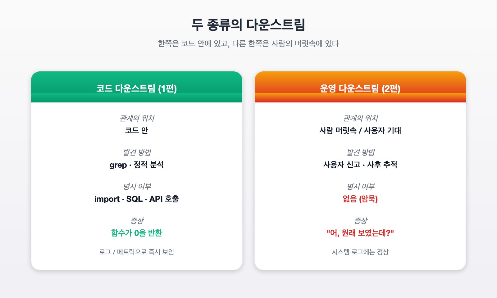
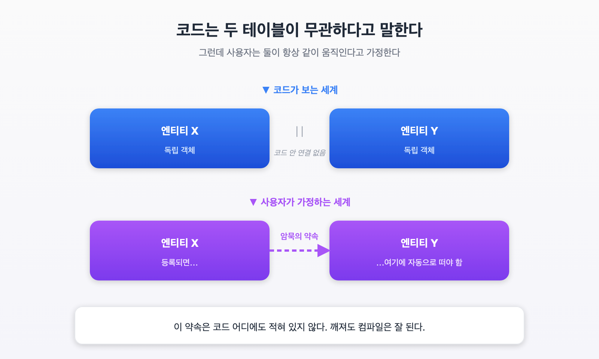
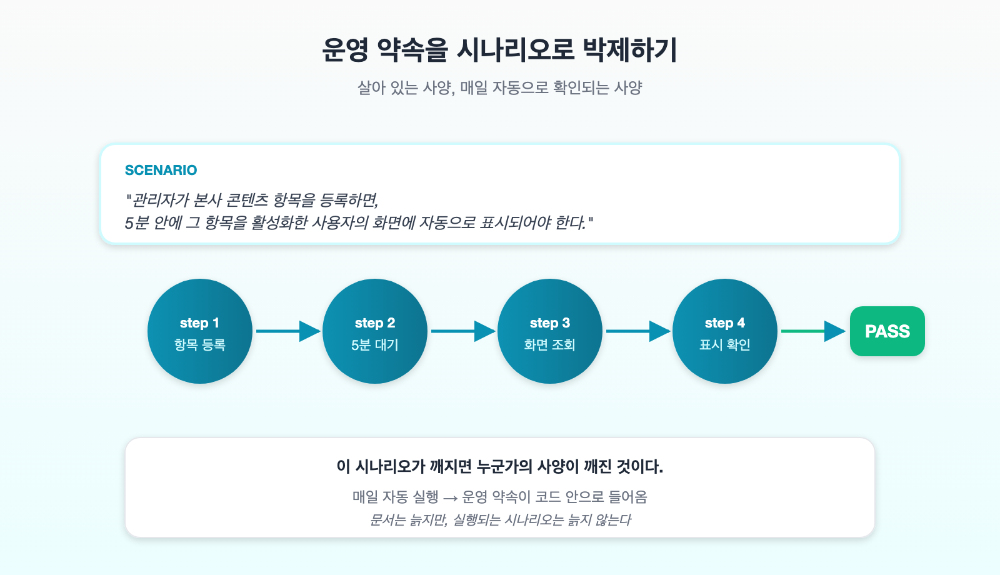
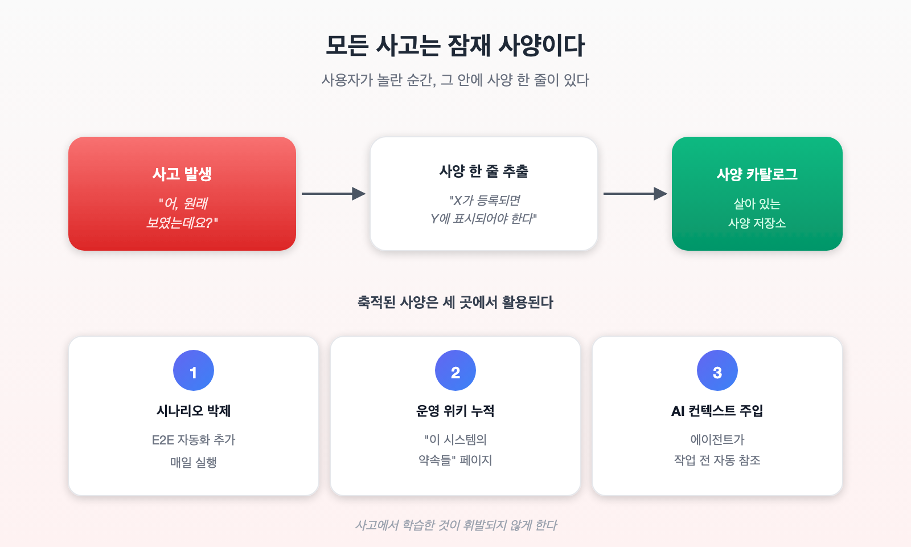

이전에 [데이터 흐름을 바꿀 때 놓치기 쉬운 것](https://reddol18.pe.kr/e67900ad)이라는 글을 쓴 적이 있습니다. 그 글은 "어떤 테이블에서 다른 테이블로 데이터를 옮겼더니, 그 테이블을 읽고 있던 집계 코드가 0을 뱉기 시작했다"는 이야기였습니다. 이번 글은 그 이야기의 2편입니다. 다만 이번 다운스트림은 **코드에 적혀 있지 않습니다.**

## 사고

운영 중인 서비스에서 어느 사용자가 이렇게 말했습니다.

> "원래 화면에 보였던 항목이 안 보여요."

처음에는 단순한 권한 문제로 보였습니다. 그런데 점검해 보니 다른 사용자에게서도 같은 현상이 있었습니다. 분명히 시스템에는 그 항목이 등록되어 있었고, 사용자도 해당 항목을 받기로 한 상태였습니다. 그런데 **사용자 화면에는 그 항목이 단 한 건도 나타나지 않고 있었습니다.**

조사해 보니 영향 범위는 한 명이 아니었습니다. 영향받는 사용자가 수백 명, 누락된 표시 건수가 수십 건. 운영팀에는 문의가 쌓이고 있었습니다.



## 원인

화면은 "표시용 엔티티 Y"라는 별도 데이터를 읽어서 그립니다. 한편 원본 정보는 "원본 엔티티 X"에 들어갑니다.

```
[설계상의 흐름]
관리자가 원본 엔티티 X 등록
        ↓
   X에 row 생성
        ↓
   (어딘가에서) Y에도 같은 정보가 row로 복제됨
        ↓
   사용자 화면에 표시
```

문제는 **(어딘가에서)** 라고 적어 둔 부분이 실제로는 없었다는 것입니다. 정확히는 이렇게 동작하고 있었습니다.

```
[실제 흐름]
관리자가 원본 엔티티 X 등록
        ↓
   X에 row 생성
        ↓
       ⛔ 끝

  (Y에는 아무 일도 일어나지 않음)
        ↓
   사용자 화면에 표시되지 않음
```

데이터 모델만 보면 이상한 일이 아닙니다. X에 정보가 있으니, Y에 보여줄지 말지는 Y 쪽 정책입니다. 코드 안에 "X가 등록되면 Y에도 복제해야 한다"라고 적혀 있는 곳은 어디에도 없었습니다.

그런데 운영자와 사용자 입장에서는 **그게 당연한 약속**이었습니다.

## 1편과의 차이 — 코드 다운스트림 vs 운영 다운스트림



1편의 사고는 **코드 다운스트림**이었습니다. 한 테이블에 쓰던 코드를 다른 테이블에 쓰도록 바꿨더니, 그 첫 테이블을 읽던 집계 코드가 0을 뱉었습니다. 이 사고는 **코드 검색으로 찾을 수 있었습니다.** "이 테이블을 SELECT하는 곳을 다 보여줘"라고 물어보면 grep 한 번에 나옵니다.

이번 사고는 다릅니다.

| 항목 | 1편 — 코드 다운스트림 | 2편 — 운영 다운스트림 |
|---|---|---|
| 관계의 위치 | 코드 안 | 운영자·사용자의 머릿속 |
| 발견 방법 | grep · 정적 분석 | 사용자 신고 · 사후 추적 |
| 명시 여부 | import · SQL · API 호출 | 없음 (암묵) |
| 깨졌을 때의 증상 | 함수가 0을 반환 | "어, 이거 원래 보였는데요?" |

코드에는 "X 등록 → Y 복제" 같은 호출이 없습니다. 검색해도 안 나옵니다. 그런데도 사용자는 그 흐름이 작동한다고 가정합니다. 왜냐하면 **과거의 어느 시점엔 그게 작동했기 때문**입니다. 사람이 수동으로 채워 넣었든, 옛 코드에 그런 동기화 로직이 있었든, 어느 순간 그 약속이 만들어졌습니다. 그리고 누구도 그것을 명문화하지 않았습니다.

## 왜 코드만 봐서는 안 보이나



코드만 보면 두 엔티티는 **서로 독립적인 객체**입니다.

- X에 row를 추가하든 안 하든, Y의 모든 함수는 계속 잘 작동합니다.
- Y에서 한 row를 지우든 안 지우든, X 쪽 코드는 멀쩡합니다.

정적 분석 도구, 타입 시스템, 단위 테스트 — 그 어느 것도 "이 두 엔티티는 항상 같이 움직여야 한다"라고 알려 주지 않습니다. 왜냐하면 **그 약속이 코드 밖에 있기 때문**입니다.

이런 약속의 출처는 보통 다음과 같습니다.

1. **운영자의 기대**: "원본이 등록되면 화면에 떠야지." 그게 시스템의 사용 가치이기 때문에 운영자는 자연스럽게 그렇게 가정합니다.
2. **과거의 동작**: 예전에 어떤 경로로든 그 흐름이 작동했고, 사용자는 그것을 사양으로 기억합니다.
3. **암묵적 통합 지점**: 외부 시스템과의 SLA, 다른 서비스의 폴링 주기 등이 "그 데이터는 거기에 있어야 한다"를 전제로 동작합니다.

이런 다운스트림은 **코드 어디에도 적혀 있지 않습니다.** 적혀 있다면 1편의 다운스트림입니다.

## 그럼 어떻게 막을까

이게 어려운 이유는, 방어선이 코드 바깥에 있어야 하기 때문입니다. 몇 가지 가능한 대안을 정리해 봤습니다.

### 대안 1 — 철저한 기억 (현실적이지만 약함)

가장 기본적인 방식입니다. 운영자, 개발자, PO가 "이 시스템에는 이런 약속이 있다"를 머릿속에 가지고 있는 것입니다.

장점은 코드 변경이 필요 없다는 점입니다. 단점은 명백합니다. **사람이 바뀌면 사라집니다.** 신규 입사자, 휴직, 인계 누락 — 어떤 형태로든 기억은 잊힙니다. 그리고 정확히 그 사람이 휴가 간 주에 사고가 납니다.

### 대안 2 — 장기 보관 문서 (보편적인 방식)

운영 위키, 사양 문서, 운영 노트에 명시합니다. "원본 엔티티 X가 등록되면 표시용 엔티티 Y에 자동 노출되어야 한다"라고 한 줄 적어 두는 것입니다.

장점은 인계가 가능해진다는 점입니다. 단점은 **문서가 코드와 함께 늙는다는 것**입니다. 코드는 매일 바뀌는데 문서는 분기에 한 번 바뀝니다. 시간이 지나면 어떤 문서가 살아 있는지, 어떤 게 거짓말을 하고 있는지 구분이 안 됩니다.

### 대안 3 — 사용자 시나리오 기반 E2E 테스트



가장 현실적인 대안입니다. **운영 약속을 자동화된 사용자 시나리오로 박제**합니다.

예를 들어 다음 시나리오를 작성합니다.

> "관리자가 X를 등록한다. 5분 안에 그 항목을 받기로 한 사용자의 화면에 해당 표시가 노출된다."

이걸 매일 자동으로 돌리면 됩니다. 새벽에 한 번, 배포 직후에 한 번. 깨지면 알람이 옵니다.

이 방식의 강점은 다음과 같습니다.

- **약속을 코드 안으로 끌어들이는 효과**: 시나리오 코드가 곧 사양입니다. 살아 있고, 실행 가능하고, 거짓말을 못 합니다.
- **개발자가 무심코 깰 수 없습니다**: 코드를 잘못 바꾸면 시나리오가 빨갛게 뜹니다.
- **새로 들어온 사람도 시나리오를 읽으면 운영 약속을 알 수 있습니다.**

단점은 비용입니다. 시나리오를 작성하고 유지하는 것은 작은 일이 아닙니다. 그리고 자동화하지 못하는 부분(예: "사용자가 보기에 자연스러워야 함" 같은 정성적 약속)은 여전히 남습니다.

### 대안 4 — 사고 자체를 사양 후보로 보기



이번 사고에서 가장 좋은 출발점은 "**사고 = 문서화되지 않은 사양의 발견**"이라고 생각하는 관점입니다.

사용자가 "이거 원래 보였는데 안 보여요"라고 말하는 순간, 그 안에는 사양 한 줄이 들어 있습니다. **"X가 등록되면 Y에 표시되어야 한다."** 이걸 매번 그 사고가 났던 PR이나 이슈에 묻어 버리지 말고, 별도의 "발견된 사양" 저장소에 모읍니다.

그렇게 모인 사양은 다음과 같이 활용할 수 있습니다.

- 새 시나리오 테스트로 박제하기
- 운영 위키의 "이 시스템의 약속들" 페이지에 누적
- 배포 전 체크리스트에 항목으로 추가

핵심은 **사고에서 얻은 학습을 휘발시키지 않는 것**입니다. 사고 보고서 안에만 묻어 두면 사고 보고서를 다시 읽는 일이 없는 한 잊힙니다.

### 대안 5 — LLM 에이전트를 운영 약속의 보조 기억으로

조금 새로운 방식입니다. 운영 약속을 구조화된 형태로 어딘가에 적어 두고, AI 에이전트가 그것을 항상 컨텍스트로 참조하게 만드는 것입니다.

예를 들어 "발견된 사양" 저장소를 두고, 코드 작업 전에 항상 그 저장소에서 관련 항목을 가져와 컨텍스트로 넣는 흐름을 만듭니다. AI는 자동으로 "이 변경이 깨뜨릴 수 있는 약속이 있는지" 검토하게 됩니다.

장점은 약속이 사람 기억에서 떨어져 나간다는 점입니다. 단점은 그 저장소 자체의 유지 비용입니다(대안 2와 같은 함정). 다만 AI가 작업 중에 항상 참조한다면, 잘못된 항목은 빠르게 발견되고 갱신될 가능성이 높습니다.

## 추천 — 셋을 묶기

현실적인 권고는 한 가지 방식이 아니라 세 가지를 결합하는 것입니다.

1. **사고 발생 시점에 사양 한 줄 뽑기** (대안 4)
2. **그 사양을 시나리오 테스트로 박제** (대안 3)
3. **시나리오 카탈로그를 AI 에이전트의 작업 컨텍스트에 자동 주입** (대안 5)

이 세 가지가 묶이면, 운영 약속이 **코드와 함께 살게** 됩니다. 코드만 봐서는 안 보이던 다운스트림이, 시나리오를 통해 가시화되고, AI 에이전트가 작업할 때마다 자동으로 참조됩니다.

## 마치며

1편에서 본 다운스트림은 코드 안에 있었습니다. grep으로 찾을 수 있었고, 좋은 정적 분석 도구로 막을 수도 있었습니다.

2편의 다운스트림은 코드 밖에 있습니다. 사용자와 운영자의 머릿속에, 그리고 "원래 그랬다"라는 과거의 동작 안에 있습니다. 코드만 봐서는 찾을 수 없습니다.

그래서 우리는 다른 방어선을 만들어야 합니다. 기억에 의존하는 것은 약합니다. 문서는 늙습니다. 살아있는 사양 — 시나리오 테스트, 사고에서 추출한 사양 카탈로그, AI가 항상 참조하는 운영 컨텍스트 — 이 세 가지를 묶어야 코드 밖 약속을 코드 안으로 데려올 수 있습니다.

사고는 항상 일어납니다. 중요한 것은 그 사고가 단 한 줄의 사양으로 남느냐, 아니면 그냥 잊히느냐입니다.

---

*이 글은 운영 중인 서비스에서 일어난 사용자 가시성 사고에서 시작된 회고입니다. 1편 [데이터 흐름을 바꿀 때 놓치기 쉬운 것](https://reddol18.pe.kr/e67900ad)의 연장선에 있습니다.*
