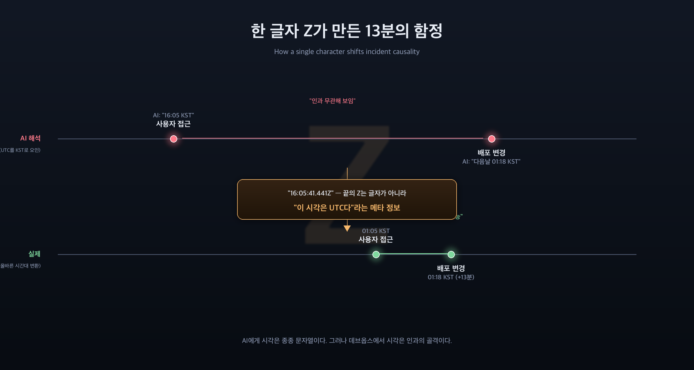
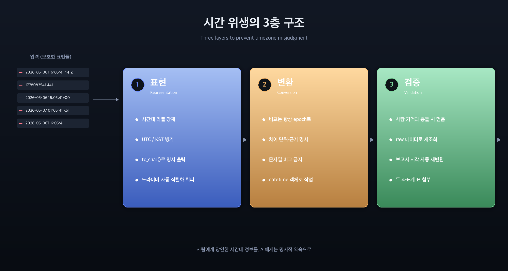

## 무슨일이 있었나

운영 사고를 추적하던 중 사용자가 한 줄을 짚었습니다.

> "왜 자꾸 시각이 9시간씩 어긋나지?"

원인은 단순했습니다. **AI가 ISO 문자열의 `Z` 접미사를 시간대 정보가 아니라 그냥 글자로 처리한 것**이죠. 사고를 13분 뒤로 미루고, 가설을 두 번 바꾸고, 사람의 기억과 어긋나게 만든 한 글자였습니다. 데브옵스에서 시각은 객관적인 진실이지만, **AI에게 시각은 종종 문자열**입니다. 이 둘의 격차가 사고 분석을 통째로 어긋나게 만들 수 있습니다.

---



## 어떤 사고였나

운영 환경에서 권한 누설이 의심되는 흔적이 발견되었습니다. 한 사용자가 본인이 속하지 않은 조직의 자원에 잠깐 접근한 기록이 있었고, 같은 시각에 배포가 한 건 있었습니다. 사람의 기억으로는 그 배포가 "어느 시각쯤" 있었는데, AI가 추적한 시각은 그것보다 9시간 늦었습니다.

대략의 흐름은 이렇습니다.

1. 사용자 접근 흔적이 DB에 남아 있음 — `created_at = 2026-05-06T16:05:41.441Z`
2. AI가 시각을 보고서에 옮김 — "5/6 16:05 KST에 접근"
3. 사용자 기억: "그 시간에 누설은 안 났을 텐데?"
4. AI가 가설을 바꿈 — "그렇다면 14시쯤 별도 노출 윈도가 있었을 가능성"
5. 깊이 파고들 수록 단서가 어긋남
6. 사용자가 다시 짚음 — "원래 KST 14시라고 하지 않았나?"
7. **확인 결과: 실제 KST는 5/7 01:05. UTC 시각을 KST로 잘못 표기해온 것**

해석이 두 번 뒤집힌 사이, **사고 발생 시각이 13분 뒤로 밀려 있었고**, 그 13분 차이는 핵심 배포 직전이냐 직후냐를 가르는 결정적인 지점이었습니다.

---

## 왜 이런 일이 벌어지나

AI는 시각을 다룰 때 종종 문자열을 **그 자체로** 신뢰합니다. `16:05:41.441Z` 같은 문자열을 보면 사람도 직관적으로 "16시 5분"이라고 읽지만, 거기 붙은 `Z`는 단순한 글자가 아니라 **이 시각은 UTC다**라는 메타 정보입니다. KST로 환산하면 9시간을 더해야 합니다.

문제는 시각이 이 시스템에서 저 시스템으로 흐르는 동안 형태가 자꾸 바뀐다는 점입니다.

- **데이터베이스 컬럼 타입**: `timestamp with time zone` vs `timestamp without time zone` — 똑같이 보이지만 의미가 다릅니다.
- **드라이버 직렬화**: 어떤 언어/드라이버는 모든 timestamp를 ISO 문자열에 `Z`를 붙여 출력합니다. 원래 KST로 변환된 값도 마찬가지로 `Z`가 붙어 나오니, 문자열만 보면 두 가지가 구분이 안 됩니다.
- **로그 시스템**: 대부분 UTC로 저장하고 표시합니다.
- **클라우드 콘솔**: 어떤 곳은 UTC, 어떤 곳은 사용자 로컬 시간으로 표시합니다.
- **사람의 기억**: 항상 로컬 시간(KST)입니다.

AI가 이걸 한꺼번에 다루다 보면, 어떤 시각이 어떤 시간대인지 추적하는 데 실패합니다. 그리고 **문자열 표면이 같아 보이면 같은 시간대라고 가정하는 실수**가 일어납니다.

---

## 데브옵스 관점에서 이게 왜 위험한가

운영 사고 조사에서 시각은 **인과의 골격**입니다. "A가 B 직전에 일어났다"라는 한 문장이 종종 사고의 본질을 결정합니다. 시각이 9시간씩 어긋나면 다음과 같은 일이 일어납니다.

- **인과가 뒤집힌다.** "원인 → 결과" 순서가 "결과 → 원인"이 되거나, 둘이 무관한 것처럼 보입니다.
- **잘못된 배포를 의심하게 된다.** 그 시각 활성이었던 리비전이 아닌 다른 리비전에 책임이 돌아갑니다.
- **사람의 기억과 충돌한다.** 사람은 자기 일과를 KST로 기억하는데 AI가 UTC를 KST처럼 말하면, 사람은 자기 기억을 의심하기 시작합니다. 이게 가장 무섭습니다 — **신뢰가 깨지는 순간 분석 속도가 급격히 떨어집니다.**
- **잘못된 처방으로 이어진다.** 잘못된 인과 위에 세운 패치는 또 다른 사고를 만듭니다.

AI는 빠르게 많은 시각을 비교할 수 있지만, **그 시각들이 같은 좌표계에 있다는 보장은 누구도 해주지 않습니다.** 그 보장은 보통 사람이 머릿속으로 합니다. AI에게 그 책임이 넘어오면, 한 글자가 9시간을 만들어냅니다.

---

## 해결책 — 세 가지 층위

이 문제는 "AI에게 시간대를 잘 다루라고 알려준다"로는 풀리지 않습니다. 시간대는 시스템 경계마다 새로 등장하고, 매번 사람이 기억해서 처방을 적용할 수 없기 때문입니다. 그래서 **시스템이 모호함을 줄이도록 만드는 것**이 본질입니다.

### 1층 — 표현 (Representation)

**시각을 표현할 때부터 모호함을 없앤다.**

- 로그·메트릭·DB 출력에 **반드시 시간대 정보**를 명시하도록 강제합니다. `Z`가 붙은 ISO 8601 또는 `+09:00` 오프셋을 항상 포함합니다.
- AI에게 시각을 보고하게 할 때는 **항상 두 좌표계 병기**: "UTC 16:05 / KST 01:05". 둘 중 하나만 적으면 다음 사람이 또 헷갈립니다.
- 데이터베이스 출력 시 **drop `timestamptz` raw, prefer `to_char(... AT TIME ZONE 'Asia/Seoul', 'YYYY-MM-DD HH24:MI:SS KST')`** — 명시적 문자열 변환. 드라이버 자동 직렬화에 맡기면 `Z`가 붙어 의미가 손상됩니다.
- 콘솔/대시보드는 시각 옆에 작은 라벨로 시간대를 항상 표시합니다.

### 2층 — 변환 (Conversion)

**시각을 비교할 때는 항상 epoch로 환산한다.**

- 사고 분석에서 두 시각을 비교할 때는 둘 다 epoch(초)로 변환한 뒤 차이를 계산합니다. "13분 차이"는 epoch 차이로 검증해야 합니다.
- AI 에이전트의 보고서에 **차이를 계산한 단위와 근거**를 명시하도록 합니다. "13분 = 783초"처럼.
- 코드/스크립트에서 시각 비교는 항상 객체(datetime) 또는 epoch로. 문자열 비교(`"16:05" < "16:18"`)는 시간대가 같은 경우에만 안전하고, 그 가정이 깨지는 순간 침묵하는 버그가 됩니다.

### 3층 — 검증 (Validation)

**사람의 기억과 어긋나면 멈춘다.**

- 사고 조사에서 사람과 AI의 시각이 어긋나면, **둘 다 어딘가 틀렸을 수 있다고 가정**하고 raw 데이터로 즉시 되돌아갑니다. AI 보고의 가공된 시각을 재인용하지 않습니다.
- "내 기억과 다른데?" 같은 신호는 가장 강한 단서입니다. 사람의 일과 기억은 보통 정확합니다.
- 자동화된 사후 검증: 사고 보고서가 작성되면, 그 안의 모든 시각을 자동으로 두 좌표계로 재변환해 표 형태로 첨부하는 후처리. 모순이 있으면 알람.

---

## 메타 — AI 협업에서 "당연한 정보"는 누구의 책임인가

이 사례의 본질은 단순합니다. **사람에게 당연한 정보를 AI는 모를 수 있다.** 시간대는 사람에게는 "내가 사는 곳이 한국이면 +9시간"이 너무 자명해서 보고할 때 생략하기 쉽고, AI는 그 생략된 맥락 때문에 잘못된 추론을 합니다.

같은 패턴이 데브옵스 곳곳에 있습니다.

- **단위**: ms vs s, MB vs MiB, 평균 vs p99
- **좌표계**: UTC vs 로컬 vs 사용자 디바이스 시간
- **세션 vs 사용자**: "1명이 10번 본 것"과 "10명이 한 번씩 본 것"
- **샘플링**: "이 로그는 100%인가, 10%인가, 1%인가"
- **이름공간 충돌**: prod vs production vs prd, dev vs development vs staging

이런 것들은 **사람 사이에서는 암묵적 합의로 굴러가지만, AI와 협업하는 순간 명시적 약속으로 끌어올려야 합니다.** 그러지 않으면 AI는 "보이는 대로" 처리하고, 사람은 자기 기억을 의심하면서 분석이 흔들립니다.

---

## 행동 항목

이 사례로부터 다음을 정착시킵니다.

1. **즉시**: 사고 분석 보고에서 모든 시각은 `UTC HH:MM:SS / KST HH:MM:SS` 병기 — 정책으로 명시.
2. **단기**: DB 조회 헬퍼에 `to_char(... AT TIME ZONE 'Asia/Seoul')` 강제 적용 옵션 추가. 사고 조사 쿼리에서 raw timestamp 노출 금지.
3. **단기**: 대시보드/로그 콘솔의 시간 표시 라벨 통일(반드시 시간대 라벨 동반).
4. **중기**: AI 에이전트 응답 후처리 단계에서 시각 문자열을 자동 파싱해 두 좌표계 병기 표로 변환하는 후크.
5. **장기**: "사람 기억과 AI 보고의 시각이 불일치할 때 raw 재조회"를 사고 대응 절차의 표준 단계로 명문화.