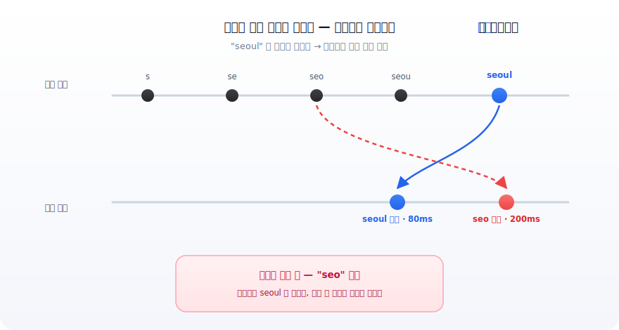
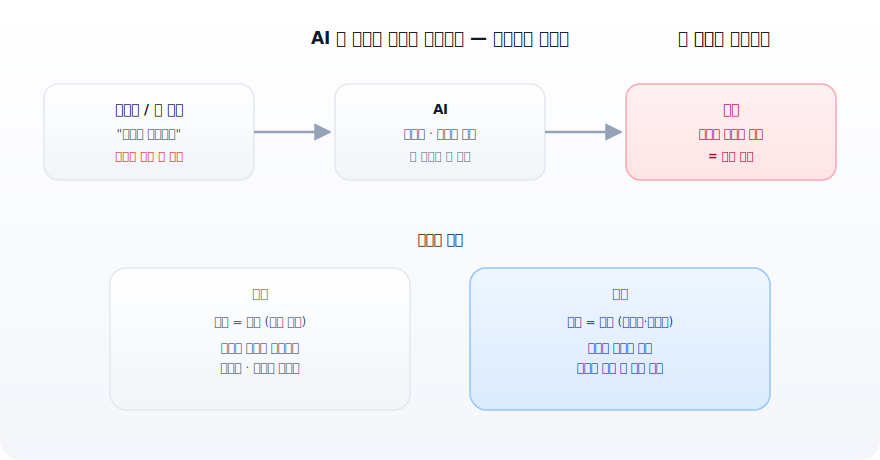
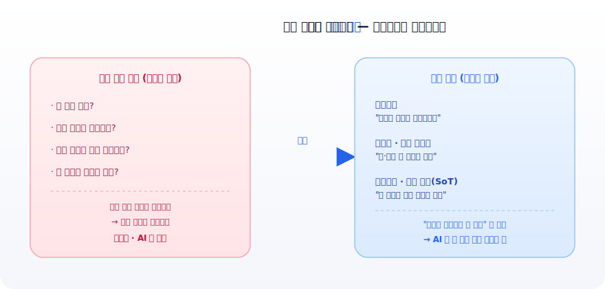

**부제**: AI 가 구현을 떠안은 시대, 정의하는 사람이 빠뜨린 함정은 누가 막아주는가

---

## 들어가며

요즘 "1인 개발", "기발자(기획+개발)" 라는 말이 흔합니다. AI 에게 시키면 코드가 나오니까, 기획자도 디자이너도 혼자 제품을 만들 수 있는 시대라고 합니다.

맞습니다. 저도 그렇게 일합니다. 그런데 막상 해보면 — **이게 생각만큼 녹록지 않습니다.** 왜 그런지, 제가 최근에 데인 버그 하나로 풀어보려 합니다. 결론부터 말하면, 1인 개발의 진짜 난이도는 *코딩 실력* 이 아니라 *함정을 미리 보는 눈* 에 있습니다.

---



## 1. 이 코드, 뭐가 문제인지 보이시나요?

검색창을 만든다고 해봅시다. 사용자가 글자를 칠 때마다 검색 API 를 쏘는 흔한 코드입니다.

```js
onChange={(e) => {
  fetch(`/search?q=${e.target.value}`)
    .then(r => r.json())
    .then(setResults)
}}
```

깔끔합니다. 별다른 지침 없이 AI 에게 "검색창 만들어줘" 하면 이런 코드가 나옵니다. 코드 리뷰를 시켜도 "정상" 이라고 합니다.

그런데 사용자가 `seoul` 을 빠르게 치면, 글자마다 요청이 하나씩 발사됩니다 — `s`, `se`, `seo`, `seou`, `seoul`. 이 다섯 개가 **보낸 순서대로 돌아온다는 보장이 없습니다.** `seoul`(마지막) 응답이 80ms 에 오고, `seo`(중간) 응답이 200ms 에 늦게 오면 — 화면엔 `seoul` 을 쳤는데 `seo` 결과가 뜹니다.



**버그는 코드 글자 안에 없습니다.** "요청 C 가 요청 E 보다 늦게 도착하는 순간" 이라는, *시간 위의 사건* 에 있습니다. 코드만 읽어서는 보이지 않습니다.

(고치는 법은 간단합니다 — 디바운스로 발사를 한 번으로 줄이거나, 요청에 번호를 붙여 "마지막 번호만 반영" 하면 됩니다. 문제는 *고치는 법* 이 아니라 *이게 문제인 줄 아는 것* 입니다.)

---

## 2. 이건 "정적 텍스트엔 안 보이는 버그" 입니다

방금 같은 버그를 저는 **시간축 사각지대(temporal blind spot)** 라고 부릅니다.

우리는 — 사람이든 AI 든 — 코드를 보통 **위에서 아래로, 한 번, 정적으로** 읽습니다. "이 조건이면 이 결과" 라는 식의 순방향 추론입니다. 그건 우리가 제일 잘하는 일입니다.

그런데 현장의 UI 는 다릅니다. 비동기 요청, 동시에 터지는 이벤트, 사용자의 변덕스러운 순서 — 버그가 *글자* 가 아니라 *글자들 사이의 실행 순서* 에 삽니다. 읽을 텍스트가 없는 곳에 버그가 있는 것입니다.

그래서 코드를 아무리 자세히 적어도 안 잡힙니다. 오히려 **자세히 적을수록 흐름이 늘어 사각지대가 넓어집니다.** "경우의 수를 빠짐없이 코드로 적자" 는 방향이 함정인 이유입니다.

---

## 3. "그럼 AI 가 멍청해서 못 잡는 거 아냐?" — 아닙니다

여기서 흔한 오해를 짚고 가겠습니다. 이건 AI 고유의 결함이 아닙니다.

- **흔한 패턴**(디바운스 같은)은 AI 가 학습 데이터로 충분히 봐서 *이미 잘 잡습니다.*
- 진짜 약한 건 **"이 코드베이스에만 있는, 처음 보는" 동시성 함정** 입니다. 학습에 없던 새 인터리빙은 추론으로 풀어야 하는데, 그게 약점입니다.

그런데 — **이건 사람 주니어도 똑같습니다.** 아니, 비개발자는 더합니다.

시니어가 검색창 코드를 0.5초 만에 보고 "이거 터진다" 고 아는 건, 머리가 빨라서가 아닙니다. **과거에 프로덕션에서 데여서 "이 모양 = 이 버그" 를 외워둔** 것입니다. 경험을 패턴으로 박제해둔 것이지요.

즉 시간축 사각지대를 메우는 건 **추론력이 아니라 경험** 입니다. 그리고 경험은 — 주니어도, 비개발자도, AI 도 — 충분히 가지고 있지 않습니다.

---

## 4. 그래서 진짜 문제: 명세 부채가 AI 속도로 쌓입니다

이제 1인 개발의 함정이 보입니다.

기술 부채(technical debt)는 *구현* 의 빚이었습니다. "일단 돌아가게 짜고 나중에 정리하자." AI 시대의 새 부채는 *정의* 의 빚입니다. 저는 이걸 **명세 부채(specification debt)** 라 부릅니다. **요구를 정의하고 설계할 때, 함정을 모른 채 빠뜨린 것들이 그대로 코드에 박제되어 쌓이는 빚** 입니다.



핵심은 이것입니다.

> **AI 는 "구현" 의 병목은 없앴지만, "무엇을·어떻게" 를 정의하는 사람의 역량 한계를 그대로 증폭해서 코드에 새깁니다.**

정의하는 사람이 함정을 모르면, AI 는 그 함정을 **더 빠르고 더 많이** 만들어냅니다. 구현이 공짜가 되면서, 명세의 빚만 남아 *더 빠르게* 쌓입니다.

이걸 한 발 더 밀면 **AX 부채(AI eXperience Debt)** 라 부를 수 있습니다. AI 에게 일을 시키는 인터페이스 — 즉 *우리가 AI 에게 무엇을·어떻게 정의해 넘기는가* — 의 미숙함이 쌓는 빚입니다. 명세 부채가 "정의의 빈틈" 이라면, AX 부채는 그 빈틈이 *AI 라는 증폭기* 를 거치며 더 빠르고 조용히 누적되는 현상을 가리킵니다.

---

## 5. 그래서 1인 개발이 녹록지 않습니다

예전엔 이 명세 부채를 **시니어와 리더가 막아줬습니다.** 기획에 빈 구멍이 있으면 "이 케이스는요?" 하고 되물었고, 코드에 race 가 있으면 리뷰에서 걸렀습니다.

1인 개발·기발자 시대엔 그 방어선이 사라집니다. **기획자 = 개발자 = 리뷰어가 전부 나 하나** 입니다. AI 가 구현을 떠안은 만큼, *판단의 무게는 오히려 한 사람에게 집중됩니다.*

낮아진 건 **진입 장벽** 이지, **책임 장벽** 이 아닙니다. 코드를 못 짜서 못 만들던 시절은 끝났지만, 이제는 *내가 빠뜨린 함정을 막아줄 사람이 없다* 는 새로운 난이도가 생겼습니다.

---

## 6. 처방: 명세 부채를 감안하고 기획하세요

비관하려는 글은 아닙니다. 처방이 있습니다.

**1) "무엇이 일어날 수 있나" 가 아니라 "무엇이 일어나면 안 되나" 를 정의하세요.**
경우의 수를 다 적으려 하지 말고, 금지된 상태·순서를 명시하세요. 상태기계, 단일 소유 데이터(SoT), 멱등키 — 이런 설계는 *시간 문제를 정적 규칙으로 번역* 합니다. 그러면 AI 도 잘 잡는 *정적 조건* 이 됩니다.



**2) 개인기를 구조로 옮기세요.**
시니어가 "경험으로 아는 것" 을 코드 구조로 박제하면, 시니어가 없어도, AI 가 기억 못 해도, *코드가 기억합니다.* 이게 1인 개발자가 자기 부재(경험의 부재)를 메우는 거의 유일한 방법입니다.

**3) 기획 단계에서 "시간" 과 "동시성" 을 의심하세요.**
"사용자가 빨리 두 번 누르면?", "응답이 늦게 오면?", "화면을 옮기는 중에 도착하면?" — 이 질문들을 *정의 단계에서* 던지는 습관입니다. 코드는 AI 가 짜주지만, **이 질문은 아무도 대신 던져주지 않습니다.**

---

## 7. 그럼 이런 부채를 잡아주는 툴은 없나요?

좋은 질문입니다. 명세 부채는 *코드 쪽* 과 *정의 쪽* 양쪽에서 새기 때문에, 도구도 두 갈래로 보면 됩니다.

### (A) 코드 쪽 — 박제된 함정을 찾는 도구

이미 코드에 들어간 동시성·race 함정을 잡아주는 쪽입니다. 다만 한계가 분명합니다. 시간축 버그는 정적 텍스트에 안 보이므로, *정적 분석만으로는* 근본적으로 한계가 있습니다.

- **lint 규칙 (`react-hooks/exhaustive-deps` 등)** — useEffect 의존성 누락 같은 *표면 신호* 는 잡습니다. race 자체를 이해하는 건 아니지만, race 가 자주 깃드는 자리를 가리켜 줍니다. 가장 싸고 즉시 적용 가능한 1차 방어선입니다.
- **범용 정적 분석기 (SonarQube, Coverity, Clang Static Analyzer 등)** — 동시성 안티패턴 룰을 일부 보유합니다. 다만 "늦게 온 응답이 덮어쓴다" 같은 *의미적* race 는 대부분 못 봅니다.
- **fast-check (property-based testing)** — 발상이 다릅니다. 정적으로 보는 대신 **프로미스·비동기 이벤트의 실행 순서를 무작위로 뒤섞어** 돌려보며 깨지는 순서를 찾아냅니다. 즉 *시간을 실제로 흔들어* 사각지대를 끌어내는 접근으로, race 검출엔 정적 분석보다 본질적으로 강합니다.

핵심: **코드 쪽 도구는 "정적으로 읽기" 의 한계를 인정하고, 실행을 흔들어 보는(property test) 쪽이 더 효과적** 입니다.

### (B) 정의 쪽 — 명세의 빈틈·모순을 미리 찾는 도구 (더 중요)

이 글의 주제에 더 가까운 쪽입니다. **코드가 되기 *전*, 명세 단계에서 빈틈을 잡자는 흐름** 이 최근 빠르게 자라고 있습니다.

- **Kiro (AWS) 의 spec 모드** — 가장 직접적입니다. 요구사항을 여러 갈래로 해석해 보며 "두 개발자가 다르게 읽을 수 있는 지점" 을 찾아내고, *두 선택지 질문* ("하드 삭제인가요, 소프트 삭제인가요?")으로 되묻습니다. LLM 의 추측이 아니라 **automated reasoning(자동 추론)** 으로 "두 요구가 동시에 만족될 수 없음" 같은 *논리적 모순* 과 *침묵한 빈틈* 까지 검증합니다. 명세 부채를 *코드 전에* 갚자는 도구의 대표격입니다.
- **ClarifyGPT** — LLM 으로 같은 요구에서 서로 다른 코드 해석이 나오는 걸 비교해, 불명확한 지점에 대해 *타깃 질문* 을 생성하는 연구 프레임워크입니다.
- **SpecFix / 요구사항 모순 검출 연구** — 형식 논리 + LLM 으로 모호·모순 요구를 자동 수정·검출하려는 학계 흐름입니다.

다만 솔직한 한계도 있습니다. 연구들이 공통으로 지적하듯, **LLM 에게 그냥 "모호한 곳 찾아줘" 라고 직접 물으면 엉뚱하거나 일관성 없는 답** 이 나옵니다. 그래서 Kiro 처럼 자동 추론을 결합하거나, 구조화된 질문 패턴을 거는 쪽이 실효가 있습니다.

### 정리하면

도구는 분명 도움이 됩니다. 코드 쪽은 fast-check 같은 *실행을 흔드는* 테스트가, 정의 쪽은 Kiro 같은 *명세를 검증하는* 도구가 유망합니다. 하지만 **어느 쪽도 "무엇을 의심해야 하는지" 를 아는 사람을 대체하진 못합니다.** 도구는 내가 던질 질문을 *거들어* 줄 뿐, *대신 던져주진* 않습니다. 결국 다시 6번의 결론으로 돌아옵니다 — 함정을 미리 보는 눈.

---

## 8. 닫으며

기발자의 시대는 진짜로 왔습니다. 다만 그 시대의 난이도는 *코딩 실력* 이 아니라 *함정을 미리 보는 눈* 에 있습니다.

AI 는 우리가 시킨 걸 충실히 만듭니다. 문제는 — **우리가 제대로 시킬 줄 아느냐** 입니다. 명세 부채를 감안하고 기획하는 것, 그게 1인 개발 시대의 진짜 실력입니다.

---

### 참고 자료

각 링크가 실제로 열리는지(2026-06-29 기준) 확인했고, 무슨 내용인지 한 줄로 요약해 둡니다.

**코드 쪽 — race 검출**

- **[fast-check: Detect race conditions (공식 문서)](https://fast-check.dev/docs/advanced/race-conditions/)**
  fast-check 의 `scheduler` 로 프로미스·비동기 이벤트의 실행 순서를 무작위로 뒤섞어, 정적으로는 안 보이는 race 를 자동으로 재현·검출하는 방법을 코드 예제로 설명합니다. 본문 7-(A)의 "시간을 실제로 흔들어 본다" 접근의 출처.
- **[Break the Race: Easy Race Condition Detection for React — Nicolas Dubien (발표 영상)](https://gitnation.com/contents/break-the-race-easy-race-condition-detection-for-react)**
  fast-check 제작자가 React 컴포넌트의 race 를 property-based test 로 잡는 과정을 라이브로 보여주는 컨퍼런스 토크. *(JS 로 렌더되는 영상 페이지라 첫 로딩이 잠깐 빈 화면일 수 있습니다. 안 뜨면 위 공식 문서를 보세요.)*

**정의 쪽 — 명세 모호성·모순 검출**

- **[Specs just got faster (and smarter) — Kiro 공식 블로그](https://kiro.dev/blog/faster-smarter-specs/)**
  Kiro 가 요구사항을 여러 해석으로 샘플링해 "두 개발자가 다르게 읽을 지점" 을 찾아 *두 선택지 질문* 으로 되묻고, automated reasoning 으로 모순·빈틈까지 검증하는 동작 원리를 1차 출처로 설명합니다. 본문 7-(B)의 핵심 근거.
- **[AWS Summit New York 2026: Kiro Brings Aerospace Spec Standards to AI Coding — TechTimes](https://www.techtimes.com/articles/318546/20260617/aws-summit-new-york-2026-kiro-brings-aerospace-spec-standards-ai-coding.htm)**
  같은 Kiro 의 spec-driven 접근을 항공우주 수준의 명세 표준에 빗대 소개한 업계 기사. 블로그보다 맥락(왜 이게 중요한가)을 잡기 좋습니다.
- **[ClarifyGPT: Empowering LLM-based Code Generation with Intention Clarification — arXiv 2310.10996](https://arxiv.org/abs/2310.10996)**
  "같은 요구를 줬는데 LLM 이 *다르게* 동작하는 코드를 내놓으면 그 요구는 모호하다" 는 일관성 검사로 모호성을 탐지하고, 타깃 질문을 생성해 요구를 다듬는 프레임워크. GPT-4 정확도를 68%→76% 로 끌어올렸다는 결과 포함. 
- **[Requirements Ambiguity Detection and Explanation with LLMs: An Industrial Study — IEEE/MDU (PDF)](https://www.ipr.mdu.se/pdf_publications/7221.pdf)**
  실제 산업 현장 요구사항에 LLM 을 붙여 모호성을 탐지·설명한 실증 연구. "그냥 모호한 곳 찾아줘" 식 직접 프롬프트가 왜 불안정한지, 무엇이 실효 있는지를 다룹니다(본문 7-(B) 한계 단락의 근거). *(바로 PDF 가 열립니다.)*
- **[Automated requirement contradiction detection through formal logic and LLMs — Springer](https://link.springer.com/article/10.1007/s10515-024-00452-x)**
  형식 논리 + LLM 을 결합해 "두 요구가 동시에 만족될 수 없는" 논리적 모순을 자동 검출하는 방법. Kiro 가 말하는 automated reasoning 기반 검증의 학술적 토대.
