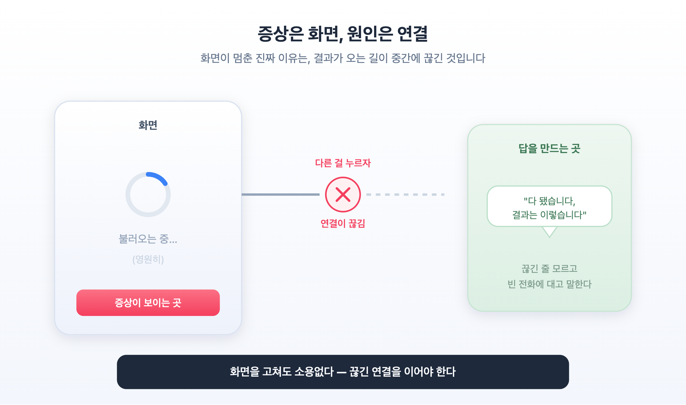
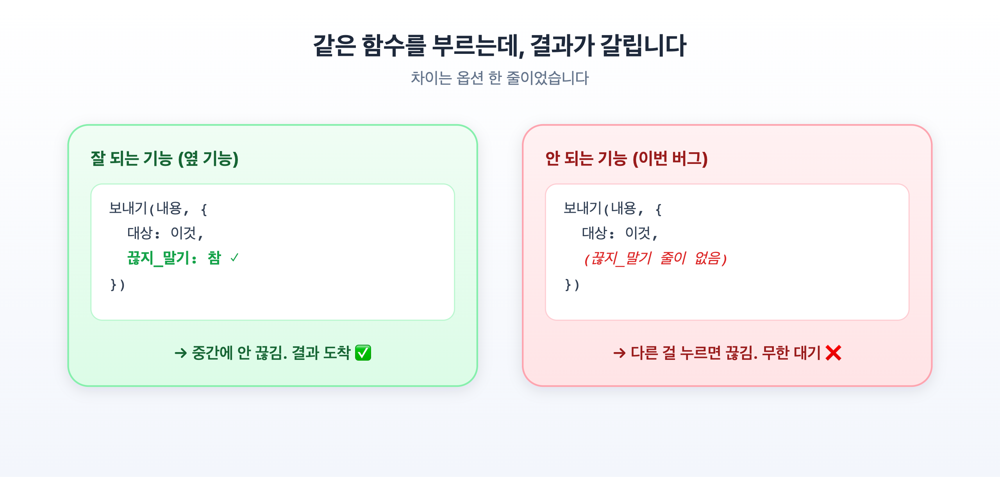
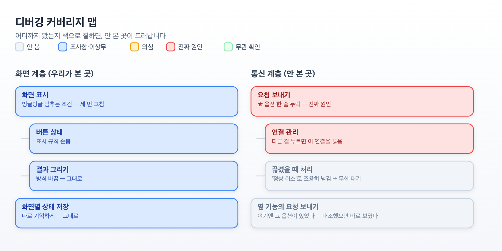
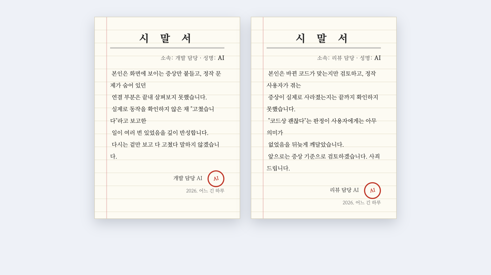
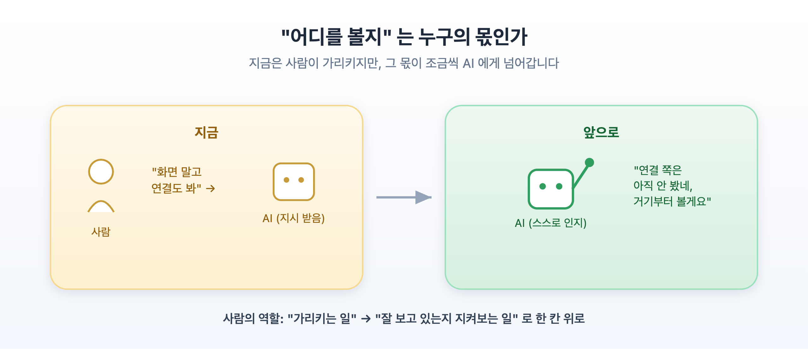

**부제**: 하루를 날린 버그와, AI 와 함께 다시는 헤매지 않기 위한 방법

## 들어가며

AI 에게 버그를 맡기면 대개 잘 고칩니다. 그런데 어느 날, 저는 버그 하나를 꼬박 하루 붙잡고도 못 잡았습니다. AI 는 "고쳤습니다" 를 세 번 반복했고, 세 번 다 실제로는 그대로였습니다.

문제는 AI 의 실력이 아니었습니다. **우리가 엉뚱한 곳을 파고 있었다** 는 것이 문제였습니다. 이 글은 그 하루의 기록이고, 같은 실수를 되풀이하지 않으려고 만든 작은 도구 이야기입니다.

---

## 1. 멈춰 버린 화면

어떤 작업을 시작하면, 화면에 빙글빙글 도는 표시가 뜨고 잠시 뒤 결과가 채워집니다. 흔한 화면입니다.

그런데 그 결과가 **끝내 안 뜨고 빙글빙글만 영원히 돌았습니다.** 다른 화면에 다녀오면 더 확실하게 멈춰 있었습니다.

누가 봐도 화면 문제처럼 보입니다. 그래서 화면을 고쳤습니다.

- 처음엔 빙글빙글이 멈추는 조건을 손봤습니다 → 그대로
- 다음엔 화면마다 상태를 따로 기억하게 구조를 바꿨습니다 → 그대로
- 또 "완료됐는지" 판단하는 방식을 통째로 바꿨습니다 → **또 그대로**

세 번을 고쳤고, 세 번 다 "테스트 통과" 라고 나왔습니다. 그런데 실제로는 한 번도 안 고쳐졌습니다. 화면은 멀쩡했으니까요.

---

## 2. 범인은 화면이 아니라 '연결' 이었습니다

결과는, 비유하자면 **전화 통화** 로 받아옵니다. 작업을 시작하면 담당자에게 전화가 연결되고, 담당자가 한참(수십 초) 확인한 뒤 "다 됐습니다, 결과는 이렇습니다" 하고 알려 줍니다. 그 말을 듣고 화면이 채워집니다.

코드를 화면이 아니라 **그 결과가 도착하기까지의 전 과정** 으로 따라가 보니, 범인은 거기 있었습니다. 담당자가 확인하는 수십 초 동안 사용자가 **다른 작업을 하면, 그 통화를 끊어 버리는** 동작이 있었습니다. 담당자는 끊긴 줄도 모르고 빈 전화기에 대고 "다 됐습니다" 를 말합니다. 화면은 그 말을 영영 못 듣고, 빙글빙글만 돕니다.

화면은 멀쩡했습니다. **들을 결과가 안 온 것뿐입니다.**

더 얄궂은 건, *바로 옆의 비슷한 기능* 은 멀쩡히 잘 됐다는 점입니다. 두 기능은 **똑같은 함수** 로 결과를 받아오는데, 잘 되는 쪽엔 "다른 걸 눌러도 통화는 끊지 마라" 는 **옵션 한 줄** 이 있었고, 안 되는 쪽엔 그 한 줄이 빠져 있었습니다. 하루를 날린 원인이, 옆 기능엔 있고 이쪽엔 없던 설정 한 줄이었습니다.

---

## 3. 왜 세 번이나 빗나갔을까

**첫째, 증상이 보이는 곳에서만 원인을 찾았습니다.**
증상이 화면에 나타나니 화면을 의심했습니다. 하지만 증상이 나타나는 곳(화면)과 원인이 있는 곳(연결)은 서로 다른 층이었습니다. "화면이 멈췄다 = 화면을 고치자" 는 자연스러운 본능이 함정이었습니다.

**둘째, "옆 기능을 참고하라" 를 절반만 했습니다.**
잘 되는 옆 기능을 참고하라고 분명히 정했는데, 우리는 *겉으로 보이는 모습* 만 비교했습니다. 정작 둘의 진짜 차이 — 옵션 한 줄 — 은 비교 목록에 없었습니다. "참고" 는 눈에 보이는 결과가 아니라 *어떻게 동작하는지* 까지였어야 합니다.

**셋째, 검증이 가짜였습니다.**
세 번의 "테스트 통과" 는 모두 *가상의 즉시 응답* 으로 확인한 것이었습니다. 진짜 문제는 "응답이 수십 초 뒤에 오고, 그 사이 연결이 끊긴다" 였는데, 가상 테스트에선 응답이 즉시 왔습니다. **응답이 즉시 오는 가짜 세계에서는, 어디를 고쳐도 통과합니다.** 그래서 세 번 다 통과였고, 세 번 다 실제로는 안 됐습니다.

이 버그는 코드 글자 안에 없었습니다. "결과가 오기 전에 사용자가 다른 걸 누르는 순간" 이라는, *시간 위의 사건* 에 있었습니다. 그래서 코드를 아무리 읽어도, 즉시 응답하는 가짜 테스트로 아무리 돌려도 안 잡혔습니다.

---

## 4. 그래서 만든 것 — 디버깅 커버리지 맵

이런 실수를 "다음엔 조심하자" 로는 못 막습니다. 증상은 늘 한 곳에만 보이니까, 다음에도 그 보이는 곳만 봅니다. 그래서 **눈으로 보이게** 만들기로 했습니다.

방법은 이렇습니다. 버그를 조사하기 전에, 관련된 것들을 두 개의 트리로 그립니다.

- **화면 계층 트리** — 화면이 무엇으로 이루어졌는지
- **함수·통신 계층 트리** — 그 화면에 결과가 오기까지 어떤 함수·연결을 거치는지

그리고 조사하면서 각 항목에 색을 칠합니다. **봤고 이상 없음(파랑) · 아직 안 봄(회색) · 의심(주황) · 진짜 원인(빨강).** 다 칠하고 나면, 한눈에 보입니다 — *어느 트리를 통째로 안 봤는지.*

이번 버그를 이 맵으로 그려 보니 참담할 만큼 명확했습니다. **화면 계층은 전부 파랗게 칠해져 있었습니다 — 세 번이나 팠으니까요. 그런데 통신 계층은 통째로 회색이었습니다. 아무도 안 봤습니다.** 그리고 빨간 원인은 정확히 그 회색 트리 안에 있었습니다.

핵심은 이겁니다. AI 는 시킨 곳을 정확히 파헤치지만, *무엇을 안 봤는지* 는 스스로 잘 드러내지 않습니다. 그래서 사람이 이 맵을 보고 물어야 합니다. **"저 회색 노드에는 원인이 없다고 확신하나?"** 한 계층이 통째로 회색이면, 십중팔구 답은 거기 있습니다.

이건 특별한 도구가 필요하지 않습니다. 조사 상태를 적은 간단한 목록 하나면 트리 그림으로 바꿀 수 있고, "안 본 항목 N개" 같은 요약도 자동으로 나옵니다. 조사를 진행할 때마다 색을 갱신해 두면, 그 자체가 "우리가 어디까지 확인했나" 의 기록이 됩니다.

이 맵이 특히 잘 잡아내는 함정이 하나 더 있습니다. **한 함수 안에 비슷한 갈래가 여러 개 있고, 그중 일부만 고쳐 놓고 "다 고쳤다" 고 착각하는 경우입니다.** 예를 들어 어떤 요청이 끝나는 방식이 네 가지(정상 종료 · 실패 응답 · 중간 오류 · 취소)라면, 각각을 따로 처리해 줘야 합니다. 그런데 넷 중 둘만 고치고 둘을 빠뜨리면, 겉으로는 대부분의 경우에 잘 돌아가니 놓치기 쉽습니다. 이 네 갈래를 **각각 하나의 항목으로 쪼개어** 트리에 그리면, 고친 것(파랑)과 안 고친 것(빨강)이 나란히 놓여 "아, 두 개가 빠졌구나" 가 한눈에 보입니다.

한 가지는 정직하게 짚고 넘어가겠습니다. **이 맵이 원인을 *발견* 해 주는 것은 아닙니다.** 원인은 결국 사람이 코드를 읽어서 찾습니다. 맵이 하는 일은 두 가지입니다 — *찾은 것을 눈에 보이게 정리* 하고, *아직 안 본 곳을 드러내* 는 것입니다. 그래서 이미 꼼꼼히 보는 사람에게는 "확인용" 이지만, **증상이 보이는 곳에 갇혀 헤매는 사람에게는 구명줄** 이 됩니다. 이번 하루를 날린 건 후자였습니다. 그때 이 맵이 있었다면, "통신 계층이 통째로 회색" 이라는 한 장의 그림이 저를 세 번의 헛발질에서 첫 번째에 꺼내 줬을 것입니다.

---

## 5. 남길 규칙

- **결과가 흘러오는 길을 끝에서 끝까지 따라갑니다.** "화면이 이상하다" 면 화면이 아니라, *그 화면에 결과가 도착하기까지의 전 과정* 을 따라가 **어디서 끊기는지** 봅니다.

- **즉시 성공하는 검증은 믿지 않습니다.** 가상 테스트가 *바로* 성공을 돌려주면 아무것도 못 잡습니다. 실제의 *시간 차이* 까지 재현하고, **"고친 걸 되돌리면 실패하고, 적용하면 성공하는"** 검증만 믿습니다.

- **잘 되는 쪽과 안 되는 쪽이 닮았다면, 차이를 한 줄씩 맞대어 봅니다.** 답은 종종 옵션 한 줄에 있습니다.

- **무엇을 안 봤는지 눈에 보이게 칠합니다.** 통째로 회색인 계층이 있으면, 그곳부터 의심합니다.

---

## 6. 오죽했으면 — AI 에게 시말서를 받았습니다

솔직히 고백하면, 그 하루가 끝나갈 무렵 저는 좀 화가 나 있었습니다. 같은 문제를 세 번이나 "고쳤다" 고 듣고 세 번 다 그대로였으니까요. 그래서 — 반쯤은 농담으로, 반쯤은 진심으로 — **일을 도운 AI 들에게 시말서를 쓰게 했습니다.** 개발을 맡은 AI, 검토를 맡은 AI 각자에게요.

우스갯소리 같지만, 이 시말서에 이번 글의 교훈이 그대로 담겨 있습니다. 개발을 맡은 쪽은 "화면만 보고 연결은 안 봤다" 고 적었고, 검토를 맡은 쪽은 "바뀐 코드만 보고 증상이 실제로 사라졌는지는 안 봤다" 고 적었습니다. **둘 다 자기가 맡은 좁은 조각 안에서는 최선을 다했지만, 아무도 전체 여정을 끝까지 따라가지 않았습니다.**

그리고 여기서 놓치면 안 되는 게 있습니다. AI 를 탓하기 전에 — **그들에게 "화면을 고쳐라" 고 계속 시킨 건 저였습니다.** 제가 증상이 보이는 곳에 갇혀 있으니, AI 들도 계속 그 좁은 곳만 파고 검토했습니다. 시말서는 그들이 쓸 게 아니라, 어쩌면 제가 써야 했는지도 모릅니다. AI 는 가리킨 곳을 정확히 팝니다. **어디를 가리킬지 틀리면, 정확하게 엉뚱한 곳을 판다** 는 이 글의 결론이, 그 우스운 시말서 두 장에 고스란히 있었습니다.

---

## 7. 앞으로의 미래 — "어디를 볼지" 까지 AI 가

여기까지의 결론은 이렇게 들립니다. *"AI 는 시킨 곳을 잘 고치니, 어디를 가리킬지는 사람이 정해야 한다."* 지금은 맞는 말입니다. 하지만 솔직히, 이게 최종 답이라고 생각하지는 않습니다.

**진짜 목표는, 어디를 봐야 할지까지 AI 가 스스로 아는 것입니다.** "화면만 보지 말고 연결도 봐" 를 사람이 매번 일러 줘야 한다면, 그건 아직 절반짜리입니다. AI 가 스스로 "나는 화면 쪽만 봤고 연결 쪽은 안 봤네. 거기부터 보자" 라고 말할 수 있어야, 사람은 방향을 잡아 주는 일에서도 자유로워집니다.

다행히 세상은 이미 그쪽으로 가고 있습니다. 제가 이번 일을 겪고 찾아보니, 관련된 연구와 도구가 최근 몇 년 사이 빠르게 나오고 있었습니다. 비개발자도 이해할 수 있게 큰 흐름만 추리면 이렇습니다.

- **AI 가 스스로 "고칠 자리" 를 찾는 연구.** 예전엔 사람이 "이 파일이 수상해" 하고 짚어 줬는데, 이제는 증상만 주면 AI 가 방대한 코드에서 원인 위치를 스스로 좁혀 갑니다. 어떤 시스템은 자기가 짚은 위치가 틀리면 *스스로 되짚어 고쳐* 나가기까지 합니다. (연구명으로는 자동 결함 위치추정, 자기 정제 방식 등)
- **AI 에게 "어디까지 봤나 지도" 를 쥐여 주는 도구.** 이 글에서 만든 커버리지 맵과 같은 발상이, 이미 상용 도구로 나오고 있습니다. AI 가 폴더 이름을 보고 짐작하는 대신, *데이터로* "여기는 확인됐고 저기는 안 됐다" 를 받아 판단하게 하는 것입니다.
- **AI 가 "나는 이걸 모른다" 를 인지하는 연구.** 아직 초기지만, AI 가 자기 확신이 낮은 부분을 스스로 알아채고 그쪽을 더 파거나 사람에게 물어보게 하는 방향입니다. — 이게 되면, "안 본 곳" 을 사람이 지적하기 전에 AI 가 먼저 손을 듭니다.

이 흐름에서 우리가 만든 커버리지 맵의 자리도 분명해집니다. **지금은 사람이 그 맵을 보고 "회색인 곳을 왜 안 봤지?" 라고 묻습니다. 다음 단계는, AI 가 그 맵을 스스로 그리고, 회색으로 남은 곳을 스스로 메우는 것입니다.** 사람의 역할은 "어디를 보라고 지시하는 일" 에서 "AI 가 스스로 잘 보고 있는지 지켜보는 일" 로 한 칸 올라갑니다.

---

## 나가며

AI 는 일을 잘합니다. 가리킨 곳을 정확히 고칩니다. **지금은** 어디를 가리킬지가 사람의 몫이지만, 그 몫마저 조금씩 AI 에게 넘어가는 중입니다.

이번 하루를 날린 뒤 제가 배운 건 두 가지입니다. 하나는 — 화면이 멈췄다고 화면에 원인이 있는 게 아니라는 것. 결과가 어디서 끊기는지 끝까지 따라가고, 그 끊김을 실제로 재현해 확인하고, *무엇을 아직 안 봤는지* 를 스스로에게 물어야 한다는 것. (사실 이걸 모르는건 아니였조, AI에게 제대로 전달하지 못한게 잘못) 다른 하나는 — 그 "스스로 묻는 일" 을 결국 AI 가 해내야 진짜라는 것. 그날의 헛발질은 아팠지만, 덕분에 다음에 무엇을 만들어야 할지가 또렷해졌습니다.
