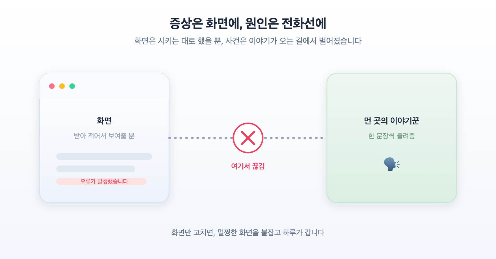
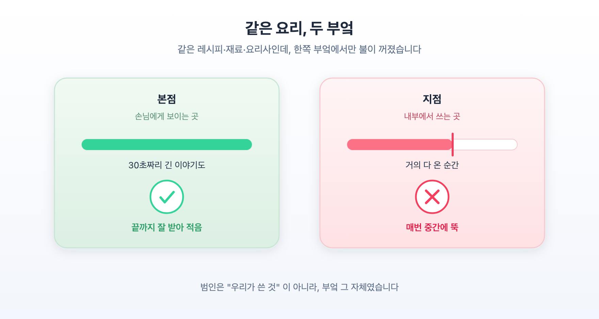
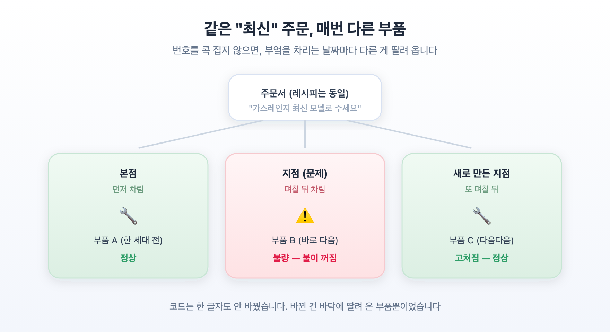

**부제**: 잘 되던 기능이 한쪽에서만 망가졌고, 범인은 우리가 쓴 코드가 아니라 그 코드를 **실행해 주는 엔진**이었습니다

---

## 들어가며

같은 요리를 같은 레시피로 만들었는데, 우리 집 부엌에서는 되고 옆집 부엌에서는 안 된다면, 우리는 보통 **레시피**를 먼저 의심합니다. "내가 뭘 빠뜨렸나, 순서를 틀렸나." 그런데 몇 시간을 들여다봐도 레시피에는 아무 문제가 없습니다. 재료도 같고, 계량도 같고, 불 세기도 같습니다.

그러다 문득 깨닫습니다. 문제는 레시피가 아니라 **옆집 가스레인지**였습니다. 겉보기엔 똑같은 모델이지만, 어느 날 조용히 이뤄진 부품 교체 때문에 불이 중간에 꺼지고 있었던 것입니다.

이 글은 그런 하루의 기록입니다. 잘 되던 기능이 어느 순간 한쪽에서만 망가졌는데, 우리가 쓴 코드에는 잘못이 없었고, 진짜 범인은 **그 코드를 실행해 주는 엔진(런타임)의 특정 버전에 몰래 끼어든 결함**이었던 이야기입니다. 요즘 AI로 코드를 만드는 이른바 '바이브코딩'을 하시는 분이라면, 언젠가 꼭 한 번은 마주칠 종류의 함정입니다. 그래서 비유로 감을 잡되, 실제로 무엇이었는지도 정확히 짚어 두겠습니다.

---



## 1. 답이 다 나오다가, 갑자기 오류로 바뀌었습니다

먼저 증상입니다. 어떤 질문을 하면, 답이 **한 글자씩 실시간으로** 화면에 채워집니다. 마치 상대가 말하는 걸 받아쓰기하듯이요. 표도 그려지고, 문장도 술술 이어집니다. 거의 다 온 것 같습니다.

그런데 마지막 순간, 다 채워진 답이 **통째로 사라지고 "오류가 발생했습니다"** 로 바뀝니다.

사용자 입장에서는 가장 약이 오르는 형태입니다. 답이 아예 안 왔으면 "느리네" 하고 넘어가지만, **다 보이던 답이 눈앞에서 지워지는** 건 이해가 안 됩니다.

여기서 첫 번째 함정이 있었습니다. 답을 화면에 그리는 건 **우리 앱**입니다. 그러니 자연스럽게 "화면 쪽 문제겠지" 하고 그쪽을 의심하게 됩니다. 하지만 그 방향은 처음부터 어긋나 있었습니다.

---

## 2. "오류입니다" 라는 말은, 사실 우리 앱이 만든 말이 아니었습니다

가장 먼저 한 일은, 화면에 뜬 그 **오류 문구를 앱 코드 전체에서 찾아보는 것**이었습니다.

없었습니다. 그 문장은 우리 화면 어디에도 적혀 있지 않았습니다.

알고 보니 그 말은 **멀리 있는 이야기꾼**이 보낸 것이었습니다. 우리 화면은 답을 직접 만들지 않습니다. 먼 곳의 이야기꾼(AI 서버)에게 질문을 전달하고, 이야기꾼이 한 문장씩 들려주는 걸 그대로 받아 적을 뿐입니다. 그런데 이야기가 거의 끝나갈 무렵 **연결이 뚝 끊기면**, 중간 다리 역할을 하는 서버가 "죄송합니다, 오류입니다" 라는 말을 대신 화면에 띄웁니다.

즉 화면은 시키는 대로 했을 뿐이고, **진짜 사건은 데이터가 오는 통로에서 벌어지고 있었습니다.**

> 첫 교훈: **증상이 보이는 곳과 원인이 있는 곳은 다를 수 있습니다.** "화면이 이상하다" 고 화면만 파면, 멀쩡한 화면을 붙잡고 하루를 보냅니다.

---

## 3. 브라우저 탓? 아니었습니다

다음 용의자는 브라우저였습니다. 웹 브라우저가 긴 응답을 못 버티고 끊는 걸까?

이걸 확인하는 방법은 간단했습니다. 브라우저를 **완전히 빼고**, 명령어 한 줄로 같은 서버에 같은 질문을 직접 던져 봤습니다. 브라우저가 원인이라면, 브라우저 없이 하면 잘 돼야 합니다.

**여전히 똑같이 끊겼습니다.** 브라우저는 무죄였습니다.

이런 식으로 용의자를 하나씩 지워 나갔습니다. 이 과정에서 중요한 원칙 하나를 지켰습니다 — **추측하지 말고, 매번 직접 재현해서 눈으로 확인한다.** "아마 이것 때문일 거야" 는 검증이 아닙니다. "이걸 이렇게 하면 실패하고, 저렇게 하면 성공한다" 를 보여줘야 검증입니다. AI에게 디버깅을 맡길 때 특히 중요합니다. AI는 그럴듯한 추측을 잘 내놓지만, 그 추측이 맞는지는 **재현으로만** 가려집니다.

지워 나간 용의자 목록은 이렇습니다.

- 브라우저 → 무죄 (없이 해도 실패)
- 화면 코드 → 무죄 (오류 문구는 화면이 만든 게 아님)
- 자료를 미리 찾아오는 **검색 단계** → 무죄 (매번 빠르게 성공하고 있었음)
- 서버가 이야기꾼에게 접속하는 **열쇠(API 키·계정)** → 무죄 (양쪽이 완전히 동일)
- 설정값, 환경값 → 무죄 (관계없는 두 개 빼고 전부 동일)

용의자를 이렇게까지 지웠는데도 문제는 그대로였습니다. 남은 건 딱 하나, **"왜 한쪽에서만 이러지?"** 였습니다.

---

## 4. 본점은 되고, 지점만 안 됩니다

우리에게는 같은 서비스가 두 곳에 돌아가고 있었습니다. 하나는 실제 사용자용(**운영**), 하나는 내부 테스트용(**개발**)입니다. 편의상 **본점**과 **지점**이라고 부르겠습니다. 손님에게 보이는 본점은 멀쩡했고, 내부에서 쓰는 지점만 이 문제가 났습니다.

그래서 **같은 질문을, 같은 시각에, 본점과 지점에 번갈아** 던져 봤습니다.

- 본점: 30초짜리 긴 응답도 **끝까지** 잘 받아 적었습니다.
- 지점: 매번 중간에서 **뚝** 끊겼습니다.

같은 레시피, 같은 재료, 같은 요리사인데 **한쪽 부엌에서만** 불이 꺼지는 셈이었습니다. 이쯤 되면 범인은 "우리가 쓴 것" 이 아니라 **"부엌 그 자체"**, 즉 서비스가 놓여 있는 실행 환경에 있다는 게 분명해집니다.

---

## 5. 잠깐, '코드를 실행하는 엔진' 이 뭔가요?

여기서 실체를 짚고 가겠습니다. 이 대목이 이 글에서 가장 중요합니다.

우리가 "코드를 짠다" 고 할 때, 그 코드는 **혼자서는 아무것도 못 합니다.** 코드는 그냥 글로 적힌 설명서에 가깝습니다. 그 설명서를 실제로 읽고 실행해 주는 **엔진**이 따로 있어야 합니다. 요즘 웹 서비스에서 그 엔진 역할을 흔히 맡는 것이 **Node.js(노드)** 라는 프로그램입니다.

비유하자면 이렇습니다. **레시피(우리 코드)는 우리가 쓰지만, 실제로 불을 켜고 냄비를 젓는 건 가스레인지(Node.js)입니다.** 우리는 "이렇게 저렇게 조리해" 라고 적을 뿐, 그 지시를 실제 동작으로 옮기는 건 엔진입니다.

그런데 이 엔진도 **소프트웨어**라서, 계속 업데이트되고 버전이 올라갑니다. `22.22.3`, `22.23.0`, `22.23.1`… 이런 식으로요. 대부분의 업데이트는 조용히 좋아지지만, 아주 가끔 **어떤 버전 하나에만 결함이 들어가는** 일이 생깁니다. 그리고 그 결함은 **우리 코드가 아무리 완벽해도** 우리를 무너뜨릴 수 있습니다. 냄비는 잘못 없이 잘 젓고 있는데, 가스레인지가 멋대로 불을 꺼 버리는 것과 같으니까요.

바이브코딩을 하시는 분들이 이 대목을 꼭 기억하셨으면 합니다. **"내 코드가 문제일 것" 이라는 가정은 대개 맞지만, 항상 맞지는 않습니다.** 코드를 열 번 고쳐도 안 되는 어떤 순간은, 코드가 아니라 그 아래에서 코드를 돌리는 엔진에 원인이 있습니다.

---

## 6. 결정적 단서: "다시 만들었더니 나았다"

방향을 튼 단서가 하나 있었습니다.

지점을 **똑같은 재료 꾸러미 그대로** 다시 배치해 봤을 때는 — 여전히 실패했습니다. 그런데 지점을 **처음부터 새로 빌드(build)** 해서 배치했더니 — **거짓말처럼 나았습니다.**

'빌드' 란, 우리 코드와 필요한 부품들을 한데 묶어 **실행 가능한 꾸러미로 만드는** 과정입니다. 요리로 치면 "부엌을 새로 차리는" 단계입니다. 그런데 여기서 중요한 사실이 드러납니다. **우리는 부엌을 차릴 때마다 "가스레인지는 최신 걸로 넣어 줘" 라고만 주문하고 있었습니다.** 특정 버전을 콕 집지 않았습니다.

실제 설정은 이랬습니다.

- 부엌 설계도에 `Node.js 22 최신` 이라고만 적혀 있었습니다.
- 그래서 **부엌을 차리는 날짜마다**, 그날 기준 "22번대 최신" 버전이 자동으로 딸려 왔습니다.
- 본점은 며칠 앞서 차려서 `22.22.3` 이 들어갔고, 지점은 며칠 뒤 차려서 `22.23.0` 이 들어갔으며, 다시 만든 지점은 또 며칠 뒤라 `22.23.1` 이 들어갔습니다.

같은 "최신" 이라는 이름표를 달았지만, 안에 든 실제 버전은 부엌마다 달랐던 것입니다.

---

## 7. 진짜 범인: 특정 한 버전에만 있던 결함

마지막으로, 두 부엌의 가스레인지 **버전 번호**를 나란히 확인했습니다.

- 본점: **Node.js 22.22.3** → 정상
- 문제의 지점: **Node.js 22.23.0** → 오류
- 다시 만든 지점: **Node.js 22.23.1** → 정상

문제의 그 버전, **딱 `22.23.0` 하나에만** 결함이 있었던 것입니다. 확인해 보니 `22.23.0` 은 **보안을 강화하는 업데이트**였는데, 그 과정에서 **"통신이 끝난 뒤 연결을 정리하는" 처리에 실수**가 끼어 있었습니다. 그래서 긴 응답의 **맨 마지막 순간**, 상대가 "이상입니다" 하고 마무리하려는 찰나에 연결이 먼저 끊겨 버렸습니다. 답이 거의 다 완성된 다음에야 오류로 바뀌던 이유가 바로 이것이었습니다.

그리고 바로 다음 버전인 `22.23.1` 에서, Node.js를 만드는 사람들이 이 실수를 조용히 바로잡았습니다. 우리가 겪은 그 며칠은, 하필 이 결함 버전이 세상에 나와 있던 **좁은 틈** 이었고, 지점이 그 틈에 부엌을 차린 것이었습니다.

우리 코드도, 우리가 고른 부품 종류도 아무 잘못이 없었습니다. **그저 어느 며칠 사이에 만들어진 실행 환경이, 하필 그 결함 버전을 물고 있었을 뿐입니다.**

---

## 8. 그래서 남긴 규칙 — 특히 바이브코딩을 위한

이 하루에서 얻은 것은 "버그 하나를 잡았다" 가 아니라, **몇 가지 습관**이었습니다. AI로 빠르게 만드는 분일수록 도움이 되는 것들입니다.

**첫째, 증상이 보이는 곳부터 파지 않습니다.** 화면이 이상해도, 그 화면에 결과가 도착하기까지의 **전 과정**을 끝에서 끝까지 따라갑니다. 오류 문구 하나도 "이 말을 누가 만들었나" 부터 찾습니다. AI에게 "화면 고쳐 줘" 라고만 하면, AI도 멀쩡한 화면만 계속 고칩니다.

**둘째, 추측이 아니라 재현으로 좁힙니다.** 용의자를 하나씩 **직접 빼 보면서** "빼면 되고, 넣으면 안 된다" 를 눈으로 확인합니다. "브라우저 없이도 실패한다", "본점은 되고 지점은 안 된다" 같은 대조가 하나씩 쌓이면, 남는 용의자가 저절로 드러납니다.

**셋째, "다시 만드니 나았다" 를 그냥 넘기지 않습니다.** 코드를 안 바꿨는데 나았다면, 범인은 코드가 아니라 **빌드 과정에 딸려 들어온 무언가**(엔진 버전, 부품 버전)입니다. 원인을 모른 채 "됐으니 됐다" 하고 넘어가면, 언제든 반대로 재발합니다.

**넷째, 실행 엔진과 부품의 버전은 번호를 콕 집어 고정합니다.** 이게 가장 실천하기 쉬운 예방책입니다. `Node.js 22 최신` 처럼 적으면 만들 때마다 다른 게 들어옵니다. 대신 `Node.js 22.23.1` 처럼 **정확한 버전을 못 박아** 두면, 어느 날 어느 환경에서 다시 만들어도 **똑같은 엔진**이 들어옵니다. "내 컴퓨터에서는 됐는데 왜 서버에서는 안 되지?" 의 상당수가 바로 이 **버전 고정을 안 해서** 생깁니다.

---

## 나가며

가장 오래 헤맨 이유는, 우리가 **"우리가 만든 것"** 안에서만 범인을 찾았기 때문입니다. 코드, 설정, 화면 — 전부 우리가 손댈 수 있는 것들이라 익숙하고, 그래서 자꾸 그 안을 뒤졌습니다.

하지만 소프트웨어는 우리가 쓴 코드 위에서만 도는 게 아닙니다. 그 아래에는 **Node.js 같은 실행 엔진과, 우리가 직접 만들지 않았지만 우리 대신 일해 주는 수많은 부품**이 깔려 있고, 그것들도 조용히 버전이 바뀝니다. AI가 코드를 아무리 잘 짜 줘도, 그 코드가 실행되는 **바닥**까지는 대신 챙겨 주지 않습니다. 바닥도 살펴보라고 시키는 건 여전히 사람의 몫입니다.

잘 되던 게 이유 없이 한쪽에서만 망가진다면, 한 번쯤 **코드 아래 실행 환경까지 내려가 볼** 필요가 있습니다. 그리고 그때를 대비해, 오늘부터 **버전을 정확히 기억**해 두시길 권합니다. **레시피가 아니라, 가스레인지를 보세요. 그리고 그 가스레인지의 모델 번호를 적어 두세요.**
