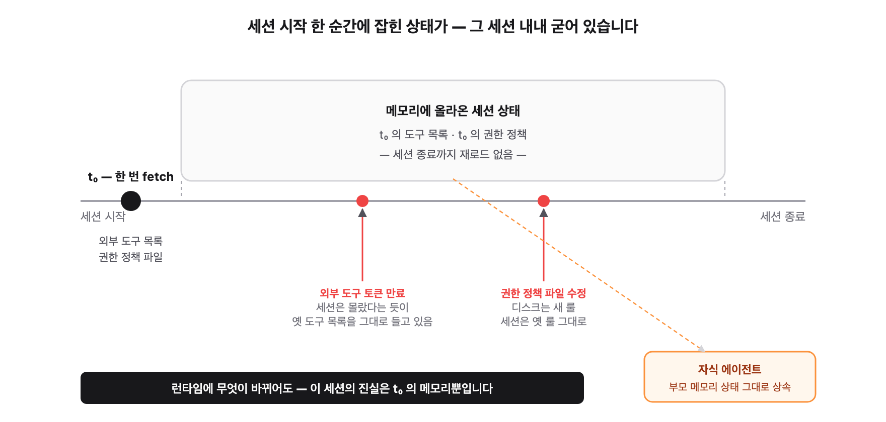
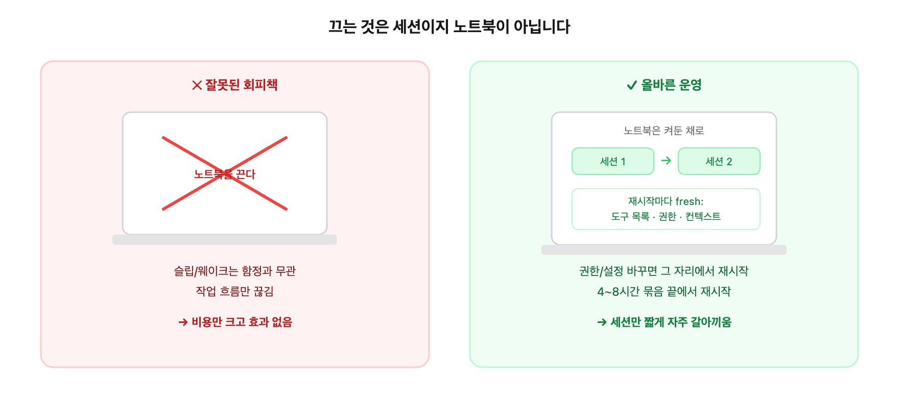

**부제**: AI 코딩 에이전트의 lifecycle 을 모르고 운영했을 때 마주친 두 사건
**대상 독자**: AI 코딩 에이전트로 장시간 작업하는 개발자, 백그라운드 에이전트로 파이프라인을 굴려본 적이 있는 개발자

---

## 두 가지 사건이 출근하자마자 동시에 일어났습니다

컴퓨터와 AI 코딩 에이전트를 켜놓고 퇴근했다가 다음날 출근하니 아래 같은 문제가 발생했습니다. 둘 다 *어제까지 잘 되던* 일 이었죠.

- **사건 A — 구글캘린더 일정등록이 자동으로 안 됩니다.** 어제 사이클에서는 작업 일정 자동 등록까지 한 번에 됐는데, 이번 사이클에서는 캘린더 도구가 *사용 가능한 도구 목록에 아예 보이지 않습니다*. `claude mcp list` 로 확인하면 분명 `✔ Connected` 로 표시되는데, 막상 호출하려고 하면 도구가 없다고 나옵니다.

- **사건 B — 백그라운드 에이전트가 코드 수정에 실패합니다.** 개발을 맡긴 서브에이전트가 코드 한 파일의 네 군데를 패치해야 하는데, *Edit 권한 거부* 를 보고하고 멈췄습니다. 권한 정책 파일에 명시적으로 허용 룰을 추가한 *후에도* 같은 거부가 반복됐습니다.

두 사건은 *처음에는* 다른 문제로 보였습니다. A 는 외부 서비스 인증 문제, B 는 파일 시스템 권한 문제. 그런데 진단을 끝까지 따라가니 둘이 같은 원인에서 출발했습니다 — **세션을 계속 켜둔 채로 일했기 때문에 그 세션 안에 *잘못된 상태가 굳어버린* 것** 이었습니다.

정리해 보면 아래와 같습니다.

---



## 사건 A — 캘린더 도구가 *목록 자체에서* 사라진 이유

먼저 사건 A 의 현상적으로 정리해 보겠습니다.

1. 이슈를 발행한 다음, 작업 일정을 캘린더에 등록하려고 했습니다.
2. AI 에이전트가 *사용 가능한 도구 목록에 캘린더가 없다* 고 보고했습니다.
3. 별도 명령으로 외부 도구의 상태를 확인하니 캘린더는 정상 *연결* 상태로 표시됐습니다.
4. 사용자가 *기존 세션을 종료하고 새 세션으로 들어가니* 캘린더 도구가 그제야 목록에 나타났습니다.

이제 실제 원인을 찾아봅시다.
여기서 핵심은 **"연결은 되어 있는데, 이 세션의 도구 목록에는 없다"** 였습니다. 

- AI 코딩 에이전트는 시작할 때 외부 서비스(*hosted MCP*) 의 도구 목록을 *한 번* 가져옵니다.
- 그 한 번의 가져오기가 — 토큰 갱신 타이밍과 겹치거나, 네트워크 장애로 — *비어 있는 응답* 으로 받아질 수 있습니다.
- 그렇게 *비어 있는 상태로 시작된 세션* 은 그 안에서 외부 서비스 도구 목록을 **다시 가져오지 않습니다.**
- 그 결과 — 외부 서비스 자체는 살아 있는데도 — 이 세션 안에서는 그 도구를 영원히 못 부릅니다.

즉 사건 A 는 *외부 서비스 인증 만료* 가 아니라 **"세션 시작 한 순간에 잡힌 도구 목록이 그 세션 내내 그대로 굳는다"** 라는 lifecycle 의 결과였습니다. 어제 캘린더 등록에 성공한 이후에 어떤 이유에서인지 몰라도 세션을 다시 켰고 그 때 발생한 문제가 다음날 출근한 후에 표면화 된 것 이었습니다.

---

## 사건 B — 권한 파일을 고쳐도 거부가 계속 난 이유

사건 B 는 표면적으로 더 단순해 보였습니다.

1. 백그라운드 에이전트가 코드 한 파일의 네 군데를 수정해야 했습니다.
2. *Edit 권한 거부* 를 보고하고 멈췄습니다.
3. 권한 정책 파일을 열어 명시적으로 *이 디렉터리는 Edit 자동 허용* 룰을 추가했습니다.
4. 같은 에이전트를 다시 띄웠는데 — *같은 거부* 가 났습니다.

처음에는 "내 룰 문법이 잘못됐나"하고 의심했습니다. 글로브 패턴을 바꿔보고, 도구명을 명시해 보고, 디렉터리 범위를 좁혀 보고 — 할 걸 다 해봤지만 아무 효과가 없었습니다.

진단을 끝까지 파고든 결과, 사건 A 와 거의 같은 원인을 말해주고 있었습니다.

- AI 코딩 에이전트는 시작할 때 권한 정책 파일을 *한 번* 읽어 메모리에 올립니다.
- 세션 도중에 파일을 수정해도 — 그 세션의 메모리는 *다시 읽지 않습니다.*
- 백그라운드 에이전트는 자기 부모(메인 세션) 의 메모리 상태를 그대로 *상속* 합니다.
- 그래서 *부모가 옛 정책을 들고 있는 한* 자식도 옛 정책으로 거부합니다.
- 권한 정책을 *디스크에서* 바꾼 시점이 *세션이 이미 떠 있던 시점* 이라면, 그 변경은 *다음 세션* 에 가서야 효과를 봅니다.

사건 B 의 해결은 결국 사용자가 *기존 세션을 종료하고 새 세션으로 들어가는* 것이었습니다.

---

## 두 사건의 공통 양상

두 사건을 나란히 놓으면 — 겉모습은 다르지만 — 뿌리가 같았습니다.

| 항목 | 사건 A — 외부 도구 누락 | 사건 B — 권한 변경 반영안됨 |
|---|---|---|
| 무엇이 문제인가? | 외부 서비스 도구 목록 | 권한 정책 |
| 언제 잡히나 | 세션 시작 시 한 번 가져오기 | 세션 시작 시 한 번 읽기 |
| 세션 도중 갱신되나 | 안 됩니다 | 안 됩니다 |
| 자식 에이전트는 어떻게 | 부모의 상태를 상속 | 부모의 상태를 상속 |
| 해결 | 세션 재시작 | 세션 재시작 |

**한 줄로 줄이면 — *세션 시작 시점에 잡힌 상태가 그 세션 내내 굳어버린다*.** 외부 서비스의 살아 있음/죽음과 무관하게, 디스크 파일의 변경 여부와 무관하게, *이미 들고 있는 메모리만이 그 세션의 진실* 입니다.

이 양상을 알고 나면, 두 사건이 *왜 우연이 아닌지* 도 보입니다. 둘 다 *세션 안에서는 그대로 고정되어야 안전한 상태* 입니다 — 외부 도구 목록이 도중에 멋대로 바뀌면 호출 중인 작업이 어긋나고, 권한 정책이 도중에 멋대로 바뀌면 보안 모델이 흔들립니다. *런타임 unreactive* 는 의도된 설계이지 버그가 아닙니다.

다만 이 설계는 한 가지를 전제하고 있습니다 — **세션의 라이프 사이클이 비교적 짧다는 전제**.

---

## 세션을 계속 켜둔 채로 일하면 왜 불이익이 누적되는가

본 작업 방식은 — *노트북을 며칠 켜둔 채로* — 같은 AI 코딩 에이전트 세션을 *몇 시간씩 또는 종일* 유지하면서 그 위에서 백그라운드 에이전트를 띄우고 파이프라인을 굴리는 흐름입니다. 효율적으로 보이지만 — 위의 *unreactive* 설계와 맞물리면 — 다음과 같은 불이익이 *시간에 비례해서* 쌓입니다.

**첫째, 외부 서비스 토큰 만료가 안에서 처리되지 않습니다.** 외부 서비스의 OAuth 토큰은 보통 1~24시간 단위로 만료됩니다. 세션이 그보다 오래 살아 있으면, *시작 때 가져온 도구 목록* 은 토큰 만료 후에도 *유효한 척* 남아 있습니다. 어느 순간 호출했을 때 거부가 나는데 — 명확한 에러 없이 *조용히* 거부되는 경우가 있습니다. 사용자는 "왜 안 되지" 라는 단계를 한 번 더 거치게 됩니다.

**둘째, 권한/설정 변경이 묻혀버립니다.** 세션 도중에 어떤 도구나 사용자가 권한 정책 파일을 한 줄 추가했다 — 그 효과는 *지금 켜져 있는 세션에는* 반영되지 않습니다. 사용자는 *방금 룰을 추가했는데* 라는 의아함을 안고 우회로를 찾게 됩니다. 우회로가 또 다른 함정을 만들기도 합니다.

**셋째, 컨텍스트 압축이 *조용한 손실* 을 누적시킵니다.** 세션이 길어지면 누적된 대화가 자동으로 압축됩니다. 압축 과정에서 — 의도하지 않게 — 도구 목록 메타데이터의 일부가 *손실된 채로* 복원될 수 있습니다. 위의 *unreactive* 설계와 결합되면, 압축 한 번에 도구 목록이 *돌이킬 수 없이* 줄어드는 경우가 생깁니다.

**넷째, 백그라운드 에이전트가 부모의 *옛 상태* 를 그대로 가져갑니다.** 사용자가 세션 도중에 settings 를 바꾸고 그 위에 새 백그라운드 에이전트를 띄워도, 그 자식은 *부모가 들고 있는 옛 settings* 를 상속합니다. 사용자가 "방금 고쳤는데 왜 자식이 옛 룰로 동작하지" 라는 단계를 또 한 번 거치게 됩니다.

이 네 가지가 다 *시간에 비례* 합니다. 짧은 세션이면 거의 안 보이는 비용이, 종일 세션이면 *반드시 한 번은* 나타나는 비용이 됩니다.

---

## 그러면 어떻게 운영해야 하는가

진단이 끝났으니 운영 룰의 조정이 필요합니다.

**룰 1. 권한/설정 파일을 바꿨다면 그 자리에서 재시작합니다.** *바꿨는데 효과를 못 봤다* 의 거의 모든 경우가 이 룰 위반입니다. 1분 안에 끝나는 일을 하지 않아서 한 사이클을 헤맵니다.

**룰 2. 4~8 시간을 묶음 단위로 보고 그 끝에서 재시작합니다.** 작업 흐름의 큰 사이클 (예: 한 이슈의 파이프라인 종료, 머지 직후) 이라면 끝나고 반드시 재시작. 아무리 길어도 종일 한 세션은 피합니다.

**룰 3. 새 세션 처음에 핵심 도구를 *prefetch* 합니다.** 외부 도구 (캘린더 / 메일 / 파일 같은 hosted 도구) 가 사용 가능한지를 *시작 직후* 한 번 점검합니다. 없으면 즉시 다시 재시작합니다. 작업이 본격 시작된 다음에 발견하는 것보다 비용이 훨씬 낮습니다.

**룰 4. 노트북을 종일 켜두는 것 자체는 무관합니다.** 위의 *unreactive* 설계는 *OS 의 슬립/웨이크* 와 무관합니다. 노트북을 며칠 켜두든 — 세션만 적절히 재시작하면 — 함정은 생기지 않습니다. "노트북도 자주 꺼야 하나" 는 잘못된 회피책입니다. 끄는 것은 *세션* 이지 *노트북* 이 아닙니다.

**룰 5. 에러 메시지가 *권한 차단* 으로 보일 때 — 그게 진짜 권한 차단인지, 아니면 *세션이 들고 있는 옛 권한이 차단된 것인지* 한 번 더 의심합니다.** 보안상 진짜 차단할 일도 분명히 있습니다. 그러나 *방금 룰을 추가했는데도 차단된다* 면 거의 100% 후자입니다.

---

## 마무리 — 설계 의도와 운영 방식의 간극

이 글은 *AI 코딩 에이전트의 설계가 잘못됐다* 는 글이 아닙니다. *세션 시작 시점에 상태를 고정하고 도중에 바꾸지 않는다* 는 설계는 *짧은 세션* 을 전제로 보면 합리적입니다. 외부 도구가 작업 도중에 멋대로 사라지지 않고, 권한이 작업 도중에 멋대로 풀리지 않으니까요.

문제는 사용자가 *짧은 세션* 이라는 전제를 깨고 *종일 세션* 으로 일했을 때 생깁니다. 설계는 흠 없이 그대로 작동하는데, 운영 방식이 그 전제에서 벗어나는 순간 — 어제 문제없이 끝나던 일이 오늘은 거부되는 — 어긋남이 하나둘 쌓입니다.

답은 단순합니다. **설계의 전제 안에서 운영합니다 — 그것이 세션을 가끔 재시작하는 일입니다.** 노트북을 끄지 않아도 됩니다. 일을 길게 해도 됩니다. 다만 *세션* 만은 *짧게 자주* 갈아 끼웁니다.

오늘의 두 함정은 — 그 단순한 룰을 하나 놓치고 종일 한 세션으로 일한 비용이었습니다.
