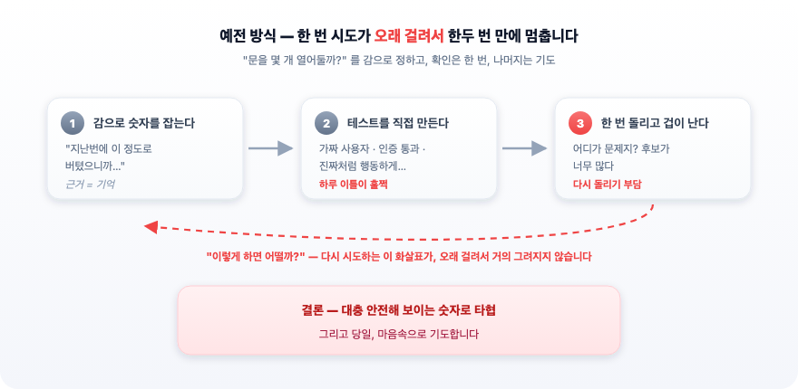
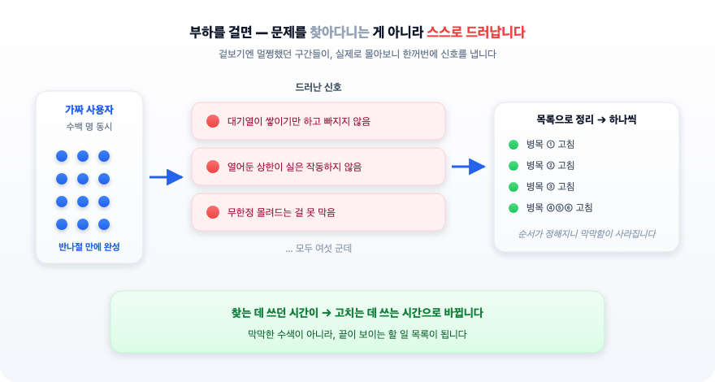

**부제**: 그냥 오픈하면 망합니다. 사용자가 없어서 망하거나, 사용자가 몰려서 망하거나. 어쨌든 망합니다.

---

## 들어가며

개발 지식 없이, 겉모습만 돌아가면 된다고 생각하고 만든 웹사이트. **그냥 배포하고 오픈하면 위험합니다.**

요즘은 코드를 한 줄도 몰라도 사이트가 나옵니다. 하고 싶은 걸 말로 설명하면 화면이 만들어지고, 버튼을 누르면 실제로 동작합니다. 혼자 확인할 때는 아무 문제가 없습니다. 눌러보면 잘 되니까요.

문제는 **혼자 눌러볼 때와 여러 명이 동시에 누를 때가 완전히 다른 일**이라는 데 있습니다. 내가 눌러서 잘 되는 것은 "한 사람이 왔을 때 된다"는 뜻일 뿐입니다. 홍보가 잘돼서 백 명이 한꺼번에 들어오는 순간, 잘 되던 화면이 멈추거나 하염없이 빙글빙글 돌기 시작합니다. 그리고 이 문제는 **오픈 전에는 거의 드러나지 않습니다.**

부제에 쓴 말이 과장이 아닙니다. 사용자가 없으면 서비스는 조용히 사라집니다. 그런데 어렵게 사용자를 모아놓고 **정작 몰리는 그날 서비스가 버티지 못하면**, 사람들은 두 번 다시 오지 않습니다. 첫인상은 한 번뿐입니다.

그래서 이 글에서는 **"트래픽 제어"** 이야기를 하려 합니다. 한꺼번에 몰려오는 사람들을 어떻게 받아낼지 정하는 일입니다. 어려운 이론이 아니라, "동시에 몇 명까지 받을 수 있게 해둘 것인가"라는 아주 실용적인 숫자 몇 개를 정하는 문제입니다. 그리고 그 숫자를 예전에는 감으로 정했지만, 지금은 **AI와 함께 실제로 재보고 정할 수 있다**는 이야기입니다.

먼저 이 "숫자"가 무엇인지 비유로 감을 잡아봅시다.

여러분이 큰 강당을 빌려서 행사를 주최한다고 상상해봅시다. 그 강당에는 출입구가 많은데요. 행사를 시작하기 전, 입구에서 이런 고민을 하게 될 겁니다. "문을 몇 개 열어둘까?" 문을 너무 조금 열면 사람들이 밖에서 줄을 서서 못 들어옵니다. 너무 많이 열면 안내 인력이 모자라 안이 아수라장이 됩니다. **적당한 개수**가 있는데, 그 적당함은 "오늘 몇 명이 얼마나 몰려서 오느냐"에 따라 달라집니다.

소프트웨어에도 똑같은 "문 개수"가 있습니다. 동시에 처리할 수 있는 작업의 상한, 한 번에 붙일 수 있는 연결의 수, 뒤에서 순서를 기다리게 하는 대기열의 크기 같은 것들입니다. 이 숫자들을 잘못 잡으면, 사용자가 몰리는 바로 그 순간에 서비스가 느려지거나 멈춥니다.

문제는 이 숫자를 **미리 정확히 알 수 없다**는 데 있습니다. 사이트를 만들어 주는 도구는 이 값들을 대개 기본값으로 채워둡니다. 그 기본값은 "혼자 눌러볼 때"는 아무 문제가 없지만, 몰려올 때를 겨냥해 정해진 값이 아닙니다.

그래서 예전에는 경험과 감으로 대충 잡았습니다. 저는 최근에 이 "감으로 잡던 숫자"를 **AI와 함께 실제로 재보고 정하는** 경험을 했는데, 예상보다 훨씬 빠르고 안정적이었습니다. 아래에서 예전 방식과 무엇이 달라졌는지 순서대로 보겠습니다.

---



## 1. 예전에는 어떻게 정했나

큰 행사를 앞두고 있다고 해봅시다. 평소보다 수백 명이 한꺼번에 몰릴 예정입니다. 서비스가 버틸지 확인해야 합니다.

예전 방식은 대략 이랬습니다.

- **감으로 숫자를 잡습니다.** "동시에 이 정도면 되겠지" 하고 상한을 정합니다. 근거는 대체로 "지난번에 이 정도로 버텼으니까"입니다.
- **직접 테스트를 만듭니다.** 수백 명이 동시에 몰리는 상황을 흉내 내는 프로그램을 짜야 하는데, 이게 손이 많이 갑니다. 가짜 사용자를 만들고, 인증을 통과시키고, 진짜처럼 행동하게 만들고… 하루 이틀이 훌쩍 갑니다.
- **한 번 돌려보고 겁이 납니다.** 결과가 안 좋게 나오면 어디가 문제인지 찾아야 하는데, 후보가 너무 많습니다. 문 개수가 문제인지, 대기열이 문제인지, 그 뒤의 다른 무언가가 문제인지. 하나씩 바꿔가며 다시 돌려야 하는데, 테스트 한 번에 시간이 걸리니 **여러 번 시도하기가 부담스럽습니다.**

결국 "몇 번 못 돌려보고, 대충 안전해 보이는 숫자로 타협"하게 됩니다. 그리고 행사 당일, 마음속으로 기도합니다.

---

## 2. AI와 함께 하니 무엇이 달라졌나

이번에는 방식이 완전히 달랐습니다. 순서대로 적어보겠습니다.

### (1) 테스트를 만드는 데 하루가 아니라 한나절이면 됐습니다

수백 명이 몰리는 상황을 흉내 내는 프로그램을, AI에게 "이런 흐름으로 이만큼의 가짜 사용자가 몰리게 해줘"라고 설명하니 **골격이 금방 나왔습니다.** 가짜 사용자에게 인증을 통과시키는 까다로운 부분도, 제가 원리를 설명하자 AI가 안전한 방법을 찾아 채워줬습니다. 손이 많이 가서 미루던 일이, 반나절 만에 돌아가는 상태가 됐습니다.

### (2) 문제를 찾는 게 아니라, 문제가 스스로 드러났습니다

테스트를 돌리자 곧바로 여기저기서 신호가 잡혔습니다. 어떤 구간은 대기열이 계속 쌓이기만 하고 빠지질 않았고, 어떤 구간은 문을 열어둔 상한이 **사실은 작동하지 않아** 무한정 몰려드는 걸 못 막고 있었습니다. 겉보기엔 멀쩡했는데 실제 부하를 걸어보니 드러난 것들입니다.

예전 같으면 "어디가 문젠지"를 한참 뒤져야 했을 텐데, 이번엔 **드러난 신호 하나하나를 그 자리에서 정리해 목록으로 만들고**, 각각을 고쳐나갔습니다. 여섯 군데의 병목을 찾아 순서대로 손봤습니다. 찾는 데 쓰던 시간이 고치는 데 쓰는 시간으로 바뀐 셈입니다.

### (3) 숫자를 감이 아니라 "실측한 값"으로 정했습니다

가장 크게 달라진 부분입니다. 문 개수(동시 처리 상한)를 정할 때, 이번엔 **실제로 재봤습니다.**

우리가 의존하는 바깥 서비스가 "1분에 이만큼까지 받아준다"는 한도를 갖고 있는데, 이 한도를 응답에 실려 오는 정보로 직접 확인했습니다. 그 값을 바탕으로 "그럼 우리 문은 몇 개까지 열어도 되는가"를 간단한 계산식으로 도출했습니다. 감이 아니라 **재본 숫자에서 출발한 결정**이었습니다.

그리고 이게 핵심인데 — **여러 번 다르게 시도해볼 수 있었습니다.** 상한을 조금 높여서 돌려보고, 대기열 크기를 바꿔서 돌려보고, 모델을 더 가벼운 것으로 바꿔서 돌려봤습니다. 예전엔 한 번 돌리는 것도 부담이라 못 하던 "이렇게 하면 어떨까?"를, 이번엔 **부담 없이 여러 번** 해봤습니다. 시도가 싸지니 결정이 대담해지고, 대담해진 만큼 더 나은 값에 도달했습니다.

---

## 3. 왜 이게 그렇게 큰 차이인가

핵심은 **"시도의 비용"이 확 낮아졌다**는 데 있습니다.

의사결정의 질은 대체로 "얼마나 많이 시도해볼 수 있느냐"에 달려 있습니다. 시도가 비싸면 사람은 한두 번 해보고 안전해 보이는 선에서 멈춥니다. 그 "안전해 보이는 선"은 대개 실제 최적값보다 한참 보수적입니다. 문을 필요 이상으로 조금만 열어두는 셈이라, 정작 사람이 몰릴 때 밖에 줄이 생깁니다.

시도가 싸지면 이야기가 달라집니다. 여러 값을 실제로 재보고 비교할 수 있으니, "감으로 잡은 보수적인 값"이 아니라 "재보고 고른 값"으로 갈 수 있습니다. AI는 바로 이 **시도의 비용을 낮추는** 역할을 했습니다. 테스트를 만드는 시간, 문제를 찾는 시간, 다시 돌려보는 시간을 전부 줄여줬습니다.

그렇다고 AI가 숫자를 대신 정해준 것은 아닙니다. **무엇을 재야 하는지, 어떤 값을 시도할지, 결과를 어떻게 해석할지**는 여전히 사람의 몫이었습니다. AI는 답을 준 게 아니라, 사람이 더 많이 시도하고 더 빨리 확인하도록 **판을 깔아줬습니다.** 이 구분이 중요합니다.

---

## 4. 남겨둘 교훈

- **"동시에 몇 명?" 같은 숫자는 감으로 정하지 말고 재서 정합니다.** 재는 도구를 만드는 비용이 예전엔 높았지만, 지금은 AI와 함께라면 훨씬 낮습니다. 낮아진 이상, 감에 기댈 이유가 줄었습니다.
- **한 번 돌려보고 멈추지 않습니다.** 값을 바꿔가며 여러 번 시도합니다. 시도가 싸졌으니 그래도 됩니다. 최적값은 대개 "처음 안전해 보인 값"보다 바깥에 있습니다.
- **드러난 문제는 그 자리에서 목록으로 만듭니다.** 부하를 걸면 문제가 한꺼번에 드러납니다. 나중에 다시 찾으려 하지 말고, 드러난 순간 기록해 하나씩 처리합니다.
- **AI에게 결정을 맡기지는 않습니다.** AI는 시도를 싸게 만들어주는 도구입니다. 무엇을 재고 어떻게 해석할지는 사람이 정합니다. 판단을 넘기는 순간, 재본 숫자가 아니라 그럴듯한 숫자로 돌아갑니다.

---

## 나가며

행사 당일, 서비스는 몰리는 순간을 무사히 넘겼습니다. 느려지긴 했어도 멈추지는 않았습니다. 예전 같으면 "버텨줘서 다행"이라고 안도했을 텐데, 이번엔 조금 다른 느낌이었습니다. **버틸 줄 알고 있었기 때문입니다.** 감으로 잡은 숫자로 기도하며 기다린 게 아니라, 재보고 정한 숫자로 준비했으니까요.

AI와 함께 일하며 가장 크게 느낀 변화는, 코드를 빨리 짜준다는 게 아니었습니다. **"한번 해볼까?"의 문턱을 낮춰줬다**는 것이었습니다. 예전엔 비싸서 못 하던 시도를 이제는 해볼 수 있고, 그 시도들이 쌓여 더 나은 결정이 됩니다. 숫자를 손으로 정하던 시절에서, 재보고 정하는 지금으로. 그 사이의 거리가, 생각보다 멀었습니다.
