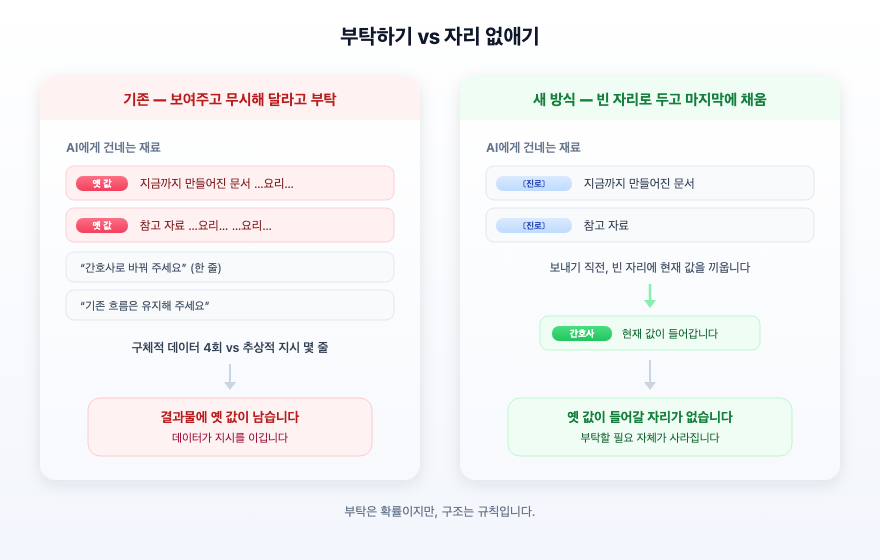

**부제**: 프롬프트로 설득하는 대신, 애초에 틀린 값이 들어갈 자리를 없애보자

---

## 들어가며

이력서를 대신 써 주는 서비스가 있다고 해 봅시다. 지원자가 "저는 요리사가 되고 싶습니다" 라고 적으면, 그 정보를 바탕으로 자기소개서 초안이 나옵니다. 그다음 장에서는 그 초안을 이어받아 지원 동기가 만들어지고, 또 그다음 장이 이어집니다. 앞 장의 결과물이 뒷 장의 재료가 되는 방식입니다.

그런데 여기서 지원자가 마음을 바꿉니다. "역시 저는 요리사 말고 간호사로 하겠습니다."

이때 무슨 일이 벌어질까요. 새로 만든 문서에 **요리 이야기가 계속 남아 있습니다.** 분명히 바꿔 달라고 말했는데도 그렇습니다.

실제로 LLM을 이용해서 문서를 작성하는 서비스들은 이런 문제로 고민하게 됩니다.
저희도 이 문제로 인해서 코드를 다섯 번이나 고쳤습니다. 그리고 다섯 번 다 실패하고 말았죠. 이 글은 그 다섯 번의 실패와, 여섯 번째에서 방향을 완전히 바꾼 이야기입니다.

---

## 1. 다섯 번의 처방, 다섯 번의 재발

처음엔 간단해 보였습니다. 옛 정보가 남아 있으니 걸러내면 될 일이라고 생각했죠.

- 첫 번째는 결과물에서 옛 단어를 찾아 지우는 방식이었습니다. 하지만 표현을 조금만 달리 쓰면 걸러내지 못했습니다.
- 두 번째는 지원자의 말에서 의도를 더 정확히 읽어내려 했습니다. 하지만 붙여 쓰거나, 뒤에 딴 얘기를 덧붙이거나, "아까 그거요" 처럼 에둘러 말하면 알아듣지 못했습니다.
- 세 번째는 결과물을 만들 때 지켜야 할 규칙을 더 촘촘히 적었습니다. 하지만 규칙을 지키는 정도가 매번 달라 옛 내용이 그대로 남는 경우가 있었습니다.
- 네 번째는 지원자가 직접 고친 값이 원래 프로필보다 우선한다고 정했습니다. 하지만 이미 만들어진 문서 안에 박혀 있는 옛 내용까지는 손대지 못했습니다.
- 다섯 번째는 서로 어긋나는 지시들을 정리해 앞뒤를 맞췄습니다. 하지만 이 역시 잘 따라 주기를 기대하는 방식이라 결과가 들쭉날쭉했습니다.

다섯 처방은 겉보기에 전부 달라 보입니다. 그런데 하나로 묶이는 공통점이 있었습니다.

**전부 "옛 값을 보여 준 다음, 그걸 무시해 달라고 부탁하는" 방식이었습니다.**

---

## 2. 부탁이 통하지 않은 진짜 이유

AI에게 글을 만들어 달라고 할 때, 저희는 여러 재료를 한 묶음으로 건넵니다. 지금까지 만들어진 문서, 지원자가 새로 한 말, 참고할 규칙 같은 것들입니다.

그 묶음이 실제로 어떤 모양이었는지 뜯어보고 나서야 문제가 보였습니다.

- 지금까지 만들어진 문서 안에 **요리 이야기가 원문 그대로** 들어 있습니다. 그것도 여러 번.
- 그 뒤에 "간호사로 바꿔 주세요" 라는 **한 줄짜리 지시**가 붙습니다.
- 그리고 "기존 흐름을 최대한 유지해 주세요" 라는 규칙도 함께 들어갑니다.

구체적인 요리 이야기는 네 번 등장하고, 바꿔 달라는 말은 몇 줄뿐입니다. 게다가 "기존 흐름을 유지하라"는 규칙은 오히려 옛 내용을 지키라고 부추깁니다.

**구체적인 데이터가 추상적인 지시를 이깁니다.** 사람이라도 그럴 겁니다. 두꺼운 자료 뭉치를 건네주면서 "여기 요리 얘기는 다 무시하고 간호 쪽으로 써 주세요" 라고 말하면, 자료를 읽는 동안 요리 이야기에 물들 수밖에 없습니다.

그러니 부탁을 더 정중하게, 더 강조해서, 더 여러 번 한다고 해결될 문제가 아니었습니다. 다섯 번의 처방이 전부 같은 자리에서 미끄러진 이유입니다.

---

## 3. 방향을 바꾸다 — 부탁이 아니라 치환식별자를 도입하자

여섯 번째에는 접근을 뒤집었습니다.

**옛 값을 보여 주고 무시해 달라고 하는 대신, 애초에 옛 값이 들어갈 자리를 만들지 않기로** 했습니다.

편지 양식을 떠올리면 쉽습니다. 초대장을 백 명에게 보낼 때, 백 통을 각각 새로 쓰지 않습니다. 이름 자리를 `〔받는 분〕` 처럼 비워 둔 양식을 한 장 만들어 두고, 보낼 때 그 자리에 이름을 끼워 넣습니다. 받는 사람이 바뀌면 이름만 갈아 끼우면 됩니다. 편지 본문을 다시 읽으며 옛 이름을 찾아 지울 필요가 없습니다. 애초에 본문에는 이름이 적혀 있지 않으니까요.

같은 방식을 적용했습니다. AI에게 건네는 재료에서 바뀔 수 있는 값들은 실제 값 대신 **빈 자리 표시**로 두고, 마지막 순간에 현재 값을 끼워 넣습니다.

효과는 분명합니다. 지원자가 마음을 바꾸면 그 자리에 끼우는 값만 달라집니다. AI가 지시를 얼마나 잘 따르는지와 무관하게, **옛 값은 애초에 그 자리에 없습니다.** 무시해 달라고 부탁할 필요 자체가 사라집니다.

---

## 4. 그런데 여기서 어려운 문제가 하나 나옵니다

이 방식에는 함정이 있습니다. 저희가 한동안 붙잡고 고민한 지점입니다.

빈 자리에 값을 끼워 넣어 AI에게 보내면, AI는 **완성된 글**을 돌려줍니다. 그 글에는 빈 자리 표시가 남아 있지 않습니다. 이미 값이 채워진 채로 문장이 되어 나왔으니까요.

문제는 그 글이 **다음 장의 재료가 된다**는 데 있습니다. 다음 장을 만들 때는 앞 장의 결과물을 그대로 넘겨받는데, 거기엔 갈아 끼울 자리가 없습니다. 값이 이미 문장 속에 녹아버린 겁니다.

이건 개인정보를 다룰 때 나오는 문제와 구조가 똑같습니다. 이름을 지우고 `〔고객1〕` 로 바꾸는 일은 쉽습니다. 반대로 이미 여기저기 흩어진 문장에서 "이 대목이 원래 누구를 가리켰는지" 되짚는 일은 훨씬 어렵습니다. 한 방향으로는 쉽고 반대 방향으로는 어렵습니다.

정리하면 이렇습니다. 빈 자리 방식은 **한 장 안에서는 완벽하게 작동하지만, 장을 넘어가는 순간 힘을 잃습니다.**

그래서 규칙을 하나 더 두었습니다. 다음 장으로 재료를 넘길 때, 앞 장에서 쓴 값 가운데 지원자가 고친 것이 있으면 **넘기기 전에 최신 값으로 갈아 끼웁니다.** 앞 장의 결과물을 그대로 흘려보내지 않습니다.

---

## 5. 남길 규칙

이번 일에서 얻은 것을 정리하면 아래와 같습니다.

**첫째, 같은 문제를 세 번 넘게 고치고 있다면 처방이 아니라 방향을 의심합니다.** 저희는 다섯 번을 고쳤습니다. 매번 조금씩 다른 처방이었지만 전부 "부탁하기" 라는 같은 방향이었습니다. 세 번째쯤에서 "이 다섯 처방의 공통점이 뭐지?" 를 물었다면 더 빨리 도착했을 겁니다.

**둘째, AI가 지시를 잘 따라 주기를 기대하는 설계는 언젠가 무너집니다.** 잘 따르는 날도 있고 아닌 날도 있습니다. 품질을 안정적으로 유지하려면 지시를 다듬는 대신, **틀린 값이 들어갈 자리를 아예 없애는** 쪽으로 가야 합니다. 부탁은 확률이지만 구조는 규칙입니다.

**셋째, 값의 주인은 한 곳이어야 합니다.** 같은 정보가 두 곳에 살면 반드시 어긋나고, 그 순간 "어느 쪽이 맞느냐" 라는 답 없는 질문이 시작됩니다.

**넷째, 한 단계에서 통하는 방법이 여러 단계에서도 통하는지 따로 확인합니다.** 빈 자리 방식은 한 장 안에서는 완벽했지만 장을 넘는 순간 힘을 잃었습니다. 이음매는 늘 따로 봐야 합니다.

---

## 나가며

서비스를 정식으로 열기 전에 이 작업을 한 이유가 있습니다.

혼자 시험 삼아 써 볼 때는 이런 문제가 잘 드러나지 않습니다. 마음을 바꾸는 일 자체가 드물고, 어쩌다 옛 내용이 남아도 그러려니 하고 넘어갑니다. 하지만 실제 사용자는 마음을 자주 바꿉니다. 그게 자연스러운 일입니다. 그리고 바꿨는데도 옛 내용이 남아 있으면, 사용자는 그 서비스를 신뢰하지 않습니다. "고쳐 달라고 했는데 안 고쳐 주는 서비스" 로 기억됩니다.

부탁으로 지탱하던 품질은 사용자가 늘어나는 순간 흔들립니다. 열 명 중 아홉 번 통하던 방식은 천 명이 오면 백 번 실패합니다. 그래서 문을 열기 전에, 부탁으로 버티던 자리를 구조로 바꿔 두어야 했습니다.

다섯 번을 고치고 나서야 방향이 틀렸다는 걸 알았습니다. 조금 돌아갔지만, 여섯 번째에는 같은 문제로 돌아오지 않았습니다.
