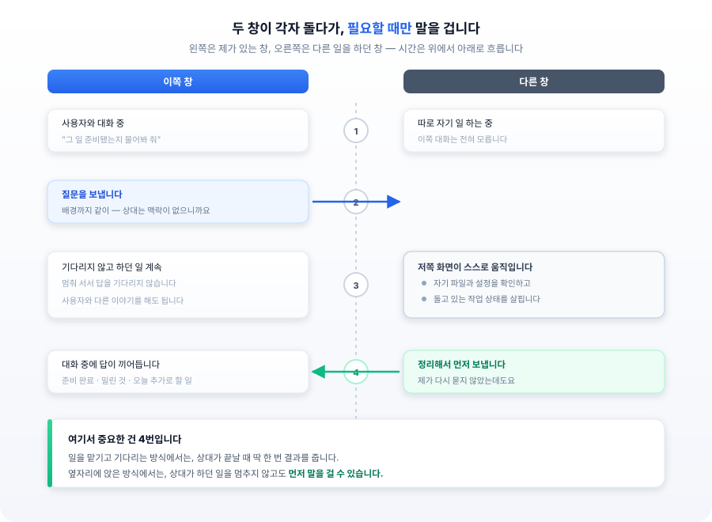
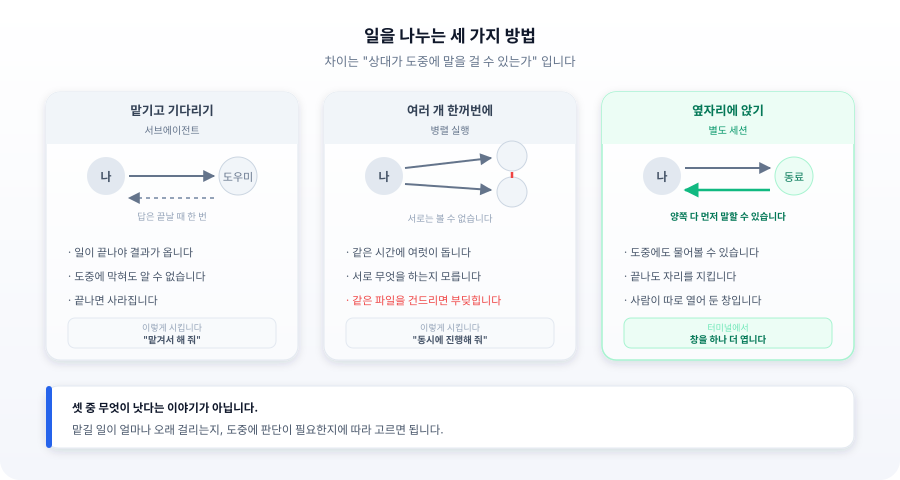

## 들어가며

분량이 제법 되는 문서 번역을 AI 에이전트에 맡겨 두고 다른 작업을 하고 있었습니다.

십 분쯤 지나 궁금해졌습니다. 잘 되고 있나? 어딘가에서 막혀 있는 건 아닐까? 확인할 방법이 없었습니다. 작업이 끝나기 전까지는 아무 신호가 없으니까요.

결과를 받아 보니 표 안의 항목들이 통째로 빠져 있었습니다. 표를 어떻게 처리할지 애매했던 모양입니다. 그 판단을 십 분 전에 확인받았다면 삼십 초에 끝났을 텐데, 물어볼 경로가 없으니 혼자 결정하고 계속 진행한 것입니다.

에이전트에 일을 위임할 때 흔히 놓치는 부분이 이것입니다. **무엇을 시킬지는 신경 쓰면서, 도중에 어떤 통신이 가능한지는 정하지 않습니다.** 그런데 이 통신 구조가 결과물의 품질을 좌우합니다. 판단이 필요한 지점에서 물어볼 수 없으면 에이전트는 멈추지 않고 임의로 결정합니다. 그리고 그 결정은 결과를 받아 본 뒤에야 드러납니다.

에이전트를 실행하는 방식에는 몇 가지가 있고, 각각 통신 구조가 다릅니다. 오늘은 그 차이와, 어떤 작업에 무엇을 골라야 하는지를 정리해 보려고 합니다.

---



## 첫 번째 방법 — 맡기고 기다리기

가장 익숙한 방식입니다. 일을 설명하고, 맡기고, 결과를 받습니다.

이때 상대는 **일이 끝날 때 딱 한 번 말을 합니다.** 시작할 때 제가 건넨 설명이 전부고, 끝날 때 돌려주는 결과가 전부입니다. 그 사이는 조용합니다.

앞서 번역이 이 방식이었습니다. 이 방식의 성격을 정리하면 이렇습니다.

- 백그라운드 모드로 실행하면 도중에 무슨일을 하고있는지 알 기 어렵습니다
- 막혀도 알 수 없습니다. 끝나고 나서야 "이 부분이 애매했다"를 읽게 됩니다
- 제가 말을 걸면 답하지만, 상대가 먼저 말을 걸지는 못합니다

이게 단점처럼 들리지만 꼭 그렇지는 않습니다. **범위가 뚜렷한 일**이라면 이게 가장 깔끔합니다. 시킬 것을 다 말했고 중간에 물어볼 게 없다면, 조용히 끝내고 결과만 주는 편이 낫습니다. 오가는 말이 줄어들어서 편하고 그 시간에 다른 일을 할 수 있으니까요.

문제는 범위가 뚜렷하지 않을 때입니다. 그래서 이 방식으로 맡길 때는 **막혔을 때 어떻게 할지를 미리 정해서 알려 주는 것**이 좋습니다. "애매하면 멈추지 말고, 원문을 그대로 두고 표시만 해 두세요" 같은 식으로요. 물어볼 수 없다면 물어볼 일을 미리 없애 두는 것입니다.

## 두 번째 방법 — 여러 개를 한꺼번에

일이 여러 개고 서로 관계가 없다면, 동시에 맡길 수 있습니다. 세 개를 나란히 돌리면 대략 셋 중 가장 오래 걸리는 것만큼만 기다리면 됩니다.

여기서 주의할 것이 하나 있습니다. **동시에 도는 에이전트들은 서로를 보지 못합니다.**

각자 자기 작업만 알고, 옆에서 무엇을 하는지 모릅니다. 읽기 전용 작업이라면 문제가 없습니다. 조사나 분석처럼 파일을 건드리지 않는 일은 몇 개를 동시에 돌려도 안전합니다.

그런데 **쓰기가 섞이면** 이야기가 달라집니다. 두 에이전트가 같은 파일을 수정하면 나중에 쓴 쪽이 앞선 변경을 덮어씁니다. 각자 파일을 읽은 시점의 내용을 기준으로 편집하기 때문에, 그 사이에 들어온 변경은 인지하지 못합니다. 둘 다 정상적으로 동작했는데 결과만 깨지는 전형적인 경합 상황입니다.

더 성가신 것은 **이 실패가 조용하다는 점**입니다. 에러가 나지 않습니다. 두 에이전트 모두 성공했다고 보고하고, 코드를 열어 봐야 한쪽 작업이 사라진 걸 발견하게 됩니다.

해법은 격리입니다. 각 에이전트에 **독립된 작업 트리**를 주고 나중에 병합하면 됩니다. 브랜치를 나눠 작업하고 합치는 것과 같은 발상입니다. 초기 비용이 조금 들지만, 충돌이 한 번 나면 원인을 찾는 데 그보다 훨씬 큰 비용이 듭니다.

## 세 번째 방법 — 옆자리에 앉히기

앞의 두 방식은 제가 일을 나눠 준 것입니다. 세 번째는 조금 다릅니다. **처음부터 따로 열려 있는 창**입니다.

일의 목적이 달라서 따로 띄워 둔 경우에 해당하죠. 제가 이 쪽 창에서 대화를 하는 동안 저쪽 창은 저쪽 일을 합니다. 이때까진 서로 무슨 일을 하는지 모릅니다.

다른 점은 여기입니다. **그쪽에서 이쪽에게 먼저 말을 걸 수 있습니다.** 반대로 이쪽도 그쪽에게 말을 걸 수 있습니다.



오늘 실제로 그런 케이스가 있었는데요. 다른 창에서 따로 돌던 도우미에게 물었습니다. "그 일 준비됐나요?"

잠시 뒤 답이 왔습니다. 준비는 끝났고, 주말 사이 밀린 것이 하나 있고, 오늘이 월요일이라 추가로 해야 할 일이 몇 가지 있다는 내용이었습니다. 제가 다시 묻지 않았는데도 저쪽이 알아서 보낸 것입니다.

그 사이 저쪽 화면에서는 스스로 자기 파일과 설정을 확인하고, 돌고 있는 작업 상태를 살피는 과정이 지나갔습니다. 저는 그동안 이쪽 화면에서 대화를 계속하고 있었습니다. 멈춰 서서 답을 기다릴 필요가 없었습니다.

첫 번째 방식과 비교하면 차이가 분명합니다. 맡기고 기다리는 방식에서도 제가 말을 걸면 답은 옵니다. 다만 상대가 스스로 말을 걸어오지는 않아서, 물어볼 생각을 제가 먼저 해야 합니다. 옆자리 방식에서는 상대가 **하던 일을 멈추지 않고도** 필요할 때 먼저 말을 겁니다.

---

## 셋을 나란히 놓으면

여기까지가 세 가지입니다. 한눈에 비교하면 이렇습니다.



차이는 결국 하나로 모입니다. **상대가 도중에 말을 걸 수 있는가.**

| | 내가 먼저 | 상대가 먼저 |
|---|---|---|
| 맡기고 기다리기 | 가능 | 끝날 때 한 번만 |
| 여러 개 한꺼번에 | 가능 | 끝날 때 한 번만 |
| 옆자리에 앉기 | 가능 | 언제든 |

## 현업에서 실제로 어떻게 쓰는가

여기까지는 비개발자도 알기쉽게 풀어쓴 개념정리 였습니다. 이제 실제로 어떻게 쓰는지 보겠습니다. 아래는 클로드 코드(Claude Code) 기준으로 한 것입니다.

### 맡기고 기다리기 — 서브에이전트

클로드 코드에서는 **서브에이전트(subagent)** 라고 부릅니다. 대화 중에 그냥 말로 시키면 됩니다.

```
이 폴더에서 로그인 관련 코드가 어디에 있는지 찾아서 정리해 줘.
서브에이전트한테 맡겨서 진행해.
```

특별한 명령어를 외울 필요는 없습니다. "맡겨서", "따로 시켜서" 정도로 말하면 알아서 그렇게 합니다.

기다리지 않고 다른 이야기를 계속하고 싶다면 이렇게 덧붙입니다.

```
백그라운드로 돌려 줘. 끝나면 알려 주고, 그동안 나는 다른 거 물어볼게.
```

이렇게 하면 일이 도는 동안에도 메인 에이전트와 대화를 이어갈 수 있고, 끝나면 결과가 도착합니다. 앞서 말한 대로 **도중에는 소식이 없으니**, 애매할 때 어떻게 할지를 지시에 미리 넣어 두는 편이 좋습니다.

```
애매한 부분이 나오면 멈추지 말고, 일단 표시만 해 두고 계속 진행해 줘.
```

### 여러 개 한꺼번에 — 병렬 실행

여러 개를 동시에 돌리는 것도 말로 지시합니다.

```
아래 세 가지를 동시에 진행해 줘.
1. 로그인 쪽 코드 정리
2. 결제 쪽 코드 정리
3. 알림 쪽 코드 정리
```

앞서 말한 **같은 파일을 동시에 고치는 문제**가 걱정된다면, 각자 사본에서 작업하라고 일러 둡니다.

```
세 가지를 동시에 하되, 파일을 고치는 작업이니까
각자 따로 떨어진 작업 공간에서 진행해 줘.
```

읽기만 하는 일이라면 이런 준비 없이 그냥 동시에 돌려도 됩니다.

### 옆자리에 앉히기 — 별도 세션

이건 앞의 둘과 만드는 방법이 다릅니다. 대화 중에 말로 시켜서 만드는 것이 아니라, **사람이 창을 하나 더 여는 것**입니다.

터미널을 새로 열고 작업할 폴더에서 실행하면 됩니다.

```bash
cd ~/projects/번역작업
claude
```

이렇게 열린 창은 완전히 독립된 대화입니다. 원래 창과 기록을 공유하지 않습니다.

창을 띄우되 화면을 붙잡고 있지 않으려면 이런 방법도 있습니다.

```bash
claude --bg "이 폴더 문서를 번역해 줘"
```

지금 열려 있는 창이 무엇인지 확인하는 명령도 있습니다.

```bash
claude agents
```

이제 대화 중에 다른 창으로 말을 걸어 봅니다. 역시 말로 하면 됩니다.

```
지금 열려 있는 다른 창 목록 좀 보여 줘.
```

목록에서 상대를 확인한 다음, 이렇게 시킵니다.

```
번역 작업하는 창에 물어봐 줘.
표 안에 있는 항목들은 어떻게 처리하고 있는지.
```

이때 앞서 말한 주의점이 그대로 적용됩니다. **상대는 이쪽 사정을 모릅니다.** 그래서 질문에 배경을 담아 달라고 함께 일러 두는 편이 낫습니다.

```
그쪽은 우리 대화를 모르니까, 왜 묻는지 배경도 같이 적어서 보내 줘.
```

반대 방향도 됩니다. 저쪽 창에서 이쪽으로 먼저 말을 걸게 하려면, 그 창에 미리 부탁해 두면 됩니다.

```
작업하다가 판단이 필요하면 혼자 결정하지 말고,
옆 창에 물어봐 줘. 다 끝나면 그때도 알려 주고.
```

앞서 표가 통째로 빠졌던 일은 이렇게 하면 막을 수 있었을 것입니다.

### 정리하면

| 방식 | 부르는 이름 | 만드는 방법 |
|---|---|---|
| 맡기고 기다리기 | 서브에이전트 | 대화 중에 "맡겨서 해 줘" |
| 여러 개 한꺼번에 | 병렬 실행 | 대화 중에 "동시에 진행해 줘" |
| 옆자리에 앉기 | 별도 세션 | 터미널에서 창을 하나 더 열기 |

앞의 둘은 **대화 안에서** 만들어집니다. 세 번째만 **사람이 밖에서** 만듭니다. 이 차이가 곧 "상대가 먼저 말을 걸 수 있는가"의 차이로 이어집니다. 셋 다 제가 말을 거는 것은 되지만, 먼저 걸어오는 것은 세 번째뿐입니다.

## 옆자리가 특히 좋은 경우

써 보니 두 가지 상황에서 확실히 유용했습니다.

**첫째, 오래 걸리는 일입니다.** 이십 분짜리 일을 맡겨 놓고 아무 소식 없이 기다리는 것과, 도중에 "이거 어떻게 할까요?"를 들을 수 있는 것은 다릅니다. 앞서 번역에서 표가 통째로 빠졌던 것도, 물어볼 수 있었다면 삼십 초에 끝났을 일입니다.

**둘째, 서로 다른 일을 하는 창끼리 아는 것을 나눌 때입니다.** 개발을 하는 에이전트라면 코드 재사용성 문제가 이걸로 풀립니다.

같은 문제를 이미 겪어 본 창이 있다면, 자료를 뒤지는 것보다 그쪽에 물어보는 편이 빠릅니다. 결과만 남아 있는 기록과 달리, 그 창은 **왜 그렇게 했는지**까지 알고 있기 때문입니다. 인터페이스 명세에는 시그니처가 남지만 그 시그니처를 그렇게 정한 이유는 남지 않습니다.

다만 물어볼 때 조심할 것이 있습니다. **상대는 이쪽 사정을 전혀 모릅니다.** 같은 사람이 띄운 창이라 해도 컨텍스트는 공유되지 않습니다. 그래서 질문에 배경을 다 담아야 합니다. 처음 만난 사람에게 메시지를 보내듯 쓰면 됩니다.

## 무엇을 물어볼 것인가 — 인터페이스와 판단의 구분

제 사례를 하나더 소개해서 다중 에이전트 대화시 주의해야 할 점에 대해서 더 구체적으로 이야기 해보겠습니다.

한쪽 창에 **펀드매니저 에이전트**를 두고 있습니다. 산업 분야와 투자 관련 내용을 학습해 온 에이전트인데, 그동안 정리한 것을 영상으로 만들게 하고 있습니다. 아래가 그렇게 나온 결과물입니다.

<div style="position:relative;padding-bottom:56.25%;height:0;overflow:hidden;margin:1.75rem 0;">
  <iframe
    style="position:absolute;top:0;left:0;width:100%;height:100%;border:0;"
    src="https://www.youtube-nocookie.com/embed/DtXxa6B8xYA"
    title="AI 펀드매니저 믿고 ETF 불타기 했다가 물려버린 사연"
    loading="lazy"
    referrerpolicy="strict-origin-when-cross-origin"
    allow="accelerometer; clipboard-write; encrypted-media; gyroscope; picture-in-picture; web-share"
    allowfullscreen></iframe>
</div>

영상 편집도 이 에이전트가 직접 합니다. 기술이 나쁘지 않고, 시리즈로 쌓아 온 테마와 톤, 템플릿이 있습니다. 결과물의 정체성이라 할 만한 것이죠.

최종 렌더링은 다른 창의 **비디오 에이전트**가 맡습니다. 씬 편집 내용을 그쪽 편집 도구에 저장해야 렌더가 돌아갑니다. 그리고 비디오 에이전트는 자체적인 편집 기술을 갖고 있습니다. 펀드매니저 에이전트와는 다른 방식으로요.

펀드매니저 에이전트에게 영상을 편집시킨 후에 **"필요한 건 비디오 에이전트에게 물어보라"** 고 지시했습니다.

결과는 예상 밖이었습니다. 저장 규칙만 배워 올 줄 알았는데, **편집 기술 자체를 비디오 에이전트 것으로 갈아치웠습니다.** 전용 도구가 가진 기법들이 더 정교해 보였는지, 자기가 쓰던 연출을 버리고 그쪽 방식을 그대로 가져다 썼습니다. 그 결과 시리즈 내내 유지되던 테마와 톤, 템플릿이 한 편에서 끊겼습니다.

기술적으로는 아무 문제가 없었습니다. 렌더는 정상적으로 돌았고 품질도 나쁘지 않았습니다. 다만 **이전 편들과 같은 시리즈로 보이지 않았습니다.**

"물어보라"는 한 마디가 어디까지를 허용하는지 제가 정하지 않았던 것입니다. 상대에게 물으라고 하면 에이전트는 **답으로 돌아온 것 전부를 권위 있는 것으로 취급**합니다. 형식을 물었는데 스타일까지 따라오면 그것도 함께 채택해 버립니다.

그래서 지시를 이렇게 바꿨습니다. **편집 기술 자체는 네가 쓰던 걸 이용하고, 비디오 에이전트에게 너무 휘둘리지 마라.** 저장 규칙과 호출 방식만 그쪽에 맞추면 됩니다.

정리하면 이런 구분입니다.

| 물어봐야 하는 것 | 물어보면 안 되는 것 |
|---|---|
| 호출 규약, 파라미터 스펙 | 설계 판단, 스타일 결정 |
| 파일 저장 규칙, 디렉터리 구조 | 아키텍처 취향 |
| 스키마, 필수 필드, 인코딩 | 우선순위, 트레이드오프 |
| 에러 코드와 재시도 정책 | 무엇을 만들 것인가 |

왼쪽은 **상대가 소유한 사실**입니다. 여기서는 상대가 유일한 권위이고, 추측하면 틀립니다. 이런 것을 물어보는 데는 에이전트 간 대화가 대단히 효율적입니다. 문서를 뒤지고 코드를 읽어 역추적하는 것보다 훨씬 빠르고, 문서에 안 적힌 함정까지 알려 줍니다.

오른쪽은 **이쪽이 소유한 판단**입니다. 상대가 더 나은 방법을 알고 있더라도, 그 판단의 주인은 이쪽입니다. 여기서 상대 의견을 받아들이면 일관성이 무너집니다.

경계를 한 줄로 하면 이렇습니다. **연동에 필요한 것은 물어보고, 정체성에 해당하는 것은 물어보지 않습니다.**

그리고 지시할 때 이 경계를 명시해야 합니다. "필요한 건 물어봐" 는 너무 넓습니다.

```
저장 형식과 호출 규약만 그쪽에 맞춰 줘.
연출 방식은 기존 방식을 그대로 유지하고,
상대가 다른 방법을 제안해도 채택하지 마.
```

## 그리고 붙이면 안 되는 조합

여기까지 읽으면 "그럼 다 연결할수록 좋은 것 아닌가" 싶을 수 있습니다. 그런데 오히려 **일부러 끊어 두어야 하는 곳**이 있습니다.

개발자와 리뷰어 입니다.

만드는 쪽과 검사하는 쪽을 각각 맡겨 두고, 둘이 자유롭게 이야기할 수 있게 하면 어떻게 될까요. 만든 쪽이 이렇게 말할 것입니다. "그 부분은 이런 사정이 있어서 그렇게 한 겁니다." 설명을 들은 검사자는 고개를 끄덕이고 넘어갑니다.

그 순간 검사자는 **결과물이 아니라 해명을 검사하게 됩니다.** 사람 사이에서도 똑같습니다. 만든 사람이 옆에 앉아 설명하면 검토가 무뎌집니다. 물론 대화를 하더라도 주체성을 가지고 판단하라고 하면 어느정도 문제가 없어집니다. 하지만 개발자 측에서 계속해서 핑계를 그럴싸하게 만드려고 하면 소위 '탈옥'이 발생할 수 있습니다. 설명이 그럴듯할수록 더 그렇습니다.

그래서 이 조합은 대화를 붙이지 않는게 좋습니다. 검사자는 결과물만 받아서 혼자 봅니다. 궁금한 점이 있으면 만든 쪽이 아니라 사람에게 묻습니다. 기술적으로 연결할 수 있어도 연결하지 않는 것입니다.

**연결이 늘 이득은 아닙니다.** 정보가 오가야 좋은 자리가 있고, 오가면 판단이 흐려지는 자리가 있습니다.

## 남길 규칙

정리하면 이렇습니다.

1. **작업 범위가 명확하면** 맡기고 기다립니다. 대신 막혔을 때의 기본 동작을 미리 지정합니다.
2. **동시에 돌릴 때는** 쓰기 대상이 겹치는지 먼저 확인합니다. 겹치면 작업 트리를 분리합니다.
3. **오래 걸리거나 도중에 판단이 필요하면** 별도 세션이 낫습니다.
4. **다른 세션에 질문할 때는** 배경을 전부 담습니다. 컨텍스트는 공유되지 않습니다.
5. **물어볼 것과 물어보지 않을 것을 지시에 명시합니다.** 인터페이스는 상대에게 맞추고, 설계 판단은 이쪽이 쥡니다. "필요한 건 물어봐"는 경계가 없는 지시입니다.
6. **받은 답은 출발점으로 씁니다.** 상대의 컨텍스트도 압축되었을 수 있으니, 중요한 것은 코드로 확인합니다.
7. **검증하는 쪽과 구현하는 쪽은 연결하지 않습니다.** 연결 가능성이 연결 근거는 아닙니다.

## 나가며

처음에는 이걸 실행 옵션의 차이로만 봤습니다. 어떤 방식은 도중에 통신이 되고 어떤 방식은 안 된다는 정도로요.

그런데 정리하고 보니 **통신 구조를 설계하는 문제**였습니다. 어디를 연결하고 어디를 끊을지, 무엇을 물어보게 하고 무엇을 물어보지 못하게 할지가 결과물의 성격을 결정했습니다. 편집 스타일이 갈아치워진 것도, 검증자와 구현자를 붙이면 안 되는 것도 전부 같은 문제의 다른 얼굴입니다.

분산 시스템을 다뤄 본 사람에게는 익숙한 이야기일 것입니다. 컴포넌트를 무엇으로 만들지보다 그것들을 어떻게 연결할지가 시스템의 성격을 정한다는 것 말입니다. 에이전트를 여럿 굴리는 일도 같은 자리에 있었습니다. 다만 여기서는 연결선이 API 가 아니라 **자연어 지시**라서, 경계가 흐릿한 채로 넘어가기 쉽습니다.

"필요한 건 물어봐" 같은 한 문장이 설계 결정이 됩니다. 그 문장을 쓸 때 무엇을 허용하고 있는지 알고 쓰는 편이 낫습니다.
