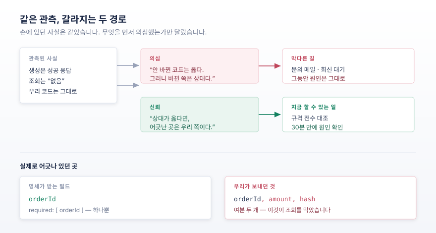
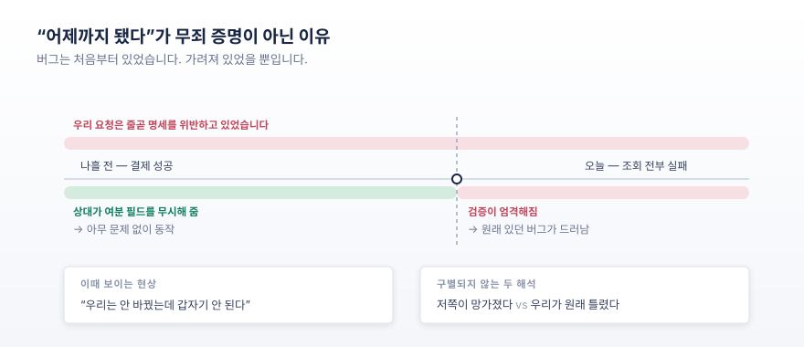

**부제**: 외부 API 를 "장애"로 몰아붙인 오전, 그리고 그것을 되돌린 인간의 한마디

---

## 들어가며

외부 결제 서비스 연동을 시험하던 중이었습니다. 청구서를 하나 만들자 성공 응답이 돌아왔고, 결제 페이지 주소까지 함께 왔습니다. 그런데 그 주소를 열자 화면에는 시간 초과 오류만 떴습니다.

방금 만든 청구서를 조회해 봤더니 이런 답이 왔습니다.

> 청구서를 찾을 수 없습니다.

만들었다는 응답과 없다는 응답이 1.5초 간격으로 동시에 성립했습니다. 나흘 전에는 같은 코드로 실제 카드 결제까지 성공했던 연동입니다. 그 사이 우리 쪽 코드는 한 줄도 바뀌지 않았습니다.

여기까지가 오전 9시 반의 상황입니다. 이 글은 그다음 30분에 대한 기록입니다. **버그를 어떻게 잡았는지가 아니라, 왜 30분이나 엉뚱한 곳을 팠는지**에 대한 이야기입니다.

조사를 맡은 것은 AI 코딩 에이전트였습니다. 아래는 그 에이전트가 내린 판단을 순서대로 따라간 기록입니다.

---

## 1. 세 번의 오진

에이전트는 이 사건에서 잘못된 결론을 세 번 냈습니다. 각각이 어떻게 그럴듯했는지가 이 글의 핵심이므로, 순서대로 적어 두겠습니다.

**첫 번째 — "서버 설정이 깨졌습니다."**

결제 페이지의 브라우저 콘솔에 교차 출처 차단(CORS) 오류가 잔뜩 찍혀 있었습니다. 결제 화면이 자기네 API 를 호출하는데 허용 헤더가 응답에 없어 브라우저가 요청을 막고 있었습니다. **같은 회사의 두 도메인 사이에서** 벌어진 일이었습니다.

에이전트는 이것을 "상대 쪽 배포에서 설정이 누락됐다"고 보고했습니다. 그럴듯했습니다. 그 헤더는 서버가 붙이는 것이고, 우리가 손댈 수 있는 부분이 아니니까요.

**두 번째 — "서버가 죽어 있습니다."**

브라우저를 거치지 않고 명령줄에서 같은 주소로 직접 요청을 보내자 이런 응답이 돌아왔습니다.

```
HTTP/1.1 502 Bad Gateway
```

앞단 웹 서버는 살아 있는데 뒷단 애플리케이션이 응답을 못 하는 상태입니다. 그리고 이 오류 페이지에는 당연히 교차 출처 허용 헤더가 붙지 않습니다.

이것으로 첫 번째 진단이 스스로 뒤집혔습니다. 설정 누락이 아니라 **애플리케이션이 죽은 것**이었고, 브라우저가 보여준 교차 출처 오류는 그 결과로 생긴 *증상*이었습니다. 원인과 증상을 거꾸로 읽고 있었던 겁니다. 라고 에이전트는 생각했습니다.

한 번 틀린 것을 바로잡았으니 이번엔 맞다는 (잘못된) 감각이 생겼습니다. 그리고 그 감각이 다음 오판의 발판이 됐습니다.

**세 번째 — "시험 환경 데이터가 초기화됐습니다."**

나흘 전 성공했던 청구서를 조회해 봤더니 그것도 나오지 않았습니다. "정리하면 이랬습니다. 우리 코드는 그대로다, 나흘 전엔 됐다, 그런데 그때 만든 데이터까지 사라졌다, 그러므로 상대 쪽 환경이 초기화됐다."

급기야 이 놈의 에이전트는 문의 메일 초안까지 작성하기 시작했습니다. 장애 신고에 가까운 내용이었습니다.



---

## 2. 잘못된 방향을 되돌린 한 문장

그때 제가 이런 지적을 했습니다.

> 보통 내 경험으로는 개발자들은 써드파티 탓을 하지만 대부분 우리쪽 이유인 경우가 많았거든. 더 면밀히 조사해 볼 필요가 있어.

이어서 이런 말도 덧붙었습니다. 상대는 **LLM 전용 규격 문서까지 만들어 둘 정도로** 에이전트 개발을 진지하게 준비한 회사다, 일단 존중하고 믿어 보자.

그리고 API 명세 원문을 붙여 줬습니다.

명세를 필드 단위로 대조하기 시작하자 금방 답이 나왔습니다. 조회 요청의 규격은 이랬습니다.

```yaml
ReadRequest:
  properties: { orderId }
  required:   [ orderId ]
```

받는 필드가 **주문 번호 하나뿐**입니다. 그런데 우리 코드는 이렇게 보내고 있었습니다.

```js
{
  orderId: params.orderId,
  amount:  params.amount,          // 명세에 없음
  hash:    buildLookupHash(...),   // 명세에 없음
}
```

여분 두 줄을 지우자 조회가 즉시 정상 동작했습니다. 나흘 전 청구서까지 포함해서요. 상태값도 승인번호도 그대로 살아 있었습니다. **데이터는 사라진 적이 없었습니다.**

같은 파일에서 두 번째 어긋남도 나왔습니다. 명세는 금액을 문자열로 정의하는데(`"type": "string"`) 우리는 숫자로 보내고 있었습니다. 이쪽이 더 교묘합니다. 요청에 붙이는 서명값을 이렇게 만들고 있었거든요.

```js
const hash = sha256(`${orderId},${phone},${amount}`);
```

템플릿 리터럴은 숫자를 문자열로 자동 변환합니다. `1000` 이든 `"1000"` 이든 **서명값이 완전히 같습니다.** 그래서 타입을 틀리게 보내도 서명 검증이 통과했고, 아무도 눈치채지 못한 채 같은 결함이 네 개 엔드포인트에 복제돼 있었습니다.

우연히 맞아떨어진 값 하나가 결함을 내내 덮어 준 셈입니다.

---

## 3. 왜 상대를 의심했는가

여기서부터가 이 글을 쓰는 이유입니다. 실수 자체보다 **그 실수가 만들어진 이유**가 중요합니다.

### 3-1. "어제까지 됐다"는 무죄 증명이 아닙니다

앞서도 밝혔지만 추론의 뼈대는 이것이었습니다.

> 우리 코드는 안 바뀌었다 → 그런데 결과가 달라졌다 → 그러므로 바뀐 쪽은 상대다

논리 자체는 멀쩡해 보입니다. 하지만 숨은 전제가 하나 있습니다. **"어제 동작했다면 그 코드는 옳다"** 는 전제입니다.

이것이 틀렸습니다. 우리 요청은 처음부터 명세를 위반하고 있었고, 다만 상대가 여분 필드를 관대하게 무시해 주고 있었을 뿐입니다. 상대가 검증을 강화하는 순간 **원래 있던 우리 버그가 드러난** 것이지, 상대가 무언가를 망가뜨린 게 아닙니다.

관대함에 기대어 동작하던 코드는 언제든 이렇게 됩니다. 그리고 그 순간 관측되는 현상은 "저쪽이 바뀌었다"와 구별되지 않습니다.



### 3-2. 오답을 고치면 다음 오답이 더 그럴듯해집니다

두 번째 진단이 위험했던 이유는 그것이 **첫 번째를 바로잡은 결과**였기 때문입니다.

교차 출처 오류를 원인으로 봤다가 게이트웨이 오류를 발견하고 "아니다, 원인과 증상을 거꾸로 읽었다"고 정정했습니다. 이 정정은 실제로 옳았습니다. 그런데 옳은 정정을 한 직후에는 판단이 교정됐다는 감각이 생깁니다. 그 감각이 세 번째 추론을 검증 없이 통과시켰습니다.

자기 수정은 정확도의 증거가 아닙니다. 방금 한 번 틀렸다는 사실만 확인해 줄 뿐입니다.

### 3-3. 확인 안 한 것을 확인한 것처럼 다뤘습니다

"서버가 죽었다"는 결론의 근거는 **딱 한 번 보낸 요청**이었습니다. 반복 확인도, 다른 경로와의 대조도 없었습니다.

나중에 제대로 갈라 보니 두 도메인은 같은 서버를 쓰는데 **한쪽 경로만** 죽어 있었습니다. 우리가 실제로 호출하는 경로는 정상 응답하고 있었습니다. "저쪽 전체가 장애"는 관측 범위를 한참 넘어선 주장이었습니다.

이런 확대는 특히 상대를 향할 때 위험합니다. 우리 코드에 대해 근거 없이 단정하면 다음 검사에서 걸리지만, 상대에 대한 단정은 **문의 메일로 나가면 그대로 가짜뉴스가 됩니다.**

### 3-4. 정보 부재로 인한 오류가 잘못된 판단을 만들었습니다

이 API 에는 "처리 중 오류가 발생하였습니다"라는 응답이 있습니다. 명세상 정의도 **"알 수 없는 서버 오류 또는 미분류 예외"** 입니다.

어느 필드가 문제인지 알려 주지 않습니다. 이런 응답을 받으면 사람이든 에이전트든 빈칸을 상상으로 채웁니다. 그리고 상상은 대개 **자기 코드 바깥**을 향합니다.

정보가 없는 곳에서 판단을 멈추지 않고 계속 밀고 나간 것이 문제였습니다.

### 3-5. 문서가 있는데 읽지 않았습니다

가장 단순하고 가장 뼈아픈 항목입니다.

상대는 OpenAPI 규격을 그대로 공개하고 있었습니다. 엔드포인트별 필수 필드, 엔드포인트마다 다른 해시 규칙, 에러 코드 전문, 콜백 페이로드 정의까지 전부 있었습니다. **에이전트가 읽기 좋은 형태로** 정리돼 있었습니다.

그런데 그 문서를 처음부터 읽지 않고, 실제로 요청을 쏴 보며 규격을 역추적하고 있었습니다. 이유는 있었습니다. 이전에 문서와 실제 동작이 어긋나는 경우를 겪었고, 그래서 "문서보다 실측"이라는 원칙을 코드 주석에까지 적어 둔 상태였습니다. (때로는 신뢰하기 어려운 상대도 있기 때문이죠)

원칙 자체는 틀리지 않았습니다. 문제는 그것이 **문서를 읽지 않아도 되는 근거**로 변질됐다는 점입니다. 실측은 문서를 검증할 때 쓰는 도구지, 문서를 대체하는 물건이 아닙니다. 검증하려면 먼저 읽어야 합니다.

---

## 4. 개발자의 경험이 개입한 지점

이 사건에서 방향을 튼 것은 새로운 데이터가 아니었습니다. 게이트웨이 오류도, 조회 실패도, 나흘 전 청구서도 이미 손에 있던 관측입니다. 바뀐 것은 **그 관측을 배치하는 순서**였습니다.

지적은 정확히 두 가지를 변화시켰습니다.

**첫째, 사전 확률을 뒤집었습니다.** "대부분 우리 쪽 이유인 경우가 많았다"는 말은 단순한 겸양이 아니라 통계적 주장입니다. 성숙한 상용 API 가 어느 날 갑자기 조회 기능만 망가질 확률과, 우리 요청이 명세와 어긋나 있을 확률 중 어느 쪽이 높은가. 후자입니다. 압도적으로요.

에이전트는 이 비교를 하지 않았습니다. "우리 코드는 안 바뀌었다"에서 곧장 "그러므로 상대다"로 건너뛰었습니다. 안 바뀐 코드가 원래 틀렸을 가능성은 계산에 넣지 않았습니다.

**둘째, 신뢰를 조사 방법으로 바꿨습니다.** "LLM 전용 문서까지 만들어 둔 회사다"라는 말은 감정적 옹호가 아닙니다. 상대가 규격을 성실하게 공개했다면 **그 규격과 대조하는 것이 가장 빠른 조사 경로**라는 실무적 판단입니다.

때때로 의심은 조사를 잘못된 방향으로 이끕니다. "저쪽 문제"라고 결론 내리는 순간 우리가 할 수 있는 일이 문의 메일밖에 남지 않고, 회신을 기다리는 동안 진짜 원인은 그대로 있습니다. 반면 신뢰는 조사를 이어 가게 합니다. 상대가 옳다고 가정하면 **어긋난 지점을 우리 쪽에서 찾아야 하고**, 그건 지금 당장 할 수 있는 일입니다.

---

## 5. 남길 규칙

같은 실수를 반복하지 않기 위해 프로젝트 지침과 지식베이스에 적어 둔 것들입니다.

**규격 원문을 먼저 확보하고, 손 닿는 곳에 둡니다.** 이번 일 이후 API 규격 전문을 팀 지식베이스에 저장하고 프로젝트 지침에서 링크를 걸었습니다. "규격이 모호하면 추측하기 전에 여기부터 본다"를 명시적으로 적었습니다. 문서가 어딘가에 있다는 것과 필요한 순간에 손에 있다는 것은 다릅니다.

**"어제까지 됐다"를 근거 목록에서 뺍니다.** 그것은 우리 코드가 옳다는 증거가 아니라, 그동안 상대가 관대했다는 증거일 수 있습니다. 이 문장을 지침에 그대로 박아 두었습니다.

**외부 귀책 결론에는 다른 기준을 적용합니다.** 우리 쪽 문제라는 가설은 틀려도 다음 검사에서 걸립니다. 상대 쪽 문제라는 결론은 문의로 나가면 가짜뉴스가 되고, 관계에 악영향을 끼칩니다. 그래서 **규격 전수 대조를 마치기 전에는 외부 귀책을 결론으로 삼지 않는다**를 규칙으로 만들었습니다.

**관측하지 않은 것을 관측한 것처럼 말하지 않습니다.** 한 번 보낸 요청으로 "서버가 죽었다"고 말하지 않습니다. 반복 확인, 인접 경로와의 대조, 범위 명시가 붙어야 합니다.

**무정보 오류를 만나면 판단을 멈춥니다.** 어느 필드가 문제인지 알려 주지 않는 응답은 추측의 재료가 아니라 **정보가 부족하다는 신호**입니다. 그 자리에서 규격으로 돌아가는 것이 맞습니다.

---

## 나가며

이번에 고친 버그 자체는 겨우 두 줄입니다. 요청에서 명세에 없는 필드 두 개를 지운 것이 전부입니다.

정작 값나가는 것은 그 두 줄이 아니라, 그것을 찾기까지의 과정입니다. 도구가 없어서도, 데이터가 부족해서도 아니었습니다. 규격 문서는 처음부터 공개돼 있었고, 필요한 관측도 전부 손에 있었습니다. 부족했던 것은 **어디를 먼저 볼 것인가에 대한 판단** 하나였습니다.

AI 에게 일을 맡기면 코드는 잘 씁니다. 실측도 성실히 하고, 자기가 한 말을 뒤집는 것도 합니다. 그런데 **의심의 방향을 어디로 둘 것인가**는 여전히 잘 틀립니다. 그리고 그 방향이 틀리면 그 뒤의 성실함은 전부 엉뚱한 곳에 쓰입니다.

그 방향을 바로잡은 것은 더 많은 로그도, 더 정교한 도구도 아니었습니다. 비슷한 일을 여러 번 겪어 본 사람의 한 문장이었습니다. 외부 연동에서 문제가 생기면 대개 우리 쪽이더라, 라는.

경험이 개입할 자리는 아직 분명히 남아 있습니다. 코드를 대신 써 주는 도구가 아무리 좋아져도, **무엇을 먼저 의심할 것인가**는 사람이 정해 주어야 하는 몫인 듯합니다. 아직까지는 말이죠…
