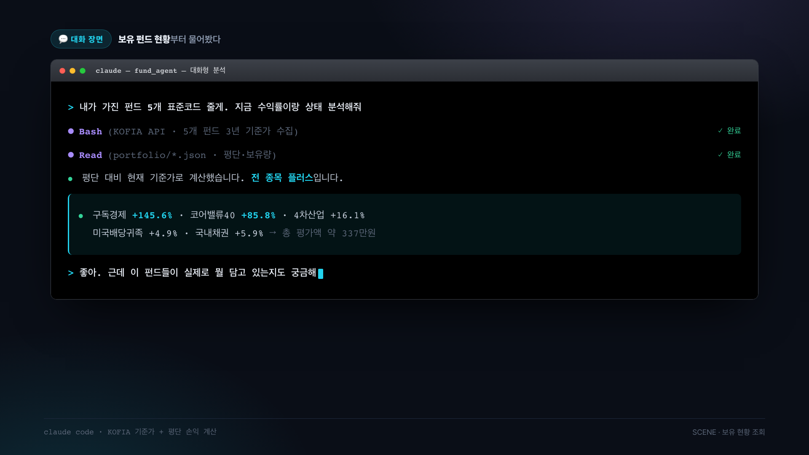
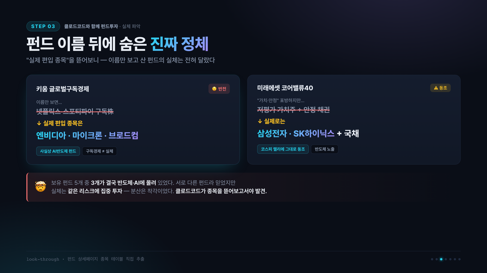
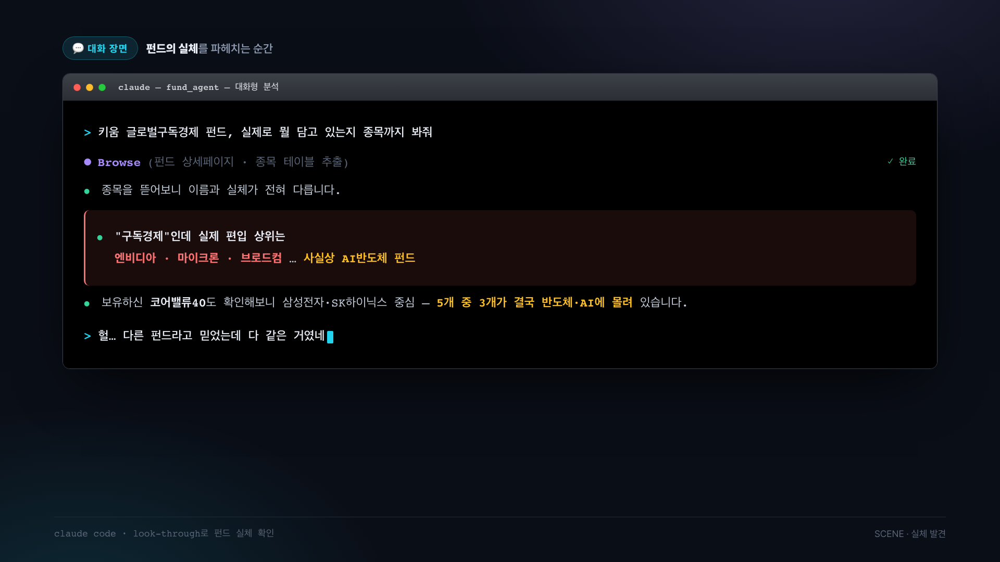

<iframe width="560" height="315" src="https://www.youtube.com/embed/UzlKyihjqrM" title="YouTube video" frameborder="0" allow="accelerometer; autoplay; clipboard-write; encrypted-media; gyroscope; picture-in-picture; web-share" allowfullscreen></iframe>

> API 요금 몇 백 원에 손을 떨만큼 소심한 제가, 피같은 돈 200만원을 별다른 검토 없이 펀드에 투자하고 있었는데요. 
> 그래서 AI에게 보유 펀드들을 분석해달라고 했지요. 그런데 에이전트엑 질의 응답을 이어가다보니 펀드매니저를 만들고 있더군요.
> AI 펀드매니저 만들기, 그 첫 번째 기록입니다.

## 200만 원짜리 대참사의 시작

코스피가 만 포인트를 가려다가 고꾸라 졌죠. 그래도 어디선가는 주식으로 몇 억을 벌었다는 이야기가 들려옵니다. 물론 피맺힌 절규가 더 많이 들려옵니다만...

제 계좌에는 200만 원이 있습니다.

액수를 밝히는 게 부끄럽긴 한데, 오히려 이래서 시작할 수 있었습니다. 200만 원은 날려도 인생이 안 끝나지만, 아무렇게나 굴리기엔 아까운 돈이거든요. 실험 재료로 이보다 적당한 금액이 없습니다.

그런데 웃긴 게 있습니다. 저는 AI API 요금 몇 백 원 나가는 것에도 손을 떠는 사람입니다. 그런 인간이 지금 AI한테 "제 전 재산 좀 굴려주세요"라고 부탁하고 있어요. 이 모순을 어떻게 설명해야 할지 아직도 모르겠습니다.



## 왜 주식이 아니라 펀드였나

소재로 주식이 아니라 **펀드**를 골랐습니다. 이유가 있습니다.

주식은 정보가 넘칩니다. 유튜브에도, 블로그에도, 심지어 SNS 안에도 있죠. 그런데 펀드는 반대예요. 내가 가진 펀드가 지금 뭘 담고 있는지조차 알기가 의외로 어렵습니다.

증권사 API로 정보를 캐보려 했는데, 이쪽은 주식처럼 친절하지 않더군요. 그래서 더 해볼 만하다고 생각했습니다. 남들이 잘 안 보는 곳에 덜 파먹은 게 남아 있는 법이니까요.

## 그리고 밝혀진 펀드 타이틀 "사기극(?)"

AI에게 제 펀드 현황을 정리시켰습니다. 그런데 숫자가 이상했어요.

**"구독경제"**라는 이름이 붙은 펀드 하나가 수익률이 유독 높았습니다. 넷플릭스나 스포티파이 같은 회사들이 잘나가나 보다, 하고 넘어갈 뻔했죠.

그래서 물어봤습니다. "이거 왜 이렇게 잘 나와?"

까보니 **상위 종목이 죄다 반도체 회사**였습니다.

이름은 구독경제. 얼굴은 반도체. 심지어 운용보고서에는 "구독경제 SaaS에 주목한다"는 취지의 문장이 멀쩡히 적혀 있었고요. 저는 그 문장을 읽고 "아 SaaS에 투자하는구나" 했던 겁니다.

정리하면 이렇습니다. **저는 반도체에 투자하고 있으면서 구독경제에 투자하는 줄 알았습니다.** 2년 동안이나요.

수익이 났으니 다행 아니냐고요? 아닙니다. 이건 더 무서운 이야기입니다. 왜 벌었는지 모르는 돈은, 왜 잃는지도 모르게 사라지거든요. 제가 분산투자를 한다고 믿었던 포트폴리오는 사실 반도체 한 곳에 몰빵된 상태였습니다.

## 그래서 얻은 첫 번째 규칙

이날 이후 저희 프로젝트에는 규칙이 하나 생겼습니다.

**펀드 이름을 믿지 마라. 운용사가 쓴 설명글도 믿지 마라. 수익률 보고 추측하지도 마라. 오직 보유종목 비중표만 실체다.**

너무 당연한 말 같지만, 저는 이걸 200만 원과 2년을 주고 배웠습니다.

## 다음 편에서는

이름값 못 하는 펀드들을 정리하기로 했습니다. AI에게 대안 펀드를 찾아달라고 했고, 이미 수익 난 것들은 어떻게 팔지도 물어봤어요.

답이 재밌었습니다. 살 때도 나눠 사고, **팔 때도 나눠 팔라**고 하더군요. 한 번에 던지지 말라는 겁니다.

과연 환매는 계획대로 될까요? 새로 찾은 펀드는 제가 원하는 가격에 살 수 있을까요?

그게 잘 안 됐기 때문에 2편이 있습니다. 다음 편에서 뵙겠습니다.
